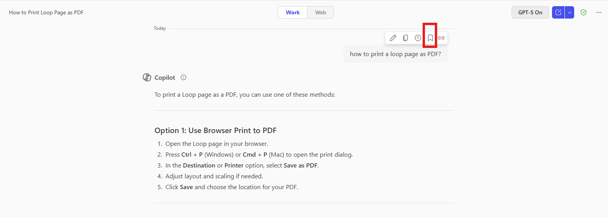
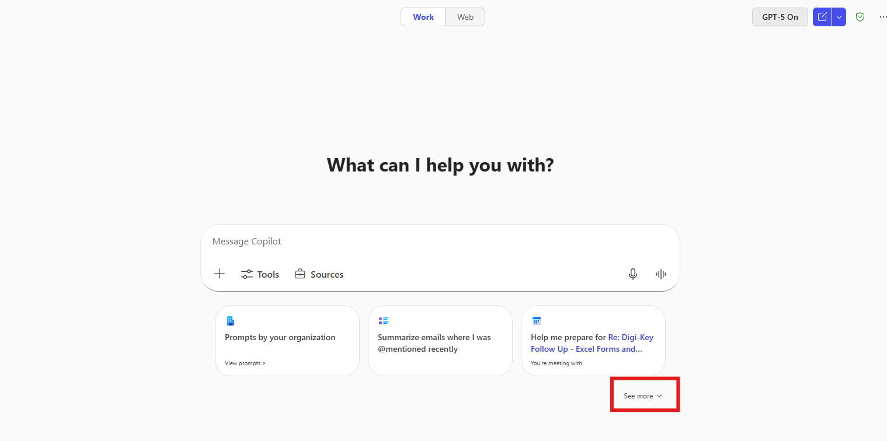
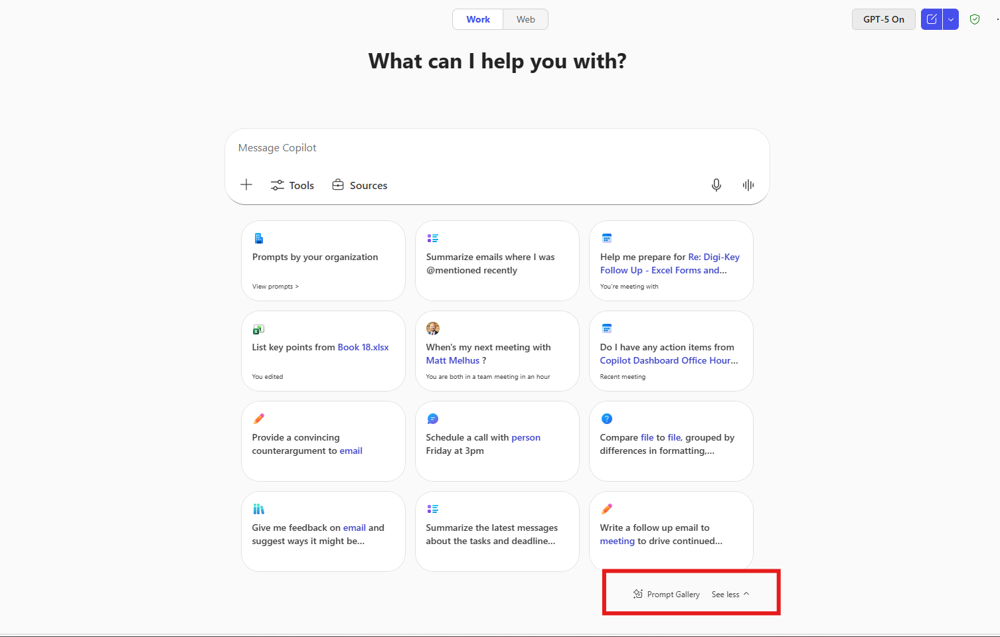
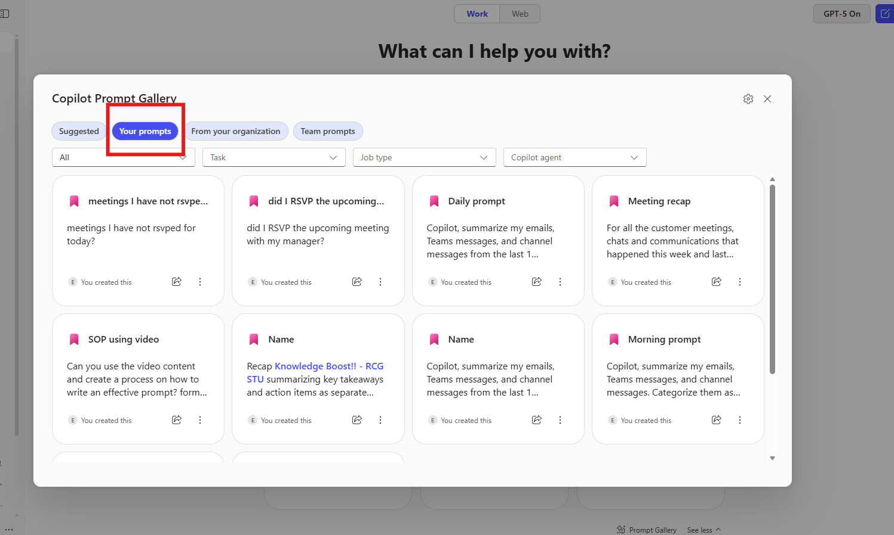
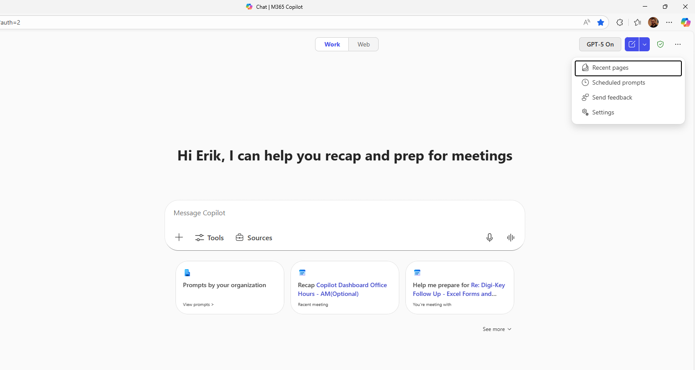
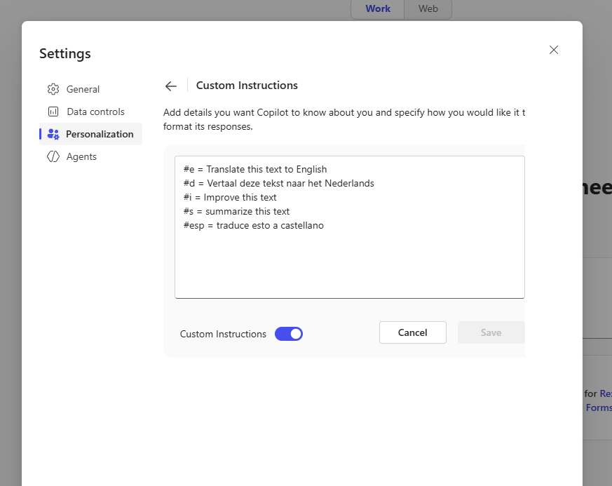

---
demo:
    title: 'Legal Demo'
---

# Copilot Basics  

Enhance decision-making by gathering insights, conducting online analysis, and drafting professional communications.  

You'll perform three tasks:  

- Research information using **Copilot Chat** (and optionally try GPT-5 for comparison).  
- Conduct an analysis using **Copilot Chat**.  
- Draft a professional communication using **Copilot in Word**.  

> **NOTE:** Sample prompts are provided to help you get started. Feel free to personalize them to suit your needs—be creative and explore! If Copilot Chat doesn’t deliver the result you want, refine your prompt and try again. Enjoy the process and have fun experimenting!  

> **Note:** Learn more about new features here [Copilot Chat](https://www.microsoft.com/en-us/microsoft-365/roadmap/copilotchat?msockid=05bfca65f23f66d91dd1df54f3f86721)

---

## Practice 1: How to Save Prompts in Copilot

Saving prompts helps you quickly reuse instructions or queries without having to rewrite them each time. Below is an explanation of how to manage and save them:

**Step-by-step guide**

**Step 1: Save a Prompt**

1.  Open a new browser tab and navigate to [M365copilot.com](https://m365copilot.com/). 
2.  Start by running a prompt, for example::
   
    ```text
Copilot, summarize my emails, Teams messages, and channel messages from the last 1 workday. Categorize them as internal activities, external activities, or messages from my team or manager, and prioritize them for my attention. List action items in a dedicated column and suggest follow-ups if possible, in a dedicated column. The table should look like this: Type (Mail/Teams/Channel) | Topic | Summarization | Category | Priority | Action Item | Follow-up. If I have been directly mentioned, make the font of the topic bold. 
    ```

3. Hover over the prompt.

4.  Click *Save Prompt*.

5.  Give a name for easy reference.



> **Tips**  
> • Use clear names for prompts (e.g., "Weekly Report Summary").
> • Share the most frequently used prompts with your team to maintain consistency.
> • Regularly review and update saved prompts to keep them relevant.

**Step 2: Access your saved Prompts**

1.  Open Copilot.

2.  Click *See more*.

3.  Select *Prompt Gallery*.

4.  Go to *Your prompts*.

    - From here, you can delete prompts, share them via link or share them with a team.







## Practice 2: Memory and Customization of Copilot

Copilot Memory offers a more personalized experience when training Copilot based on your previous chats, work profile, custom instructions, and other metadata. This allows Copilot to understand you best and suits your needs.

Copilot Customization uses the information from the Memory of Copilot to create tailored interactions. For example, you can tell Copilot your writing style (tone, preferred length of the usual responses, greetings, or closings), which helps the AI-generated drafts sound more like you.

**Step-by-step guide to adding custom instructions**

**Step 1: Access Copilot**

Open a new browser tab and navigate to [Copilot](m365.cloud.microsoft/chat) (or use your usual method to access Copilot).

**Step 2: Add instructions**

• Click on the settings by selecting “…”

• Open *Settings* and selec *Personalization*.



- Then select *Custom Instructions.*



You can add your custom instructions in this section. How reference, here's a guide with sample instructions that you can add to Copilot: Copilot instructions:

- [Copilot Custom Instructions](https://livesend.microsoft.com/i/rNoOVLzAAYKpEIxHcPLUSSIGNURf0AnaauPLUSSIGNpTT12ioHC1iT2S9v5zfm___ebPPLUSSIGNq8yBBDVxGsPLUSSIGNGevpl4gM20eehkcX55fDwwHvmMnfisgImZ___gDPLUSSIGN7MtPeWjGSVb8I5OJM40FI6OPIj)

# Legal Demo

**Scenario:**  

You’re a legal advisor at Contoso, responsible for assessing whether the company’s AI Resume Screening Software complies with the EU AI Act. Your goal is to research legal risks, draft an executive summary, and communicate recommendations to leadership.

## Demo Setup

There are no sample documents required for this demo.

## Demos

## Copilot Chat

Let’s start by researching the AI Act and its potential impact on Contoso’s AI hiring tool.

1. Open a browser and navigate to [M365copilot.com](https://m365copilot.com/).

1. Ensure **Web Mode** is selected.

    

1. In the prompt window, type the following:

    ```text
      Contoso is launching an AI Resume Screening Software to evaluate job applicants. As a legal advisor, I need to assess whether it complies with the EU Artificial Intelligence Act. Summarize key provisions related to AI in hiring, compliance requirements for high-risk systems, and potential legal risks.
    ```

1. Review Copilot’s response and take notes on relevant legal risks and compliance requirements.

1. Now we will ask Copilot a series of follow up questions to gather more information:

    ```text
    Does the AI Act classify resume screening software as a high-risk AI system?
    ```

    ```text
    What are the key obligations for high-risk AI systems under the AI Act?
    ```

    ```text
    Are there any exemptions in the AI Act that could apply to Contoso’s system?
    ```

1. Now ask copilot to summarize all the information so far:

    ```text
    Summarize all the information we've discussed into a structured list, ensuring no key details are missed. Then, export the summary to a Word document
    ```

1. Select the hyperlink copilot provides for the new Word document to open it.

1. Once opened, select **Enable Editing** and then turn on "AutoSave". Select your OneDrive account when prompted.

1. Copy the shared URL for use in the next step. (Enable AutoSave and select your OneDrive account if prompted.)

    

## Copilot in Word

Now, we’ll draft an executive summary outlining legal risks and recommendations for Contoso’s leadership.

1. Open a new instance of Word, either in your browser or desktop application.

1. In the **"Describe what you'd like to write"** prompt box, type the following:

    ```text
    Reference the following document [Link to exported Copilot Chat summary from the first task] and draft an executive summary outlining key legal risks, compliance requirements, and recommendations for Contoso’s AI Resume Screening Software.
    ```

    > **NOTE:** Attach the document or paste the shared link directly into the prompt to ensure Copilot can access the relevant content.

1. Review Copilot’s output. Before selecting **Keep it**, refine the response by asking Copilot:

    ```text
    Add a section on the potential business impact of these compliance requirements.
    ```

1. Other optional Refinements:

    - ask Copilot to reword sections for a more professional tone.
    - Request a shorter, more concise version if the summary is too long.
    - Expand with additional sections.

1. After reviewing and finalizing the document, **Copy the generated Executive Summary** to your clipboard for use in the next demo.

## Copilot in Outlook

Lastly, we’ll draft an email to Contoso’s leadership summarizing our findings and next steps.

1. Open Outlook (either in your browser or desktop application).

1. Select **New Email**.

1. Select **Copilot** in the ribbon. From the drop-down menu, choose **Draft with Copilot**.

1. In the **"What do you want this email to say?"** prompt window, type:

   ```text
    Draft an email to Contoso’s executive leadership summarizing our legal assessment of the AI Resume Screening Software under the EU AI Act. Use the following executive summary as a reference.

    [paste Executive Summary from the previous task]

    Conclude the email with a request for leadership’s input on the next steps, including a proposed compliance review meeting.
   ```

    > **NOTE:** Paste the Executive Summary contents that you copied from the previous demo.

1. Once the draft is generated, you can use the **Adjust** feature to modify the tone, length, or level of formality.

### Additional sample prompts


### Lawyer’s Second Copilot Prompt: Plain-English Summary

```text
Convert the technical language of Article I, paragraphs 1 (Normal Exercise) and 2 (Acceleration) into a plain-English summary suitable for non-lawyers, while preserving all legal obligations.
```

### Lawyer’s Third Copilot Prompt: Scenario Analysis

```text
Scenario: What happens if the optionee voluntarily leaves the company before the second anniversary (i.e., before any shares vest on October 12, 2012)? Explain which shares, if any, remain exercisable and for how long
```


