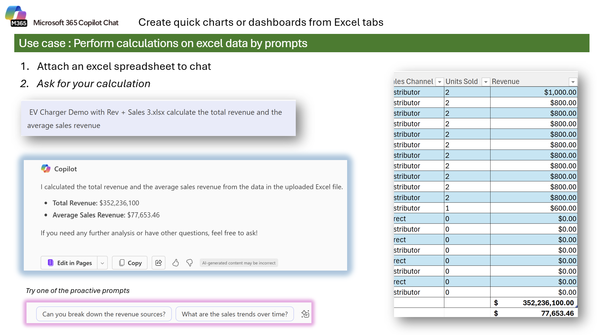
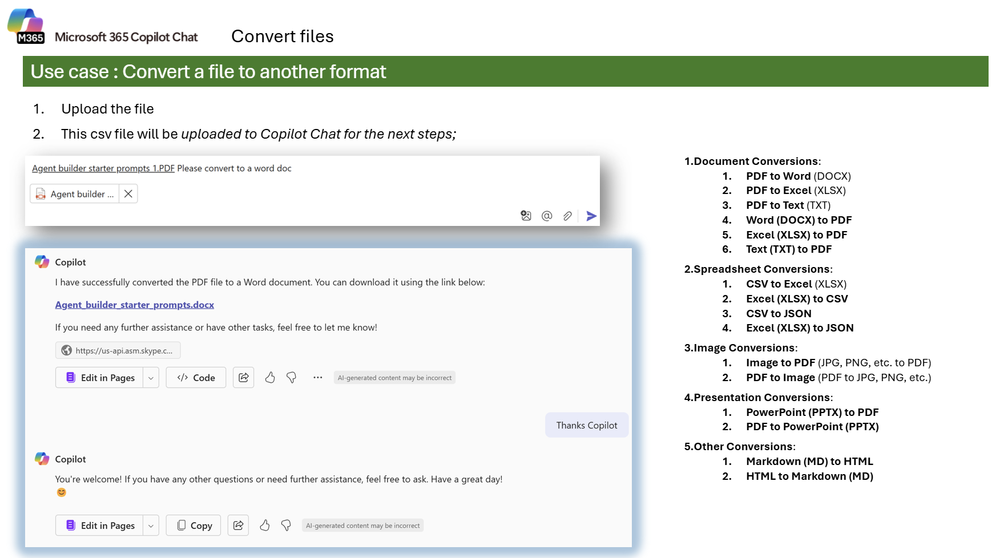

---
demo:
    title: 'Arcos Dorados Copilot '
---

[Back to Index](https://github.com/emontes07/Learning/)

# Copilot Chat  

Mejora la toma de decisiones recopilando información, realizando análisis en línea y redactando comunicaciones profesionales.  

Realizarás tres tareas:  

- Investigar información usando **Copilot Chat** (y opcionalmente probar GPT-5 para comparar).  
- Realizar un análisis usando **Copilot Chat**.  
- Redactar una comunicación profesional usando **Copilot en Word**.  

> **NOTA:** Se proporcionan ejemplos de indicaciones para ayudarte a comenzar. Siéntete libre de personalizarlas según tus necesidades: sé creativo y explora. Si Copilot Chat no entrega el resultado que esperas, ajusta tu indicación y vuelve a intentarlo. ¡Disfruta el proceso y diviértete experimentando!  

---

### Tarea 1: Generar un brief competitivo

En **Copilot Chat**, ya sea en el navegador web [M365copilot.com](https://m365copilot.com/), la aplicación de escritorio o Teams, presione el botón "Trabajo" y luego "Pruebe GPT-5". Ingrese el mensaje a continuación y haga clic en la flecha.

**Pasos**:

- Abra una nueva ventana en el navegador de internet y escriba la siguiente URL: [M365copilot.com](https://m365copilot.com/)
- Seleccione el tab de "Trabajo" or "work" y ademas la opcion de "Pruebe GPT-5" 
  
      

**Ejemplo de prompt**:

```text
Soy ejecutivo en McDonald’s y quiero generar un informe de inteligencia competitiva enfocado en Burger King, Subway y KFC en America Latina. Quiero: ​
Resumir los lanzamientos de productos recientes, cambios en precios y campañas publicitarias. ​
Destacar movimientos estratégicos (por ejemplo, inversiones en tecnología, asociaciones). ​
Recomendar contraacciones u oportunidades. ​
Entregables: ​
Resumen ejecutivo (≤100 palabras). Tabla comparativa de competidores. Recomendaciones estratégicas de respuesta. Citas y metodología.
```

> **CONSEJO:**  Si la primera respuesta es demasiado general o superficial, ajusta tu prompt agregando más contexto. Por ejemplo:
> Especifica un país o subregión dentro de América Latina.
> Define un periodo de tiempo (últimos 6 meses, último trimestre).
> Incluye métricas clave (ventas, participación de mercado).
>Esto ayudará a Copilot a generar información más relevante y accionable para la toma de decisiones.

> **Resultado de Aprendizaje:**
> Al completar esta tarea, serás capaz de:
>   Utilizar Copilot Chat para realizar investigaciones estructuradas sobre la competencia.
>   Generar resúmenes ejecutivos y tablas comparativas que faciliten la toma de decisiones estratégicas.
>   Refinar prompts para obtener información más precisa y adaptada al contexto de McDonald’s en América Latina.

**Prompt 2**:

```text
Transforme este informe en una presentacion de powerpoint con agenda, insights, recomendaciones y cytas y metodologia.
```


---

### Tarea 2: Resumir y convertir una reunión en decisiones y propietarios

Utiliza Copilot en Microsoft Teams para transformar una reunión en un resumen accionable con decisiones y propietarios. Esto te permitirá ahorrar tiempo y mantener a todos alineados.

**Pasos**:

- Abre el chat de una reunión reciente en Microsoft Teams.
- Haz clic en la pestaña Recapitulación.
- Selecciona el botón Copilot para ver las opciones sugeridas.
- Ingresa el siguiente prompt o personalízalo según tus necesidades:


**Ejemplo de prompt**:

```text
Resuma esta reunión en una tabla con las siguientes columnas: Temas Clave, Preguntas Pendientes y Tareas con sus Responsables.
```

     


> **CONSEJO:** Además de usar Copilot en la pestaña Recapitulación, también puedes:
> Referenciar la reunión desde el tab Trabajo en Copilot Chat.
> Pedir que la información se organice en tablas para mayor claridad.
> Consultar el recap en Microsoft Stream o revisar las notas generadas por el facilitador.
> Durante la reunión, invocar al facilitador o preguntar directamente a Copilot para capturar decisiones en tiempo real.
> Esto te ayudará a obtener resúmenes más completos y accionables.

> **Resultado de Aprendizaje:**
> Al finalizar esta tarea, podrás:
> Convertir notas y transcripciones en resúmenes claros y compartibles.
> Identificar decisiones clave y asignar responsables de manera estructurada.
> Aprovechar las capacidades de Copilot en Teams para mejorar la productividad y la colaboración en reuniones.

---

### Tarea 3: Crear tu propia campaña de marketing 

Usando **Copilot Chat**, ya sea en el navegador web [M365copilot.com](https://m365copilot.com/), la aplicación de escritorio o Teams, presione el botón "Trabajo" y luego "Pruebe GPT-5". Ingresa el primer prompt y luego itera con preguntas de seguimiento para refinar los entregables.

**Pasos**:

- Abre una nueva pestaña del navegador y navega a [M365copilot.com](https://m365copilot.com/)
- Selecciona Copilot Chat → pestaña Trabajo → Pruebe GPT-5.
- Pega el prompt inicial (abajo) y solicita que la salida sea en tabla con columnas específicas (Idea, Insight cultural, Público objetivo, Canal, KPI esperados, Presupuesto estimado, Riesgos/Mitigaciones).
- Usa preguntas de seguimiento para:
-   Crear una matriz de priorización (p. ej., RICE o Impacto × Esfuerzo × Costo).
-   Obtener un plan de medios (mix por canal, formatos, rango de inversión, KPIs objetivo).
-   Generar un roadmap 30-60-90 días y un brief creativo (mensajes, tono, piezas por canal, adaptaciones ES/pt-BR).
  
      

**Ejemplo de secuencia de prompts:**:

```text
Actúa como estratega de marketing para McDonald’s Latinoamérica. Quiero idear una campaña para “Día de Muertos” orientada a aumentar visitas en restaurante y ventas en app. Proporciona una tabla con estas columnas: Idea, Insight cultural (breve y respetuoso), Público objetivo, Mensaje clave, Canales y formatos, KPI esperados, Presupuesto estimado (bajo/medio/alto), Riesgos y mitigaciones. Incluye citas/metodología al final.
```

```text
Genera una matriz de priorización usando RICE (Reach, Impact, Confidence, Effort) y recomienda las 3 ideas con mayor puntuación. Explica la justificación en 3–4 frases por idea.
```

```text
Propón un plan de medios por canal (TV, DOOH, Social, Influencers, App, CRM/SMS, PR) con formato, frecuencia sugerida, rango de inversión y KPI objetivo (CTR, CPA, tasa de conversión en app, ventas incrementales).
```

> **CONSEJO:**  Pide salidas estructuradas en tabla para comparar ideas y acciones con claridad.
> Solicita citas y metodología para validar supuestos y reducir sesgos.
> Incluye criterios y restricciones (objetivo de negocio, presupuesto, fechas, mercados) en el prompt inicial para mejorar la relevancia.
> Si buscas ejecución: solicita matriz de priorización (RICE), plan de medios y roadmap 30-60-90 en la misma conversación.
> Para adaptaciones regionales, pide versiones en español y pt-BR con guía de tono y sensibilidad cultural.
> Si necesitas activos operativos, pide briefs listos para compartir con agencias y equipo interno.

> **Resultado de Aprendizaje:**
> Al completar esta tarea serás capaz de:
> Orquestar con Copilot un flujo de trabajo de marketing end-to-end: ideación, evaluación, priorización y plan de ejecución.
> Diseñar prompts efectivos que produzcan salidas estructuradas (tablas, matrices, roadmaps) y que incorporen fuentes/metodología.
> Asegurar relevancia regional para América Latina (incluyendo pt-BR) con sensibilidad cultural, tono de marca y consideraciones de cumplimiento.
> Transformar la exploración creativa en decisiones accionables, con KPIs claros, responsables y próximos pasos.


### Tarea 4: Crear imágenes publicitarias y conceptos de empaque 

Usa Copilot Chat para generar imágenes hiperrealistas y proponer ideas creativas para empaques especiales. Esta tarea te ayudará a explorar cómo Copilot puede apoyar en diseño visual y conceptualización para campañas de marketing.

**Pasos**:  

1. Abre una nueva pestaña del navegador y navega a [M365copilot.com](https://m365copilot.com/)
2. Selecciona Copilot Chat en la pestaña Trabajo.
3. Ingresa el siguiente prompt para generar una imagen publicitaria:


**Ejemplo de prompt para imagen publicitaria:** 

```text
Crea una imagen publicitaria para McDonald’s Latinoamérica que muestre una **bebida refrescante de mango y piña** en un vaso de McDonald’s con tapa transparente y popote. Elementos clave:
- **Ambientación:** escena veraniega, con fondo brillante de colores cálidos (amarillo mango, naranja, dorado) y detalles tropicales como rodajas de piña, hojas de palma y cubos de hielo salpicando alrededor.  
- **Estilo visual:** hiperrealista y vibrante, mostrando el líquido brillante y apetitoso, con gotas de condensación en el vaso para resaltar frescura.  
- **Paleta de colores:** tonos amarillos, naranjas y verdes frescos, con acentos rojos de la marca McDonald’s (por ejemplo, el logo en el vaso).  
- **Composición:** bebida en el centro, ligeramente en ángulo, con frutas frescas flotando o salpicando alrededor para transmitir dinamismo y energía.  
- **Sensación:** refrescante, tropical y divertida, ideal para atraer a jóvenes y familias en verano.  
No incluyas texto ni tipografía en la imagen.
```

Después, solicita ideas para diseño de empaque con el siguiente prompt:

  

**Ejemplo de prompt para empaque especial:** 

```text
Sugiere **ideas de diseño de empaque** para una edición especial de **Cajita Feliz** relacionada con el evento de octubre 2025 en Ciudad de México. La idea debe incluir:
- **Diseño visual** (colores, ilustraciones, personajes).  
- **Elemento interactivo** (p. ej., recortable, código QR con minijuego, sticker o parte coleccionable).  
- **Experiencia educativa o lúdica** que conecte con el público infantil (4–10 años).  
Ejemplo de tema: 
1. **Exploradores de CDMX:** ilustraciones de monumentos icónicos (Ángel de la Independencia, Chapultepec) y juegos para descubrir datos curiosos.
```

  


> **CONSEJO:**  Pide variantes de la imagen con diferentes ángulos, iluminación o estilos (p. ej., más minimalista, más tropical).
> Solicita archivos descargables o versiones optimizadas para redes sociales.
> Para empaques, pide 3–5 conceptos con descripciones detalladas y un boceto visual si es posible.
> Usa preguntas de seguimiento como:
> “¿Puedes generar una versión con colores más vibrantes?”
> “¿Cómo puedo adaptar este diseño para un display en punto de venta?”
> “¿Puedes crear un mockup del empaque con el diseño propuesto?”

> **Resultado de Aprendizaje:**
> Al completar esta tarea, podrás:
> Generar imágenes publicitarias hiperrealistas alineadas con la identidad de marca.
> Explorar conceptos creativos para empaques con elementos interactivos y educativos.
> Iterar sobre diseños solicitando variantes y adaptaciones para diferentes canales y formatos.
> Integrar Copilot en procesos creativos para campañas y activaciones especiales.

### Tarea 5: Visualizar datos financieros con gráficos y mapas de calor

Usa Copilot Chat para crear diferentes visualizaciones a partir de datos en Excel, como tendencias mensuales, ventas por producto y distribución de ingresos. En esta tarea, explorarás las capacidades de Copilot para generar gráficos que revelen insights clave a partir de datos estructurados.

**Pasos**:  

1. Abre tu libro de Excel y selecciona una sola hoja (Copilot solo analiza una pestaña a la vez).
- [EV Charger Demo.csv](https://github.com/emontes07/Learning/blob/main/ResourceFiles/EV%20Charger%20Demo%20(Original).csv)
2. Guarda la hoja seleccionada como archivo .csv.
3. Abre una nueva pestaña del navegador y navega a [M365copilot.com](https://m365copilot.com/)
4. Selecciona Copilot Chat y sube tu archivo .csv.
5. Usa los siguientes prompts de ejemplo para analizar y visualizar los datos.

  

**Ejemplo de indicación** *(after uploading your CSV file)*:

```text
Enumera los gráficos que puedes crear a partir de los datos de ventas y luego créalos.
```
```text
Crea un gráfico de tendencia mensual de ingresos.
```
```text
Crea un gráfico circular “Distribución de unidades vendidas por canal de ventas”.
```
```text
Crea un gráfico “Ingresos totales por producto”.
```
```text
Crea un mapa de calor de los productos más vendidos (sin incluir fechas de compra).
```

> **CONSEJO:**
> Una vez generadas las visualizaciones, prueba estos prompts de seguimiento para mejorar tu análisis:
> “¿Puedes añadir líneas de tendencia o resaltar picos estacionales en el gráfico de ingresos?”
> “¿Qué revela el mapa de calor sobre las preferencias de los clientes?”
> “Agrupa las ventas por categoría y crea un gráfico de barras apiladas.”
> “Exporta estos gráficos como archivos de imagen para usarlos en PowerPoint.”

> **Resultado de Aprendizaje:**
> Al completar esta tarea, podrás:
> Transformar datos numéricos de ventas en visualizaciones claras usando Copilot Chat.
> Crear gráficos como líneas, circulares, barras y mapas de calor para presentar insights.
> Identificar tendencias, patrones y oportunidades a partir de datos estructurados.
> Preparar visuales listos para presentaciones y toma de decisiones.


### Tarea 6: Perform Calculations from Excel Data  

Use **Copilot Chat** to perform calculations directly from Excel data—without needing formulas or pivot tables. In this task, you’ll calculate the **total revenue** and the **average sales revenue** from a provided spreadsheet and explore how to break down those results further.

This is a great use case for operations, finance, or business teams looking for fast insights without writing code or complex formulas.

**Pasos**:  

1. Save the following Excel workbook (right click "Save Link as").  
   - [EV Charger Demo with Rev + Sales.xlsx](https://github.com/emontes07/Learning/blob/main/ResourceFiles/EV%20Charger%20Demo%20with%20Rev%20%2B%20Sales%20CSV.csv)
2. Open a new browser tab and navigate to [M365copilot.com](https://m365copilot.com/)  
3. Select Copilot Chat and upload your `.xlsx` file  
4. Use the following sample prompt to analyze and calculate values from the data  

  

**Ejemplo de indicación** *(after uploading your Excel file)*:

```text
Calculate the total revenue and the average sales revenue.
```

> **CONSEJO:** 
Once the results are shown, try these follow-up prompts to dig deeper:
> Can you break down the revenue sources by sales channel or product?
> What are the monthly or quarterly sales trends?
> Can you calculate revenue growth over time?

> **Resultado de Aprendizaje:**
After completing this task, you’ll be able to use Copilot Chat to quickly calculate financial metrics like total and average revenue, and follow up with deeper questions to uncover trends or performance breakdowns in your Excel data.


### Tarea 7: Convert Files to Another Format  

Use **Copilot Chat** to convert files between formats quickly and easily. This task helps you explore supported conversion types—perfect when you need to standardize formats or extract data for analysis.  

**Pasos**:  

1. Upload the file you want to convert to **Copilot Chat**.  
2. Ask Copilot Chat to convert it into your desired format.  



**Ejemplo de indicación**:  

```text
Convert this PDF to a Word document.
```
You can also request Copilot to perform other conversions such the one mentioned in the image.


> **CONSEJO:** 
Ask follow-up questions like:
> Can you extract tables from this PDF into Excel?
> Save this as a downloadable file.
> Combine multiple PDFs into one document.”

> **Resultado de Aprendizaje:**
After completing this task, you’ll know how to use Copilot Chat to convert files into various formats, making it easier to prepare data, create editable documents, and streamline workflows.


### Tarea 8 (FYI): Create or Replace an Excel Macro with Copilot

This advanced, **FYI-only** task shows two ways to handle VBA-style calculations using **Copilot Chat**—either by asking Copilot to do the equivalent calculation from an uploaded spreadsheet, or by having Copilot help author/adjust the VBA macro.  
> **Heads-up:** VBA macros don’t run in **Excel for the web**; Copilot Chat can still perform the same calculations from your uploaded workbook.

**How to use it:**  

1. Open a new browser tab and go to [M365copilot.com](https://m365copilot.com/).  
2. Select **Copilot Chat**.  
3. Use one of the options below.


**Option 1 – Have Copilot perform the calculation from your file**  

Upload your `Revenue.xlsx` (or similar) and run:

```text
Please create an Excel Macro script that performs the following task:
Calculate the total and average revenue from the "Sales by Product" worksheet.

For Excel web users, execute the equivalent calculation now on the uploaded file and report:
- Total Revenue
- Average Revenue
```

**Option 2 – Ask Copilot to draft/modify the VBA macro**

```text
Write a VBA macro that calculates the total and average revenue from the
"Sales by Product" worksheet and displays the results in a message box.

Now modify the script so it writes:
- Total Revenue to cell J4
- Average Revenue to cell J5
and formats both as currency.
```

> **CONSEJO:**
> Explain what this macro does line by line.
> Convert this macro to a Copilot prompt that performs the same calculation without VBA.
> Add error handling if the sheet or column is missing.”

> **Resultado de Aprendizaje:**
You’ll understand two practical paths to handle macro-style work: (1) let Copilot Chat run the calculation directly from your uploaded workbook, or (2) have Copilot author or refactor the VBA macro for desktop Excel, including writing results to specific cells.


### Tarea 9: Create a Job Description & Evaluate a Candidate  

Use **Copilot Chat** to create a professional job description based on web research, define KPIs, and then analyze a candidate’s resume for fit against the role. This task is ideal for HR teams, hiring managers, and recruiters who want to streamline job creation and resume evaluation.

**Pasos**:  

1. Open a new browser tab and navigate to [M365copilot.com](https://m365copilot.com/)  
2. Select **Copilot Chat**.  
3. Start by asking Copilot to research and build a job profile.  
4. Then, upload a candidate’s resume (in `.docx` format) and ask Copilot to perform a gap analysis.


**Ejemplo de indicación** *(Step 1 – Build the job description)*:

```text
In a table format perform a web analysis for a "data analyst" role for finance to include:
- Industry job titles  
- Basic definition  
- Key attributes  
- Ideal average years of education  
- Salary range  
- A list of 10 questions and answers to ask this role in an interview  

Then provide some KPIs for the role.  

Finally, based on the above information, write a job description with a competitive salary based on years of experience. This job description will serve as the guide for our hiring board.
```

> **CONSEJO:**
> Rank the candidate from 1–10 based on fit for the role.
> Identify skill gaps and recommend a training plan if they were hired.
> Generate a scorecard template the hiring board can use for all candidates.

> **Resultado de Aprendizaje:**
After completing this task, you’ll be able to create a well-structured job description, identify KPIs for a role, and perform a resume gap analysis with Copilot Chat—streamlining your hiring process and improving candidate evaluation consistency.
