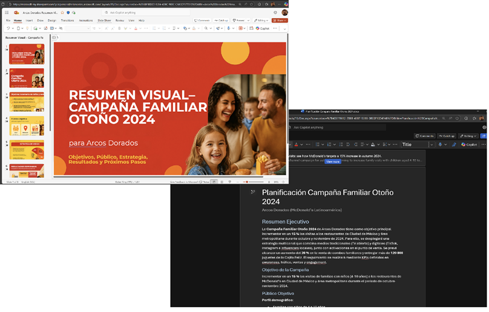
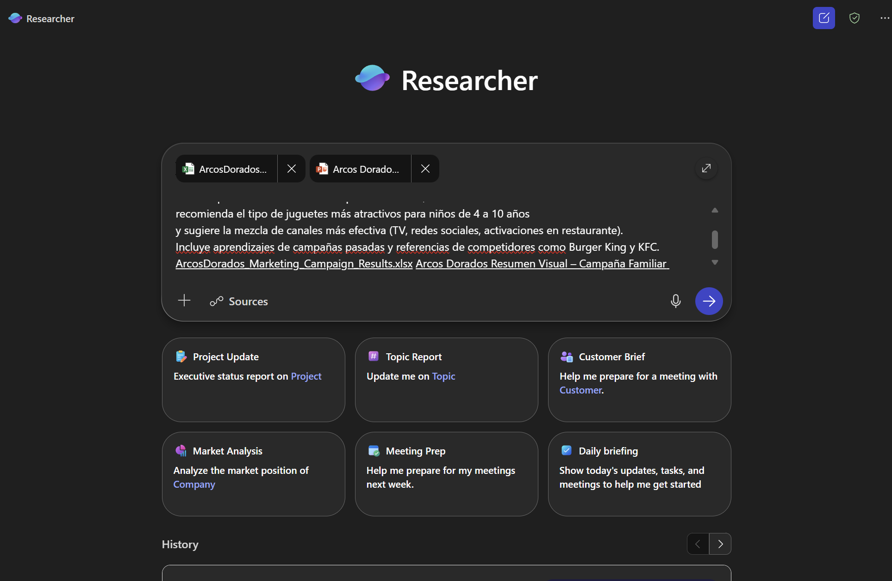
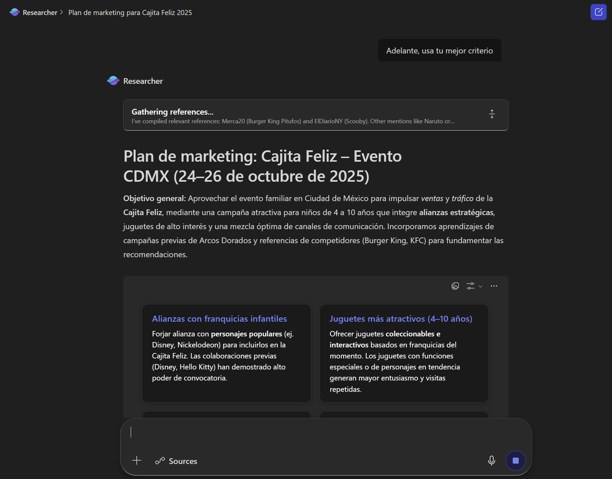

<html lang="en">
<head>
<meta charset="UTF-8">
<meta name="viewport" content="width=device-width, initial-scale=1.0">
<title>Agente Researcher — Arcos Dorados | Learning</title>
<link rel="stylesheet" href="../../Allfiles/demo-style.css">

</head>
<body>

  <a href="https://emontes07.github.io/Learning/">← Back to Index</a>

<button class="sidebar-toggle" onclick="openSidebar()" aria-label="Open menu">☰ Menu</button>

  

    <h1>🔬 Agente Researcher — Arcos Dorados</h1>
    
Investigación multi-paso con Copilot y el agente Researcher.

    

      🔬 Researcher
      🍔 Arcos Dorados
      💬 Copilot
    

  

<nav class="sidebar" id="sidebar">
  <a class="sb-home" href="https://emontes07.github.io/Learning/">← Back to Index</a>
  
Arcos Dorados

  <a href="#sec-intro" class="section-link">Overview</a>
  <a href="#part1-researcher-construye-un-plan-de-marketing" class="part-link">Researcher: Construye un Plan de Marketing</a>
  <a href="#part2-researcher-segmentación-de-clientes-y-modelado-financiero" class="part-link">Researcher: Segmentación de Clientes y Modelado Financiero</a>
  <a href="#part3-preguntas-de-seguimiento-para-el-researcher-agent" class="part-link">Preguntas de Seguimiento para el Researcher Agent</a>
  <a href="#part4-escenarios-adicionales-para-researcher" class="part-link">Escenarios adicionales para Researcher</a>
</nav>

Esta demostración destaca cómo usar el agente **Researcher**, este es un agente experto integrados en la aplicación Copilot. Researcher te ayuda a abordar tareas de investigación de múltiples pasos, combinando datos web con archivos y conocimientos de tu empresa.

- **Researcher** te ayuda a abordar tareas de investigación de múltiples pasos, combinando datos web con los archivos y el conocimiento de tu empresa.
  
**Tarea 1: Realizar investigación y análisis en línea**

Para completar estas demostraciones, deberás descargar lo siguientes archivos que contiene todos los archivos y recursos necesarios.

- [Arcos Dorados Resumen Visual Campaña 2024](https://github.com/emontes07/Learning/blob/main/ResourceFiles/Arcos%20Dorados%20Resumen%20Visual%20%E2%80%93%20Campa%C3%B1a%20Familiar%202024.pptx)

- [Arcos Dorados - Planificación Campaña Familiar 2024](https://github.com/emontes07/Learning/blob/main/ResourceFiles/Arcos%20Dorados%20-%20Planificaci%C3%B3n%20Campa%C3%B1a%20Familiar%202024.docx)

  

> **💡 Tip: :** Antes de realizar la demostración, puedes almacenar los archivos en un sitio de SharePoint de tu entorno de pruebas para facilitar el acceso. Alternativamente, puedes guardar los archivos localmente y hacer referencia a ellos directamente en tus indicaciones usando **/**.

Para acceder a estos agentes:  

- Abre la **aplicación Copilot** desde [m365.cloud.microsoft](https://m365.cloud.microsoft).  
- Usa la **navegación del panel izquierdo** para seleccionar  **Resercher**.  

> **Nota:** Deberás vincular Researcher y Analyst a archivos internos (SharePoint/OneDrive) para obtener información fundamentada en datos confiables.

---

## Escenario
- El departamento de Marketing de Arcos Dorados está planificando la campaña de octubre 2025 en Ciudad de México. Para esta planeación, utilizarán el agente **Researcher** en Copilot.
  
- El agente ayudará a:
 – Investigar tendencias y comportamientos de consumo.
 – Proponer alianzas estratégicas para la Cajita Feliz.
 – Recomendar el tipo de juguetes más relevantes para la audiencia infantil.
  
- ¿Por qué usar Researcher?
  – Analiza datos de mercado de forma rápida y confiable.
  – Detecta oportunidades y brechas en la estrategia actual.
  – Visualiza el impacto estimado de cada recomendación.
  – Reduce riesgos al evitar decisiones basadas solo en intuición.

---

  

  

    <h2>Researcher: Construye un Plan de Marketing</h2>
    ▾
  

  

1. Abre **Researcher** desde la navegación izquierda en la aplicación de Copilot.  

      

2. Ingresa el siguiente prompt:

    Crea un plan de marketing para la próxima campaña de Cajita Feliz      durante el evento en Ciudad de México (24-26 octubre 2025).      Destaca posibles alianzas con franquicias infantiles,      recomienda el tipo de juguetes más atractivos para niños de 4 a 10 años      y sugiere la mezcla de canales más efectiva (TV, redes sociales, activaciones en restaurante).      Incluye aprendizajes de campañas pasadas y referencias de competidores como Burger King y KFC.<button class="copy-btn" onclick="copyPrompt(this)">Copy</button>

1. Adjunta los archivos de referencia usando `/` (apuntando a SharePoint/OneDrive):  

- [Arcos Dorados Resumen Visual Campaña 2024](https://github.com/emontes07/Learning/blob/main/ResourceFiles/Arcos%20Dorados%20Resumen%20Visual%20%E2%80%93%20Campa%C3%B1a%20Familiar%202024.pptx)

- [Arcos Dorados - Planificación Campaña Familiar 2024](https://github.com/emontes07/Learning/blob/main/ResourceFiles/Arcos%20Dorados%20-%20Planificaci%C3%B3n%20Campa%C3%B1a%20Familiar%202024.docx)

      

2. Haz clic en **Enviar**.  

Researcher hará lo siguiente:  

- Combinará los hallazgos de los documentos internos con información del mercado y la web.  
- Estructurará un plan de marketing con recomendaciones sobre la mezcla de canales y la estrategia de contenidos.  
- Citará las fuentes para que puedas validar el análisis.  

> **Nota:** Researcher muestra su ruta de razonamiento (“chain of thought”) y puede invocar otros agentes si es necesario.

  

  

  

    <h2>Researcher: Segmentación de Clientes y Modelado Financiero</h2>
    ▾
  

  

1. Abre **Researcher** desde la navegación izquierda en la aplicación de Copilot. 

   

1. Ingresa el siguiente prompt:

    Con base en las recomendaciones identificadas para la campaña de Cajita Feliz, realiza un análisis de priorización estratégica.       Clasifica cada recomendación según su ROI estimado, facilidad de implementación y alineación con los objetivos de McDonald's para 2025.       Asigna una ponderación: ROI (50%), facilidad de implementación (30%) y alineación estratégica (20%).       Presenta los tres principales enfoques priorizados incluyendo:     – Recursos necesarios y tiempos estimados       – Riesgos o dependencias potenciales       – KPIs sugeridos para medir el impacto inicial       Incluye una matriz de acción (impacto vs. esfuerzo) y una narrativa breve que justifique cada prioridad.<button class="copy-btn" onclick="copyPrompt(this)">Copy</button>

1. Click **Submit**. 

Researcher hará lo siguiente:  

- Analizará el conjunto de datos.  
- Identificará los segmentos de clientes de mayor valor.  
- Proporcionará visualizaciones que respalden las recomendaciones.

  

  

  

  

    <h2>Preguntas de Seguimiento para el Researcher Agent</h2>
    ▾
  

  

Después de recibir el primer análisis, puedes hacer estas dos preguntas para profundizar en el escenario:

**Pregunta 1:Estrategia de Comunicación Digital**

Propón una estrategia de comunicación digital que complemente la campaña de Cajita Feliz en Ciudad de México. Incluye ejemplos de publicaciones para TikTok, dinámicas interactivas en Instagram y activaciones en restaurante.   Asegúrate de adaptar el tono y estilo al público infantil y familiar, y de integrar elementos visuales que refuercen el mensaje de la campaña.<button class="copy-btn" onclick="copyPrompt(this)">Copy</button>

**Pregunta 2:Alianzas Estratégicas**

Sugiere posibles alianzas con franquicias infantiles para la campaña de Cajita Feliz. Evalúa el potencial de colaboración con marcas de películas, series animadas, videojuegos o juguetes educativos.   Incluye ejemplos de campañas similares exitosas y justifica por qué estas alianzas podrían aumentar el alcance y la relevancia de la campaña.<button class="copy-btn" onclick="copyPrompt(this)">Copy</button>

  

  

  

    <h2>Escenarios adicionales para Researcher</h2>
    ▾
  

  

Puedes ejecutar estos mensajes adicionales para variar. Cada uno sigue el mismo patrón: **Mensaje → Adjuntar archivo → Enviar → Revisar resultados.**

- **Evaluación de Canales**

    Compara el mix de medios de campañas pasadas con el comportamiento actual de consumo de medios en familias urbanas mexicanas. Identifica si estamos sobreinvirtiendo o subinvirtiendo en algún canal y sugiere ajustes.<button class="copy-btn" onclick="copyPrompt(this)">Copy</button>

- **Mensajes y Creatividad**

    Evalúa si el tono y lenguaje de las campañas pasadas siguen siendo relevantes para niños y padres en 2025.  Propón ajustes creativos o de storytelling que conecten mejor con el público objetivo.<button class="copy-btn" onclick="copyPrompt(this)">Copy</button>

- **Innovación en la Experiencia**

    Propón ideas innovadoras para que la Cajita Feliz incorpore experiencias digitales, por ejemplo juegos con realidad aumentada, códigos QR con minijuegos o coleccionables virtuales. <button class="copy-btn" onclick="copyPrompt(this)">Copy</button>

**💡 Tips útiles:** 
- Cita siempre fuentes confiables y actualizadas (por ejemplo: datos 2024–2025 de INEGI, Euromonitor, Kantar).
- Usa los datos internos de Arcos Dorados como base: ventas históricas, desempeño de productos como la Cajita Feliz, estudios previos, etc., para afinar tus recomendaciones.
- Nombra los archivos adjuntos de forma clara para facilitar su referencia en el análisis (ej. “Planificación Familiar 2024”, “Resumen Visual Campaña 2024”).
- Itera: después de ver los resultados iniciales, haz preguntas de seguimiento para ajustar supuestos, explorar escenarios alternativos o validar hipótesis inesperadas.

## Resultados de aprendizaje esperados

- Identificar y priorizar tendencias emergentes en el mercado infantil, especialmente en juguetes/licencias, experiencias digitales/AR y hábitos de consumo familiar.
- Combinar datos internos (ventas, campañas anteriores) con datos externos de mercado para detectar oportunidades estratégicas.
- Traducir esas tendencias en recomendaciones accionables, incluyendo KPIs SMART, estimaciones de impacto y mapas de canal.
- Generar visualizaciones efectivas (gráficos, comparativos, proyecciones) que respalden decisiones de campaña.
- Optimizar el proceso de análisis de campañas: desde archivo + prompt → análisis → seguimiento → resultados accionables, ahorrando tiempo y reduciendo riesgos.

Juntos, Researcher y Analyst acortan el camino de la **pregunta al conocimiento**, convirtiendo semanas de trabajo en minutos.

  

<!-- /main-content -->

<!-- /layout -->

</body>
</html>
