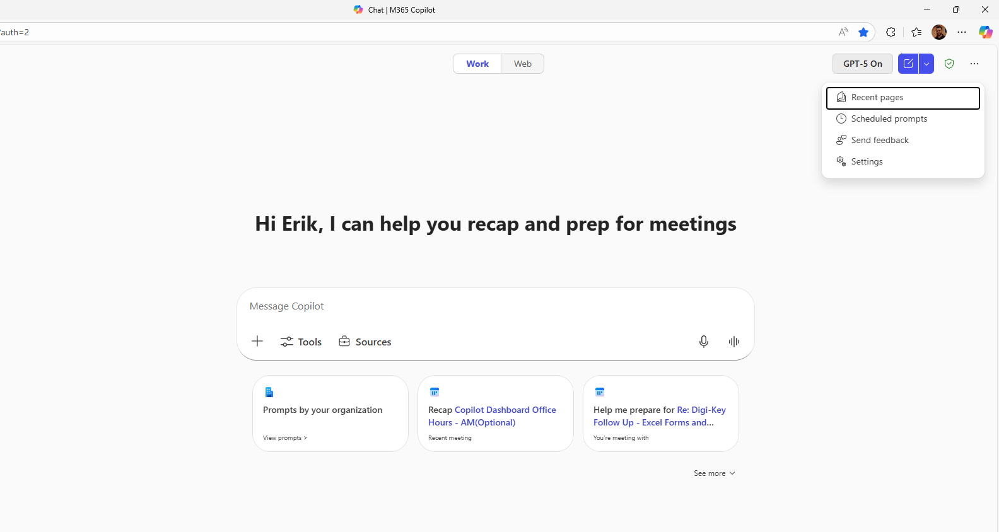
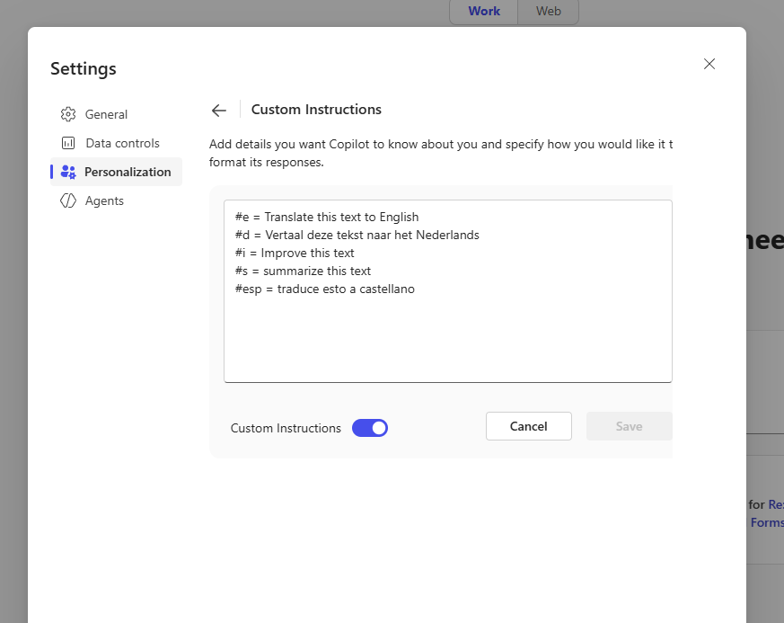
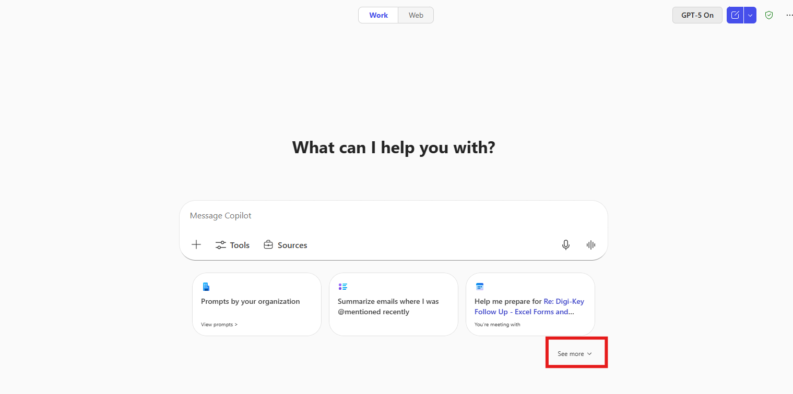
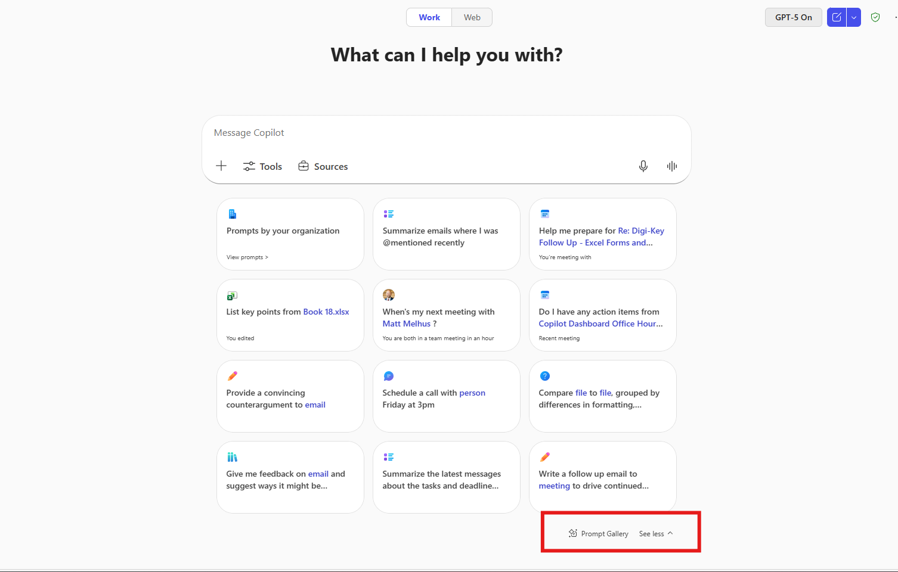
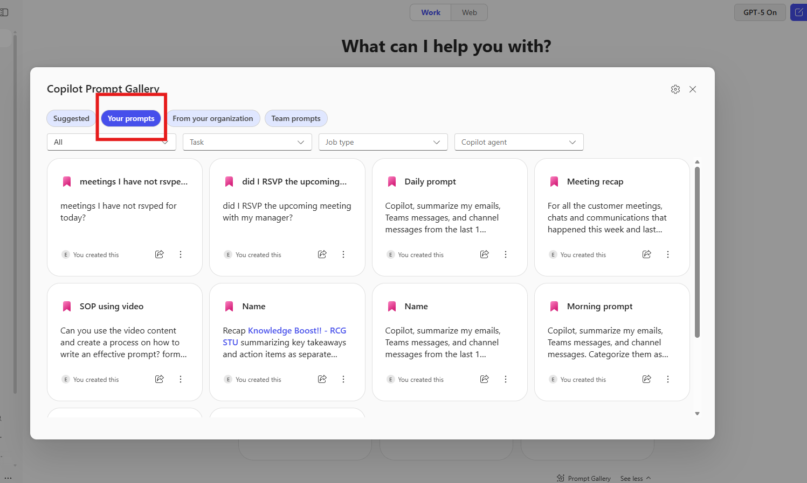
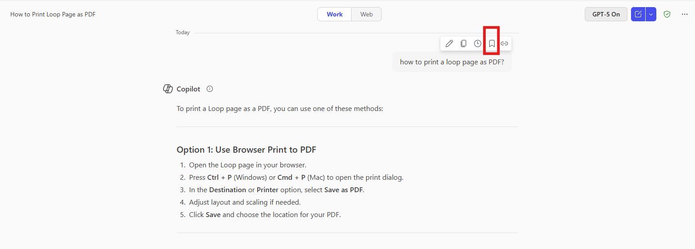
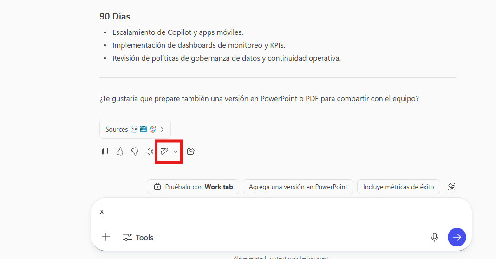
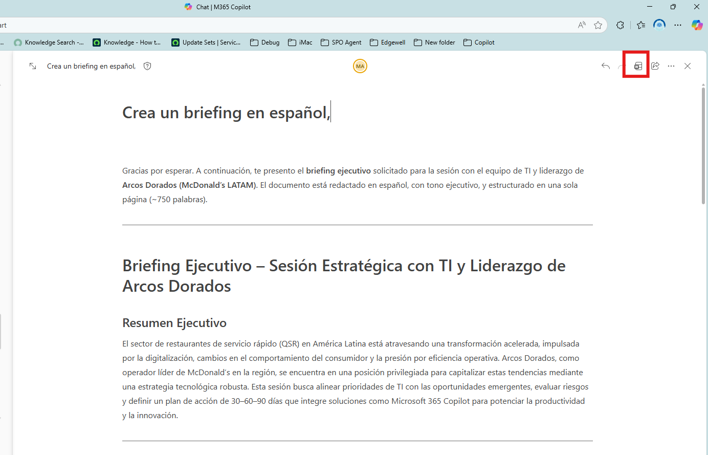
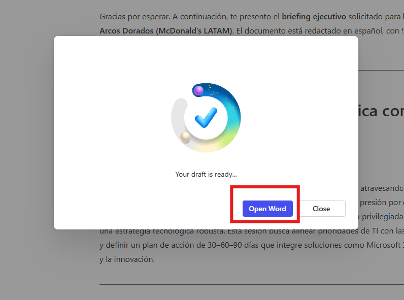
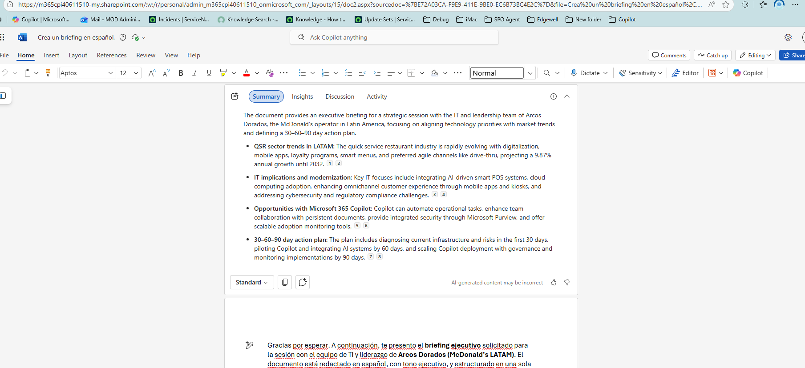

---
task:
    title: 'Arcos Dorados IT'
---

# **Arcos Dorados: IT Edition**

Bienvenido a esta sesión interactiva diseñada para ayudarte a desbloquear todo el potencial de Microsoft Copilot dominando el arte y la ciencia de la creación efectiva de prompts.
Aprenderás técnicas prácticas para crear prompts claros e impactantes que generen valor real para el negocio, ahorren tiempo y aumenten la productividad.

Prepárate para una experiencia práctica y colaborativa, donde experimentarás, iterarás y descubrirás cómo Copilot puede optimizar tus flujos de trabajo y empoderar a tu equipo para lograr más.

---

## Práctica 1: Memoria y Personalización de Copilot

Copilot Memory ofrece una experiencia más personalizada al entrenar a
Copilot con base en tus chats previos, perfil de trabajo, instrucciones
personalizadas, metadatos y más. Esto permite que Copilot te comprenda
mejor y se adapte a tus necesidades.

La Personalización de Copilot utiliza la información de la Memoria de
Copilot para crear interacciones a tu medida. Por ejemplo, puedes
indicarle a Copilot tu estilo de redacción (tono, longitud preferida de
las respuestas, saludos o cierres habituales), lo que ayuda a que los
borradores generados por IA suenen más como tú.

**Guía paso a paso para agregar instrucciones personalizadas**

**Paso 1: Acceder a Copilot**

Abre una nueva pestaña del navegador y navega a
m365.cloud.microsoft/chat (o usa tu método habitual para acceder a
Copilot).

**Paso 2: Agrega instrucciones**

• Haz clic en la configuración seleccionando “…”

• Abre *Settings* y selecciona *Personalization*.



- Luego selecciona *Custom Instructions.*



Puedes agregar tus instrucciones personalizadas en esta sección. Como
referencia, aquí tienes una guía con ejemplos de instrucciones que
puedes agregar a Copilot: Copilot instructions: 

- [Copilot Custom Instructions](https://livesend.microsoft.com/i/rNoOVLzAAYKpEIxHcPLUSSIGNURf0AnaauPLUSSIGNpTT12ioHC1iT2S9v5zfm___ebPPLUSSIGNq8yBBDVxGsPLUSSIGNGevpl4gM20eehkcX55fDwwHvmMnfisgImZ___gDPLUSSIGN7MtPeWjGSVb8I5OJM40FI6OPIj)

## Práctica 2: Guardar Prompts en Copilot

Guardar prompts te ayuda a reutilizar rápidamente instrucciones o
consultas sin tener que escribirlas cada vez. A continuación, se explica
cómo administrarlos y guardarlos:

**Guía paso a paso**

**Paso 1: Acceder a tus Prompts guardados**

1.  Abre Copilot.

2.  Haz clic en *See More*.

3.  Selecciona *Prompt Gallery*.

4.  Ve a *Your Prompts*.

    - Desde aquí, puedes eliminar prompts, compartirlos mediante enlace
      o compartirlos con un equipo.







**Paso 2: Guardar un Prompt**

1.  Comienza ejecutando un prompt, por ejemplo:
   
    ```text
    Crea un briefing en español, tono ejecutivo, para una sesión con el equipo de TI y liderazgo de Arcos Dorados (McDonald’s LATAM). El documento debe tener 1 página (~600–800 palabras) e incluir: resumen ejecutivo, tendencias recientes del sector QSR en LATAM, implicaciones para TI (modernización POS, nube, apps, seguridad, IA generativa), oportunidades para Microsoft 365 Copilot, riesgos y plan de acción 30–60–90 días. Usa encabezados claros, párrafos cortos, resalta 3–5 ideas clave en negrita y cita fuentes recientes.

    ```

3.  Pasa el cursor sobre el prompt.

4.  Haz clic en *Save Prompt*.

5.  Asigna un nombre para fácil referencia.



> **Consejos**  
> • Usa nombres claros para los prompts (por ejemplo, “Weekly Report Summary”).  
> • Comparte los prompts más usados con tu equipo para mantener la coherencia.  
> • Revisa y actualiza periódicamente los prompts guardados para mantenerlos relevantes.

## Práctica 3: Crear y editar un briefing en Copilot, Loop y Word

1.  **Ejecuta el prompt en Copilot**  
    Copia y pega este prompt en Copilot:

   ```text 
Crea un briefing en español, tono ejecutivo, para una sesión con el equipo de TI y liderazgo de Arcos Dorados (McDonald’s LATAM). El documento debe tener 1 página (~600–800 palabras) e incluir: resumen ejecutivo, tendencias recientes del sector QSR en LATAM, implicaciones para TI (modernización POS, nube, apps, seguridad, IA generativa), oportunidades para Microsoft 365 Copilot, riesgos y plan de acción 30–60–90 días. Usa encabezados claros, párrafos cortos, resalta 3–5 ideas clave en negrita y cita fuentes recientes.

Crea un briefing en español, tono ejecutivo, para una sesión con el equipo de TI y liderazgo de Arcos Dorados (McDonald’s LATAM). El documento debe tener 1 página (~600–800 palabras) e incluir: resumen ejecutivo, tendencias recientes del sector QSR en LATAM, implicaciones para TI (modernización POS, nube, apps, seguridad, IA generativa), oportunidades para Microsoft 365 Copilot, riesgos y plan de acción 30–60–90 días. Usa encabezados claros, párrafos cortos, resalta 3–5 ideas clave en negrita y cita fuentes recientes.
    ```

2.  **Selecciona el ícono “Editar en Pages”**

> Esto te permitirá trabajar el contenido en formato de página dentro de
> Loop, con más opciones de edición.
>
>  alt="A screenshot of a computer AI-generated content may be incorrect." />

3.  **Abre en Microsoft Word**  
    En la esquina superior derecha, haz clic en la opción *Abrir en
    Word*. Esto convertirá el contenido en un documento editable en
    Word, donde podrás aplicar formato avanzado, revisar ortografía y
    compartirlo fácilmente.

>  alt="A screenshot of a computer AI-generated content may be incorrect." />

4.  Selecciona “Abrir en Word”

>  alt="A screenshot of a computer AI-generated content may be incorrect." />

## Práctica 4: Trabajar con documentos de Word

**1.Abre el documento en Word**  
Desde Loop, selecciona la opción **Abrir en Word** (esquina superior
derecha). El documento se abrirá en Word Online o en la aplicación de
escritorio.

**2. Selecciona “View more”**  
Haz clic en **View more** para ver información adicional generada por
Copilot.

- Copilot mostrará:

  - **Resumen del documento**

  - Sección de **Insights** (ideas clave)

  - **Discussion** (comentarios relevantes)

  - **Activity** (historial de cambios)



**3. Abre la ventana de Copilot y ejecuta el siguiente prompt**:

“Convierte este briefing en una lista de preguntas estratégicas para la
sesión”

Copilot transformará el contenido en preguntas que podrás usar para
guiar la conversación con el equipo.

## Práctica 5: Meeting Recap – Decision & Owners

**Pre-requisitos (rápido)**  
• La reunión debe existir en tu calendario de Teams (ideal si tuvo
transcripción y/o grabación activadas; Copilot tendrá más contexto).  
• Tienes licencia de Microsoft 365 Copilot y la aplicación de Teams
actualizada.

------------------------------------------------------------------------

**1) Abre Meeting Recap en Teams**

1.  Abre Microsoft Teams.

2.  Ve a *Calendar* en el panel izquierdo.

3.  Selecciona la reunión que quieres trabajar (preferentemente una que
    ya terminó).

4.  En la vista de la reunión, abre la pestaña *Recap* (o *Resumen*).

Qué verás (los nombres pueden variar según tu versión): *Resumen
generado por IA*, *Notas (AI/Manual)*, *Acciones/Tareas*, *Decisiones*,
*Cronología/Chapters*, *Contenido compartido*, *Transcripción* y
*Grabación* (si existen).

------------------------------------------------------------------------

**2) Revisa rápidamente el contenido clave del Recap**

• *Resumen:* puntos principales y temas tratados.  
• *Acciones/Tareas:* elementos extraídos por IA (verifica responsables y
fechas).  
• *Decisiones:* acuerdos explícitos detectados por Copilot.  
• *Cronología/Chapters:* saltos rápidos a momentos importantes.  
• *Transcripción:* para validar quién dijo qué.

**Tip de demo (útil con clientes como Arcos Dorados):** resalta cómo
Copilot ayuda a “aterrizar” la conversación en decisiones concretas con
responsables y fechas.

------------------------------------------------------------------------

**3) Abre Copilot y lanza prompts para “Summarizing → Decisions &
Owners”**

1.  En la misma vista de *Recap*, abre el panel de Copilot (ícono de
    Copilot, normalmente arriba a la derecha).

2.  Ejecuta este *prompt* base para orientar el objetivo:  
    *Resume la reunión en 5–7 puntos y convierte cada punto en una
    decisión con un responsable y una fecha objetivo. Si faltan datos,
    sugiere responsables y fechas tentativas basándote en el contexto de
    la conversación.*

**Prompts específicos para “Decisions & Owners” (elige o combina según
necesites):**  
• *Extrae todas las decisiones explícitas e implícitas. Para cada una,
sugiere responsable, fecha objetivo y primer siguiente paso.*  
• *Crea una tabla con: Decisión \| Responsable \| Fecha objetivo \|
Primer siguiente paso \| Riesgo/Bloqueador asociado.*  
• *¿Quién se comprometió a qué durante la reunión? Normaliza los
compromisos como tareas accionables.*  
• *Identifica riesgos y dependencias mencionadas y asigna un owner de
mitigación.*  
• *Genera un plan 30–60–90 días a partir de las decisiones tomadas, con
hitos y responsables.*

**4) Da forma final a “Decisiones y Responsables”**

• Pide el resultado como tabla para facilitar su uso:  
*Reestructura el resultado en una tabla. Campos: Decisión \| Owner \|
Due date \| Next step \| Estado (Nuevo/En curso) \| Referencia
(timestamp de la transcripción).*


## Practice 1: Generate a Competitive IT Brief

Prepare for a real or simulated IT security initiative by researching how to avoid data oversharing and secure a Microsoft 365 Tenant.

You'll perform three tasks:  

- Gather customer insights using **Copilot Chat**.  
- Draft a positioning strategy using **Copilot in Word**.  
- Create a campaign overview deck using **Copilot in PowerPoint**.  

> **NOTE:** Sample prompts are provided to help you get started. Feel free to personalize them to suit your needs—be creative and explore! If Copilot doesn’t deliver the result you want, refine your prompt and try again. Enjoy the process and have fun experimenting!  

### Task 1: Conduct security research  

Using **Microsoft 365 Copilot Chat**, research best practices to prevent oversharing of data and improve tenant security posture. Focus on identifying common risks, policy recommendations, and tools available in Microsoft 365 to strengthen data governance.

**Steps**:

- Open a new browser tab and navigate to [M365copilot.com](https://m365copilot.com/).  
- Ensure the **Web mode** tab is selected in Copilot Chat:

    

**Sample Prompt**:  

```text
I’m preparing an internal IT security brief on how to avoid oversharing and secure our Microsoft 365 tenant.  
Please summarize key recommendations related to data governance, access control, and sensitivity labels.  
Include best practices using Microsoft Purview, Conditional Access, and SharePoint/OneDrive external sharing controls.  
Highlight recent security trends or common misconfigurations that could expose sensitive information.
```

> **TIP:** If Copilot’s answer is too broad, refine your prompt by mentioning your organization’s focus area, such as Teams collaboration, SharePoint data sharing, or guest access management.

---


## Practice 2: Turn a Meeting into Decisions and Owners

Use Copilot in Teams Meeting Recap to transform meeting discussions into clear outcomes, decisions, and ownership assignments.

**Steps:**
- Open the Meeting Recap tab from your Teams meeting.
- Review the AI-generated summary, notes, and tasks created by Copilot.
- Ask follow-up questions in Copilot Chat, such as:
   ```text
    What were the key decisions made in this meeting?  
    Who owns each follow-up action?  
    Are there any unresolved topics that need escalation or clarification?  
    Summarize all next steps by department or project lead.  
   ```
  - Confirm and edit owners or action items directly in the meeting recap before sharing with attendees.
  - Use Copilot to generate a concise Follow-up Summary ready to send via Teams or email.

> **TIP:** Let Copilot do the heavy lifting — focus on validating decisions, clarifying ownership, and ensuring accountability..

---

## Practice 3: Summarize and Recap Emails in Outlook

Use Copilot Chat in Outlook to extract key requests and deadlines from email threads.

**Sample Prompt:**
```text
    Recap my email, show me:
    1. What is being asked
    2. What is being asked of the team
    3. What is being asked directly of me
    List dates and topics in a table.
```

> **TIP:** Extract key actions and deadlines from emails to stay organized.

---

## Practice 4: Analyze Reviews & Visualize Sentiments

Transform survey or review data into insights and visuals.

**Sample Prompt:**
 ```text
 Analyze the “Reviews” column in the attached CSV. Provide sentiment analysis, top themes, and create a pie chart and word cloud.
 ```

> **TIP:** Analyze qualitative data and create visual summaries.

---

## Practice 5: Visualize Financial Data with Charts & Heat Maps

Create charts and heat maps from sales data.

**Sample Prompts:**
```text
List the visual charts you can create from the sales data and then create those charts.
```
```text
Create a Monthly Revenue Trend chart.
```
```text
Create a "Units Sold Distribution by Sales Channel" pie chart.
```
```text
Create a "Total Revenue by Product" chart.
```
```text
Create a heat map of the most purchased products.
```

> **TIP:** Transform numerical data into visual formats for insights.

---

# **Scenario Options**

This next section is designed to help you practice and deepen your prompting skills. You can choose to work with Copilot Agents—such as Analyst or Researcher—or use the Copilot Agent to address a real business process. We’ve provided a list of suggested scenarios to inspire you, but if you have a specific challenge or workflow in mind, we highly encourage you to use your own. The goal is to apply what you’ve learned in a way that’s most relevant to your role and objectives.

## Choose a scenario to apply your prompting skills:

- **Scenario 1:** Organizational realignment—create a 60-day plan for a new leader.
- **Scenario 2:** Team performance—build a framework for tracking KPIs and supporting development.
- **Scenario 3:** Select your own business challenge and build an action plan.

> **TIP:** For inspiration, explore the Scenario Library: https://adoption.microsoft.com/en-us/scenario-library/

---

## Prompting Best Practices

- Break down complex tasks into manageable steps.
- Use persona-based prompting for specialized guidance.
- Ask Copilot what information it needs for success.
- Take a holistic approach—consider entire processes, not just tasks.
- Be curious and experiment with prompt structures.
- Test and refine your prompts for better results.

---

## Get Started

Partner with us to build a business case, explore pre-built agents, and keep up with Copilot news on WorkLab: https://www.microsoft.com/en-us/worklab/ai-at-work/
