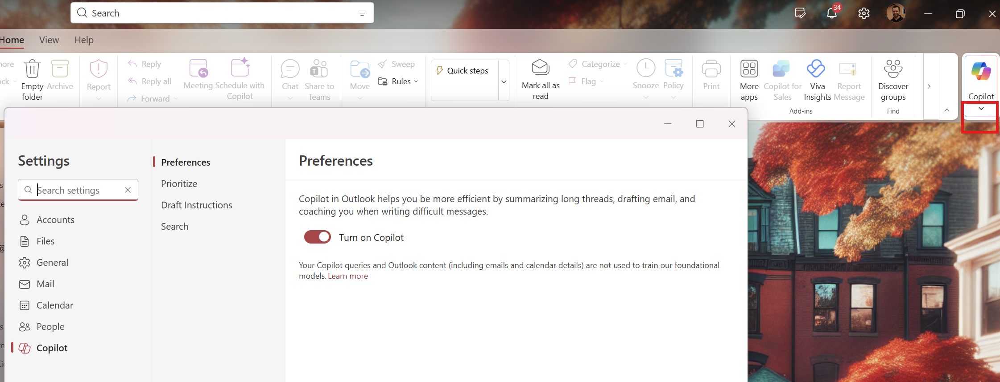
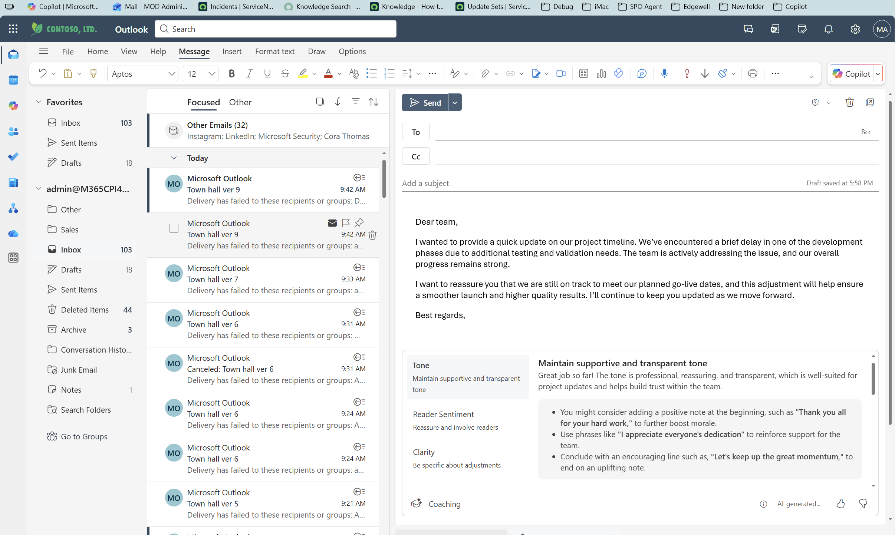
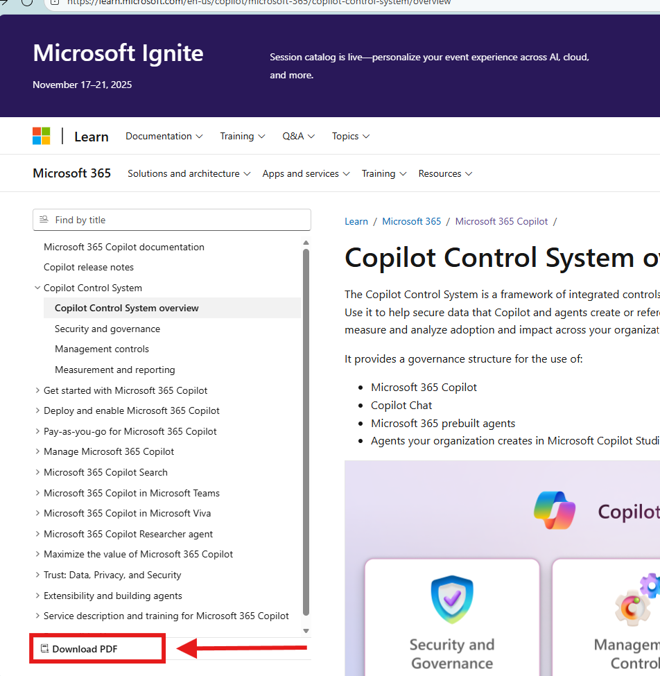

---
task:
    title: 'Arcos Dorados IT'
---

# **Arcos Dorados: IT Edition**

Bienvenido a esta sesión interactiva diseñada para ayudarte a desbloquear todo el potencial de Microsoft Copilot dominando el arte y la ciencia de la creación efectiva de prompts.
Aprenderás técnicas prácticas para crear prompts claros e impactantes que generen valor real para el negocio, ahorren tiempo y aumenten la productividad.

Prepárate para una experiencia práctica y colaborativa, donde experimentarás, iterarás y descubrirás cómo Copilot puede optimizar tus flujos de trabajo y empoderar a tu equipo para lograr más.

---

## Práctica 1: Memoria y Personalización de Copilot

Copilot Memory ofrece una experiencia más personalizada al entrenar a
Copilot con base en tus chats previos, perfil de trabajo, instrucciones
personalizadas, metadatos y más. Esto permite que Copilot te comprenda
mejor y se adapte a tus necesidades.

La Personalización de Copilot utiliza la información de la Memoria de
Copilot para crear interacciones a tu medida. Por ejemplo, puedes
indicarle a Copilot tu estilo de redacción (tono, longitud preferida de
las respuestas, saludos o cierres habituales), lo que ayuda a que los
borradores generados por IA suenen más como tú.

**Guía paso a paso para agregar instrucciones personalizadas**

**Paso 1: Acceder a Copilot**

Abre una nueva pestaña del navegador y navega a
m365.cloud.microsoft/chat (o usa tu método habitual para acceder a
Copilot).

**Paso 2: Agrega instrucciones**

• Haz clic en la configuración seleccionando “…”

• Abre *Settings* y selecciona *Personalization*.


- Luego selecciona *Custom Instructions.*


Puedes agregar tus instrucciones personalizadas en esta sección. Como
referencia, aquí tienes una guía con ejemplos de instrucciones que
puedes agregar a Copilot: Copilot instructions: 

- [Copilot Custom Instructions](https://livesend.microsoft.com/i/rNoOVLzAAYKpEIxHcPLUSSIGNURf0AnaauPLUSSIGNpTT12ioHC1iT2S9v5zfm___ebPPLUSSIGNq8yBBDVxGsPLUSSIGNGevpl4gM20eehkcX55fDwwHvmMnfisgImZ___gDPLUSSIGN7MtPeWjGSVb8I5OJM40FI6OPIj)

## Práctica 2: Guardar Prompts en Copilot

Guardar prompts te ayuda a reutilizar rápidamente instrucciones o
consultas sin tener que escribirlas cada vez. A continuación, se explica
cómo administrarlos y guardarlos:

**Guía paso a paso**

**Paso 1: Acceder a tus Prompts guardados**

1.  Abre Copilot.

2.  Haz clic en *See More*.

3.  Selecciona *Prompt Gallery*.

4.  Ve a *Your Prompts*.

    - Desde aquí, puedes eliminar prompts, compartirlos mediante enlace
      o compartirlos con un equipo.


**Paso 2: Guardar un Prompt**

1.  Comienza ejecutando un prompt, por ejemplo:
   
    ```text
    Crea un briefing en español, tono ejecutivo, para una sesión con el equipo de TI y liderazgo de Arcos Dorados (McDonald’s LATAM). El documento debe tener 1 página (~600–800 palabras) e incluir: resumen ejecutivo, tendencias recientes del sector QSR en LATAM, implicaciones para TI (modernización POS, nube, apps, seguridad, IA generativa), oportunidades para Microsoft 365 Copilot, riesgos y plan de acción 30–60–90 días. Usa encabezados claros, párrafos cortos, resalta 3–5 ideas clave en negrita y cita fuentes recientes.

    ```

3.  Pasa el cursor sobre el prompt.

4.  Haz clic en *Save Prompt*.

5.  Asigna un nombre para fácil referencia.


> **Consejos**  
> • Usa nombres claros para los prompts (por ejemplo, “Weekly Report Summary”).  
> • Comparte los prompts más usados con tu equipo para mantener la coherencia.  
> • Revisa y actualiza periódicamente los prompts guardados para mantenerlos relevantes.

## Práctica 3: Crear y editar un briefing en Copilot, Loop y Word

1.  **Ejecuta el prompt en Copilot**  
    Copia y pega este prompt en Copilot:

    ```text
    Crea un briefing en español, tono ejecutivo, para una sesión con el equipo de TI y liderazgo de Arcos Dorados (McDonald’s LATAM). El documento debe tener 1 página (~600–800 palabras) e incluir: resumen ejecutivo, tendencias recientes del sector QSR en LATAM, implicaciones para TI (modernización POS, nube, apps, seguridad, IA generativa), oportunidades para Microsoft 365 Copilot, riesgos y plan de acción 30–60–90 días. Usa encabezados claros, párrafos cortos, resalta 3–5 ideas clave en negrita y cita fuentes recientes.

    ```

2.  **Selecciona el ícono “Editar en Pages”**

> Esto te permitirá trabajar el contenido en formato de página dentro de
> Loop, con más opciones de edición.
>
>  alt="A screenshot of a computer AI-generated content may be incorrect." />

3.  **Abre en Microsoft Word**  
    En la esquina superior derecha, haz clic en la opción *Abrir en
    Word*. Esto convertirá el contenido en un documento editable en
    Word, donde podrás aplicar formato avanzado, revisar ortografía y
    compartirlo fácilmente.

>  alt="A screenshot of a computer AI-generated content may be incorrect." />

4.  Selecciona “Abrir en Word”

>  alt="A screenshot of a computer AI-generated content may be incorrect." />

## Práctica 4: Trabajar con documentos de Word

- **1.Abre el documento en Word**  
Desde Loop, selecciona la opción **Abrir en Word** (esquina superior
derecha). El documento se abrirá en Word Online o en la aplicación de
escritorio.

- **2. Selecciona “View more”**  
Haz clic en **View more** para ver información adicional generada por
Copilot.

- Copilot mostrará:

  - **Resumen del documento**

  - Sección de **Insights** (ideas clave)

  - **Discussion** (comentarios relevantes)

  - **Activity** (historial de cambios)

> 

- **3. Abre la ventana de Copilot y ejecuta el siguiente prompt**:

    ```text
    Convierte este briefing en una lista de preguntas estratégicas para la sesión
    ```

Copilot transformará el contenido en preguntas que podrás usar para
guiar la conversación con el equipo.

## Práctica 5: Meeting Recap – Decision & Owners

- **Pre-requisitos (rápido)**  
• La reunión debe existir en tu calendario de Teams (ideal si tuvo
transcripción y/o grabación activadas; Copilot tendrá más contexto).  
• Tienes licencia de Microsoft 365 Copilot y la aplicación de Teams
actualizada.

------------------------------------------------------------------------

- **1) Abre Meeting Recap en Teams**

1.  Abre Microsoft Teams.

2.  Ve a *Calendar* en el panel izquierdo.

3.  Selecciona la reunión que quieres trabajar (preferentemente una que
    ya terminó).

4.  En la vista de la reunión, abre la pestaña *Recap* (o *Resumen*).

Qué verás (los nombres pueden variar según tu versión): *Resumen
generado por IA*, *Notas (AI/Manual)*, *Acciones/Tareas*, *Decisiones*,
*Cronología/Chapters*, *Contenido compartido*, *Transcripción* y
*Grabación* (si existen).

------------------------------------------------------------------------

- **2) Revisa rápidamente el contenido clave del Recap**

• *Resumen:* puntos principales y temas tratados.  
• *Acciones/Tareas:* elementos extraídos por IA (verifica responsables y
fechas).  
• *Decisiones:* acuerdos explícitos detectados por Copilot.  
• *Cronología/Chapters:* saltos rápidos a momentos importantes.  
• *Transcripción:* para validar quién dijo qué.

> **Tip:** Copilot ayuda a resumir la conversación en decisiones concretas con responsables y fechas. Esta información estará disponible incluso desde otras experiencias de Copilot, (Teams, Outlook, etc.)

------------------------------------------------------------------------

- **3) Abre Copilot y lanza prompts para “Resumir → Decisiones y Responsables”**

1.  En la misma vista de *Recap*, abre el panel de Copilot (ícono de
    Copilot, normalmente arriba a la derecha).

2.  Ejecuta este *prompt* base para orientar el objetivo:

    ```text
    Resume la reunión en 5–7 puntos y convierte cada punto en una
    decisión con un responsable y una fecha objetivo. Si faltan datos,
    sugiere responsables y fechas tentativas basándote en el contexto de
    la conversación.
    ```  

- **Prompts específicos para “Decisiones y Responsables” (elige o combina según necesites):**  

    ```text
    Extrae todas las decisiones explícitas e implícitas. Para cada una,sugiere responsable, fecha objetivo y primer siguiente paso.
    ```   

    ```text
    Crea una tabla con: Decisión \| Responsable \| Fecha objetivo \| Primer siguiente paso \| Riesgo/Bloqueador asociado. 
    ```   

    ```text
    ¿Quién se comprometió a qué durante la reunión? Normaliza los compromisos como tareas accionables. 
    ```  

    ```text
    Identifica riesgos y dependencias mencionadas y asigna un owner de mitigación.
    ```  

    ```text
    Genera un plan 30–60–90 días a partir de las decisiones tomadas, con hitos y responsables.
    ```  

- **4) Da forma final a “Decisiones y Responsables”**

- Pide el resultado como tabla para facilitar su uso:  

    ```text
    Reestructura el resultado en una tabla. Campos: Decisión \| Owner \| Due date \| Next step \| Estado (Nuevo/En curso) \| Referencia(timestamp de la transcripción).
    ``` 

## Práctica 6: Resumir y Recapitular Correos en Outlook

Usa Copilot Chat en Outlook para extraer solicitudes clave y fechas límite de los hilos de correo.

**Sample Prompt:**
```text
    Recapitula mi correo y muéstrame:
    1. Qué se está pidiendo
    2. Qué se le está pidiendo al equipo
    3. Qué se me está pidiendo directamente a mí
    Enumera fechas y temas en una tabla
```

> **TIP:** También puedes agregar instrucciones personalizadas para que Copilot priorice ciertos temas o formatos al generar los resúmenes.
> Accede a opciones avanzadas
> 
> 


> **TIP:** puedes usar la función de **Coaching** para que Copilot proporcione sugerencias a tus correos electróicos. Por ejemploÑ
> ```text
> Dear team,
>
> I wanted to provide a quick update on our project timeline. We’ve encountered a brief delay in one of the development phases due to additional testing and validation needs. The team is actively addressing the issue, and our overall progress remains strong.
>
> I want to reassure you that we are still on track to meet our planned go-live dates, and this adjustment will help ensure a smoother launch and higher quality results. I’ll continue to keep you updated as we move forward.
>
> Best regards,
> ```
>
> 


---


# Ejercicio: Realizar investigación en línea usando Agentes

## Práctica 7: Agente Researcher - Crea un documento técnico (whitepaper)

> **IMPORTANTE:** Los pasos 1–4 deben completarse al inicio de la sesión para darle a Researcher suficiente tiempo para completar el primer prompt.

1. Abre **Researcher** desde la navegación izquierda en la aplicación de Copilot.  

      

1. Escribe el siguiente prompt::

    ```text
    Crea un documento técnico (whitepaper) que describa las mejores prácticas para adoptar Copilot y herramientas de IA generativa en toda una empresa.
Incluye secciones sobre gestión del cambio, preparación de los empleados, concientización sobre privacidad de datos y uso responsable de la IA.
Proporciona ejemplos de cómo las organizaciones líderes están equilibrando la innovación con la gobernanza, y destaca las lecciones aprendidas de las primeras implementaciones de Copilot para garantizar productividad, confianza y cumplimiento.
    ```

1. Adjunta los archivos de referencia usando `/` (apunta a SharePoint/OneDrive):  

   - **/SprintCycle Charger Product Launch.docx**  
   - *(Optional)* **/Contoso - PedalPerks GTM Plan.docx**  

1. Haz clic **Submit**.  

**Researcher hará lo siguiente:**

- Combinará información de archivos internos y de la web.
- Estructurará un plan de marketing con recomendaciones sobre canales y estrategia de contenido.
- Citará las fuentes para que puedas validar su trabajo.

> **Nota:** Researcher muestra su ruta de razonamiento (“chain of thought”) y puede invocar a otros agentes cuando sea necesario. 


### Task 3: Crear y Probar tu Agente  

Crea un agente relacionado con tu rol o usa la siguiente guía para crear tu primer agente en **Copilot Studio Lite.**

**Pasos:**  

1. En el menñu de **Copilot**, selecciona **Create agent**.

     

2. En la pestaña **Describe**, redacta las instrucciones de tu agente. Por ejemplo:  

   ```text
   Tú eres un agente que me ayudará a resolver dudas sobre Copilot: cómo utilizar la herramienta, cómo crear agentes en Copilot Studio y cómo aplicar sus funciones en los escenarios de Arcos Dorados.
   ```  

     

3. Selecciona la pestaña **Configure** y agrega una fuente de conocimiento (por ejemplo, archivos, sitios de SharePoint o páginas web).

    

   Navega al siguiente URL: (https://learn.microsoft.com/en-us/copilot/microsoft-365/copilot-control-system/overview)

   Y luego descarga la documentación en PDF y agrega el archivo al agente:

      
   
   

5. Prueba tu agente usando el panel Test y ajústalo según sea necesario.  
6. Selecciona **Create** para publicar tu agente y comenzar a usarlo. 

> **TIP:** Empieza con un agente sencillo que responda preguntas frecuentes del equipo, como “¿Dónde encuentro la guía de Copilot?” o “¿Cómo puedo solicitar acceso a Copilot Studio?”. Luego, amplía sus capacidades gradualmente.


## Prompting Best Practices

- Break down complex tasks into manageable steps.
- Use persona-based prompting for specialized guidance.
- Ask Copilot what information it needs for success.
- Take a holistic approach—consider entire processes, not just tasks.
- Be curious and experiment with prompt structures.
- Test and refine your prompts for better results.

---

## Get Started

Partner with us to build a business case, explore pre-built agents, and keep up with Copilot news on WorkLab: https://www.microsoft.com/en-us/worklab/ai-at-work/
