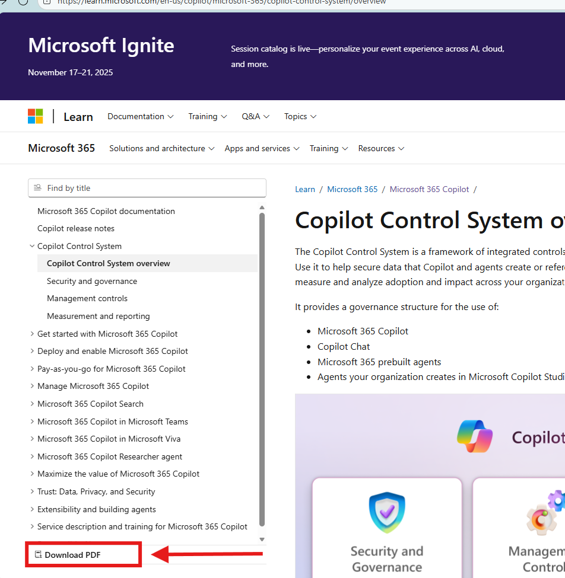

<html lang="en">
<head>
<meta charset="UTF-8">
<meta name="viewport" content="width=device-width, initial-scale=1.0">
<title>Arcos Dorados — IT Edition | Learning</title>
<link rel="stylesheet" href="../../Allfiles/demo-style.css">
<style>:root { --hero-from: #B71C1C; --hero-via: #D32F2F; --hero-to: #FFC107; }</style>
</head>
<body>

<div class="back-bar">
  <a href="https://emontes07.github.io/Learning/">← Back to Index</a>
</div>

<button class="sidebar-toggle" onclick="openSidebar()" aria-label="Open menu">☰ Menu</button>

<div class="hero">
  <div class="hero-inner">
    <h1>💻 Arcos Dorados — IT Edition</h1>
    <p class="subtitle">Sesión interactiva para equipos de IT con Copilot.</p>
    <div class="hero-meta">
      <span>💻 IT</span>
      <span>🍔 Arcos Dorados</span>
      <span>💬 Copilot</span>
    </div>
  </div>
</div>

<div class="sidebar-overlay" id="sidebarOverlay" onclick="closeSidebar()"></div>

<div class="layout">

<nav class="sidebar" id="sidebar">
  <a class="sb-home" href="https://emontes07.github.io/Learning/">← Back to Index</a>
  <div class="sb-title">IT Edition</div>

  <a href="#sec-intro" class="section-link">Overview</a>
  <a href="#part1-práctica-1-memoria-y-personalización-de-copilot" class="part-link">Práctica 1: Memoria y Personalización de Copilot</a>
  <a href="#part2-práctica-2-guardar-prompts-en-copilot" class="part-link">Práctica 2: Guardar Prompts en Copilot</a>
  <a href="#part3-práctica-3-crear-y-editar-un-briefing-en-copilot-loop-y-word" class="part-link">Práctica 3: Crear y editar un briefing en Copilot, Loop y Word</a>
  <a href="#part4-práctica-4-trabajar-con-documentos-de-word" class="part-link">Práctica 4: Trabajar con documentos de Word</a>
  <a href="#part5-práctica-5-meeting-recap-decision-owners" class="part-link">Práctica 5: Meeting Recap – Decision & Owners</a>
  <a href="#part6-práctica-6-resumir-y-recapitular-correos-en-outlook" class="part-link">Práctica 6: Resumir y Recapitular Correos en Outlook</a>
  <a href="#part7-práctica-7-agente-researcher-crea-un-documento-técnico-white" class="part-link">Práctica 7: Agente Researcher - Crea un documento técnico (whitepaper)</a>
  <a href="#part8-prompting-framework-gcse" class="part-link">Prompting Framework: GCSE</a>
  <a href="#part9-prompting-best-practices" class="part-link">Prompting Best Practices</a>
  <a href="#part10-get-started" class="part-link">Get Started</a>
</nav>

<div class="main-content">

<div class="section" id="sec-intro">
<div markdown="1">

Bienvenido a esta sesión interactiva diseñada para ayudarte a desbloquear todo el potencial de Microsoft Copilot dominando el arte y la ciencia de la creación efectiva de prompts.
Aprenderás técnicas prácticas para crear prompts claros e impactantes que generen valor real para el negocio, ahorren tiempo y aumenten la productividad.

Prepárate para una experiencia práctica y colaborativa, donde experimentarás, iterarás y descubrirás cómo Copilot puede optimizar tus flujos de trabajo y empoderar a tu equipo para lograr más.

---

</div>
</div>

<div class="part-card" id="part1-práctica-1-memoria-y-personalización-de-copilot">
  <div class="part-header-bar blue"></div>
  <div class="part-header" onclick="togglePart('body1', this)">
    <h2>Práctica 1: Memoria y Personalización de Copilot</h2>
    <span class="toggle-icon open">▾</span>
  </div>
  <div class="part-body" id="body1">
<div markdown="1">

Copilot Memory ofrece una experiencia más personalizada al entrenar a
Copilot con base en tus chats previos, perfil de trabajo, instrucciones
personalizadas, metadatos y más. Esto permite que Copilot te comprenda
mejor y se adapte a tus necesidades.

La Personalización de Copilot utiliza la información de la Memoria de
Copilot para crear interacciones a tu medida. Por ejemplo, puedes
indicarle a Copilot tu estilo de redacción (tono, longitud preferida de
las respuestas, saludos o cierres habituales), lo que ayuda a que los
borradores generados por IA suenen más como tú.

**Guía paso a paso para agregar instrucciones personalizadas**

**Paso 1: Acceder a Copilot**

Abre una nueva pestaña del navegador y navega a
m365.cloud.microsoft/chat (o usa tu método habitual para acceder a
Copilot).

**Paso 2: Agrega instrucciones**

• Haz clic en la configuración seleccionando “…”

• Abre *Settings* y selecciona *Personalization*.


- Luego selecciona *Custom Instructions.*


Puedes agregar tus instrucciones personalizadas en esta sección. Como
referencia, aquí tienes una guía con ejemplos de instrucciones que
puedes agregar a Copilot: Copilot instructions: 

- [Copilot Custom Instructions](https://livesend.microsoft.com/i/rNoOVLzAAYKpEIxHcPLUSSIGNURf0AnaauPLUSSIGNpTT12ioHC1iT2S9v5zfm___ebPPLUSSIGNq8yBBDVxGsPLUSSIGNGevpl4gM20eehkcX55fDwwHvmMnfisgImZ___gDPLUSSIGN7MtPeWjGSVb8I5OJM40FI6OPIj)

</div>
  </div>
</div>

<div class="part-card" id="part2-práctica-2-guardar-prompts-en-copilot">
  <div class="part-header-bar green"></div>
  <div class="part-header" onclick="togglePart('body2', this)">
    <h2>Práctica 2: Guardar Prompts en Copilot</h2>
    <span class="toggle-icon open">▾</span>
  </div>
  <div class="part-body" id="body2">
<div markdown="1">

Guardar prompts te ayuda a reutilizar rápidamente instrucciones o
consultas sin tener que escribirlas cada vez. A continuación, se explica
cómo administrarlos y guardarlos:

**Guía paso a paso**

**Paso 1: Acceder a tus Prompts guardados**

1.  Abre Copilot.

2.  Haz clic en *See More*.

3.  Selecciona *Prompt Gallery*.

4.  Ve a *Your Prompts*.

    - Desde aquí, puedes eliminar prompts, compartirlos mediante enlace
      o compartirlos con un equipo.


**Paso 2: Guardar un Prompt**

1.  Comienza ejecutando un prompt, por ejemplo:

</div>

<div class="prompt-box">    Crea un briefing en español, tono ejecutivo, para una sesión con el equipo de TI y liderazgo de Arcos Dorados (McDonald’s LATAM). El documento debe tener 1 página (~600–800 palabras) e incluir: resumen ejecutivo, tendencias recientes del sector QSR en LATAM, implicaciones para TI (modernización POS, nube, apps, seguridad, IA generativa), oportunidades para Microsoft 365 Copilot, riesgos y plan de acción 30–60–90 días. Usa encabezados claros, párrafos cortos, resalta 3–5 ideas clave en negrita y cita fuentes recientes.<br><button class="copy-btn" onclick="copyPrompt(this)">Copy</button></div>

<div markdown="1">

3.  Pasa el cursor sobre el prompt.

4.  Haz clic en *Save Prompt*.

5.  Asigna un nombre para fácil referencia.


> **Consejos**  
> • Usa nombres claros para los prompts (por ejemplo, “Weekly Report Summary”).  
> • Comparte los prompts más usados con tu equipo para mantener la coherencia.  
> • Revisa y actualiza periódicamente los prompts guardados para mantenerlos relevantes.

</div>
  </div>
</div>

<div class="part-card" id="part3-práctica-3-crear-y-editar-un-briefing-en-copilot-loop-y-word">
  <div class="part-header-bar purple"></div>
  <div class="part-header" onclick="togglePart('body3', this)">
    <h2>Práctica 3: Crear y editar un briefing en Copilot, Loop y Word</h2>
    <span class="toggle-icon open">▾</span>
  </div>
  <div class="part-body" id="body3">
<div markdown="1">

1.  **Ejecuta el prompt en Copilot**  
    Copia y pega este prompt en Copilot:

</div>

<div class="prompt-box">    Crea un briefing en español, tono ejecutivo, para una sesión con el equipo de TI y liderazgo de Arcos Dorados (McDonald’s LATAM). El documento debe tener 1 página (~600–800 palabras) e incluir: resumen ejecutivo, tendencias recientes del sector QSR en LATAM, implicaciones para TI (modernización POS, nube, apps, seguridad, IA generativa), oportunidades para Microsoft 365 Copilot, riesgos y plan de acción 30–60–90 días. Usa encabezados claros, párrafos cortos, resalta 3–5 ideas clave en negrita y cita fuentes recientes.<br><button class="copy-btn" onclick="copyPrompt(this)">Copy</button></div>

<div markdown="1">

2.  **Selecciona el ícono “Editar en Pages”**

> Esto te permitirá trabajar el contenido en formato de página dentro de
> Loop, con más opciones de edición.
>
>  alt="A screenshot of a computer AI-generated content may be incorrect." />

3.  **Abre en Microsoft Word**  
    En la esquina superior derecha, haz clic en la opción *Abrir en
    Word*. Esto convertirá el contenido en un documento editable en
    Word, donde podrás aplicar formato avanzado, revisar ortografía y
    compartirlo fácilmente.

>  alt="A screenshot of a computer AI-generated content may be incorrect." />

4.  Selecciona “Abrir en Word”

>  alt="A screenshot of a computer AI-generated content may be incorrect." />

</div>
  </div>
</div>

<div class="part-card" id="part4-práctica-4-trabajar-con-documentos-de-word">
  <div class="part-header-bar orange"></div>
  <div class="part-header" onclick="togglePart('body4', this)">
    <h2>Práctica 4: Trabajar con documentos de Word</h2>
    <span class="toggle-icon open">▾</span>
  </div>
  <div class="part-body" id="body4">
<div markdown="1">

- **1.Abre el documento en Word**  
Desde Loop, selecciona la opción **Abrir en Word** (esquina superior
derecha). El documento se abrirá en Word Online o en la aplicación de
escritorio.

- **2. Selecciona “View more”**  
Haz clic en **View more** para ver información adicional generada por
Copilot.

- Copilot mostrará:

  - **Resumen del documento**

  - Sección de **Insights** (ideas clave)

  - **Discussion** (comentarios relevantes)

  - **Activity** (historial de cambios)

> 

- **3. Abre la ventana de Copilot y ejecuta el siguiente prompt**:

</div>

<div class="prompt-box">    Convierte este briefing en una lista de preguntas estratégicas para la sesión<button class="copy-btn" onclick="copyPrompt(this)">Copy</button></div>

<div markdown="1">

Copilot transformará el contenido en preguntas que podrás usar para
guiar la conversación con el equipo.

</div>
  </div>
</div>

<div class="part-card" id="part5-práctica-5-meeting-recap-decision-owners">
  <div class="part-header-bar teal"></div>
  <div class="part-header" onclick="togglePart('body5', this)">
    <h2>Práctica 5: Meeting Recap – Decision & Owners</h2>
    <span class="toggle-icon open">▾</span>
  </div>
  <div class="part-body" id="body5">
<div markdown="1">

- **Pre-requisitos (rápido)**  
• La reunión debe existir en tu calendario de Teams (ideal si tuvo
transcripción y/o grabación activadas; Copilot tendrá más contexto).  
• Tienes licencia de Microsoft 365 Copilot y la aplicación de Teams
actualizada.

------------------------------------------------------------------------

- **1) Abre Meeting Recap en Teams**

1.  Abre Microsoft Teams.

2.  Ve a *Calendar* en el panel izquierdo.

3.  Selecciona la reunión que quieres trabajar (preferentemente una que
    ya terminó).

4.  En la vista de la reunión, abre la pestaña *Recap* (o *Resumen*).

Qué verás (los nombres pueden variar según tu versión): *Resumen
generado por IA*, *Notas (AI/Manual)*, *Acciones/Tareas*, *Decisiones*,
*Cronología/Chapters*, *Contenido compartido*, *Transcripción* y
*Grabación* (si existen).

> 

------------------------------------------------------------------------

- **2) Revisa rápidamente el contenido clave del Recap**

• *Resumen:* puntos principales y temas tratados.  
• *Acciones/Tareas:* elementos extraídos por IA (verifica responsables y
fechas).  
• *Decisiones:* acuerdos explícitos detectados por Copilot.  
• *Cronología/Chapters:* saltos rápidos a momentos importantes.  
• *Transcripción:* para validar quién dijo qué.

> **Tip:** Copilot ayuda a resumir la conversación en decisiones concretas con responsables y fechas. Esta información estará disponible incluso desde otras experiencias de Copilot, (Teams, Outlook, etc.)

------------------------------------------------------------------------

- **3) Abre Copilot y lanza prompts para “Resumir → Decisiones y Responsables”**

1.  En la misma vista de *Recap*, abre el panel de Copilot (ícono de
    Copilot, normalmente arriba a la derecha).

2.  Ejecuta este *prompt* base para orientar el objetivo:

</div>

<div class="prompt-box">    Resume la reunión en 5–7 puntos y convierte cada punto en una<br>    decisión con un responsable y una fecha objetivo. Si faltan datos,<br>    sugiere responsables y fechas tentativas basándote en el contexto de<br>    la conversación.<button class="copy-btn" onclick="copyPrompt(this)">Copy</button></div>

<div markdown="1">

- **Prompts específicos para “Decisiones y Responsables” (elige o combina según necesites):**

</div>

<div class="prompt-box">    Extrae todas las decisiones explícitas e implícitas. Para cada una,sugiere responsable, fecha objetivo y primer siguiente paso.<button class="copy-btn" onclick="copyPrompt(this)">Copy</button></div>

<div class="prompt-box">    Crea una tabla con: Decisión \| Responsable \| Fecha objetivo \| Primer siguiente paso \| Riesgo/Bloqueador asociado. <button class="copy-btn" onclick="copyPrompt(this)">Copy</button></div>

<div class="prompt-box">    ¿Quién se comprometió a qué durante la reunión? Normaliza los compromisos como tareas accionables. <button class="copy-btn" onclick="copyPrompt(this)">Copy</button></div>

<div class="prompt-box">    Identifica riesgos y dependencias mencionadas y asigna un owner de mitigación.<button class="copy-btn" onclick="copyPrompt(this)">Copy</button></div>

<div class="prompt-box">    Genera un plan 30–60–90 días a partir de las decisiones tomadas, con hitos y responsables.<button class="copy-btn" onclick="copyPrompt(this)">Copy</button></div>

<div markdown="1">

- **4) Da forma final a “Decisiones y Responsables”**

- Pide el resultado como tabla para facilitar su uso:

</div>

<div class="prompt-box">    Reestructura el resultado en una tabla. Campos: Decisión \| Owner \| Due date \| Next step \| Estado (Nuevo/En curso) \| Referencia(timestamp de la transcripción).<button class="copy-btn" onclick="copyPrompt(this)">Copy</button></div>

<div markdown="1">

> **Tip:** Durante la reunión, utiliza Facilitator para mantener el enfoque en los temas clave y registrar acuerdos en tiempo real. Además, puedes hacerle preguntas o solicitarle resúmenes directamente mencionándolo con “@Facilitator” en el chat de la reunión.

> **Tip:** Usa el agente Translator para comunicarte con participantes que hablen otros idiomas durante la reunión.

</div>
  </div>
</div>

<div class="part-card" id="part6-práctica-6-resumir-y-recapitular-correos-en-outlook">
  <div class="part-header-bar navy"></div>
  <div class="part-header" onclick="togglePart('body6', this)">
    <h2>Práctica 6: Resumir y Recapitular Correos en Outlook</h2>
    <span class="toggle-icon open">▾</span>
  </div>
  <div class="part-body" id="body6">
<div markdown="1">

Usa Copilot Chat en Outlook para extraer solicitudes clave y fechas límite de los hilos de correo.

**Sample Prompt:**

</div>

<div class="prompt-box">    Recapitula mi correo y muéstrame:<br>    1. Qué se está pidiendo<br>    2. Qué se le está pidiendo al equipo<br>    3. Qué se me está pidiendo directamente a mí<br>    Enumera fechas y temas en una tabla<button class="copy-btn" onclick="copyPrompt(this)">Copy</button></div>

<div markdown="1">

> **TIP:** También puedes agregar instrucciones personalizadas para que Copilot priorice ciertos temas o formatos al generar los resúmenes.
> Accede a opciones avanzadas
> 
> 


> **TIP:** puedes usar la función de **Coaching** para que Copilot proporcione sugerencias a tus correos electróicos. Por ejemploÑ
> ```text
> Dear team,
>
> I wanted to provide a quick update on our project timeline. We’ve encountered a brief delay in one of the development phases due to additional testing and validation needs. The team is actively addressing the issue, and our overall progress remains strong.
>
> I want to reassure you that we are still on track to meet our planned go-live dates, and this adjustment will help ensure a smoother launch and higher quality results. I’ll continue to keep you updated as we move forward.
>
> Best regards,
> ```
>
> 


---


# Ejercicio: Realizar investigación en línea usando Agentes

</div>
  </div>
</div>

<div class="part-card" id="part7-práctica-7-agente-researcher-crea-un-documento-técnico-white">
  <div class="part-header-bar magenta"></div>
  <div class="part-header" onclick="togglePart('body7', this)">
    <h2>Práctica 7: Agente Researcher - Crea un documento técnico (whitepaper)</h2>
    <span class="toggle-icon open">▾</span>
  </div>
  <div class="part-body" id="body7">
<div markdown="1">

> **IMPORTANTE:** Los pasos 1–4 deben completarse al inicio de la sesión para darle a Researcher suficiente tiempo para completar el primer prompt.

1. Abre **Researcher** desde la navegación izquierda en la aplicación de Copilot.  

      

1. Escribe el siguiente prompt::

</div>

<div class="prompt-box">    Crea un documento técnico (whitepaper) que describa las mejores prácticas para adoptar Copilot y herramientas de IA generativa en toda una empresa.<br>Incluye secciones sobre gestión del cambio, preparación de los empleados, concientización sobre privacidad de datos y uso responsable de la IA.<br>Proporciona ejemplos de cómo las organizaciones líderes están equilibrando la innovación con la gobernanza, y destaca las lecciones aprendidas de las primeras implementaciones de Copilot para garantizar productividad, confianza y cumplimiento.<button class="copy-btn" onclick="copyPrompt(this)">Copy</button></div>

<div markdown="1">

1. Adjunta los archivos de referencia usando `/` (apunta a SharePoint/OneDrive):  

   - **/SprintCycle Charger Product Launch.docx**  
   - *(Optional)* **/Contoso - PedalPerks GTM Plan.docx**  

1. Haz clic **Submit**.  

**Researcher hará lo siguiente:**

- Combinará información de archivos internos y de la web.
- Estructurará un plan de marketing con recomendaciones sobre canales y estrategia de contenido.
- Citará las fuentes para que puedas validar su trabajo.

> **Nota:** Researcher muestra su ruta de razonamiento (“chain of thought”) y puede invocar a otros agentes cuando sea necesario. 


### Task 3: Crear y Probar tu Agente  

Crea un agente relacionado con tu rol o usa la siguiente guía para crear tu primer agente en **Copilot Studio Lite.**

**Pasos:**  

1. En el menñu de **Copilot**, selecciona **Create agent**.

     

2. En la pestaña **Describe**, redacta las instrucciones de tu agente. Por ejemplo:

</div>

<div class="prompt-box">   Tú eres un agente que me ayudará a resolver dudas sobre Copilot: cómo utilizar la herramienta, cómo crear agentes en Copilot Studio y cómo aplicar sus funciones en los escenarios de Arcos Dorados.<button class="copy-btn" onclick="copyPrompt(this)">Copy</button></div>

<div markdown="1">

  

3. Selecciona la pestaña **Configure** y agrega una fuente de conocimiento (por ejemplo, archivos, sitios de SharePoint o páginas web).

    

   Navega al siguiente URL: (https://learn.microsoft.com/en-us/copilot/microsoft-365/copilot-control-system/overview)

   Y luego descarga la documentación en PDF y agrega el archivo al agente:
   
   

5. Prueba tu agente usando el panel Test y ajústalo según sea necesario.  
6. Selecciona **Create** para publicar tu agente y comenzar a usarlo. 

> **TIP:** Empieza con un agente sencillo que responda preguntas frecuentes del equipo, como “¿Dónde encuentro la guía de Copilot?” o “¿Cómo puedo solicitar acceso a Copilot Studio?”. Luego, amplía sus capacidades gradualmente.


---

</div>
  </div>
</div>

<div class="part-card" id="part8-prompting-framework-gcse">
  <div class="part-header-bar blue"></div>
  <div class="part-header" onclick="togglePart('body8', this)">
    <h2>Prompting Framework: GCSE</h2>
    <span class="toggle-icon open">▾</span>
  </div>
  <div class="part-body" id="body8">
<div markdown="1">

To get the best results from Copilot, use the GCSE framework: 

  

- **Goal**: What do you want Copilot to do?
- **Context**: Why do you need it? Who is involved?
- **Source**: What information or samples should Copilot use?
- **Expectations**: How should Copilot respond? (Format, tone, detail)

**TIP:** If your prompt is too short, you’ll get generic results. If it’s too long, Copilot might miss instructions. Aim for clarity and specificity.

---

</div>
  </div>
</div>

<div class="part-card" id="part9-prompting-best-practices">
  <div class="part-header-bar green"></div>
  <div class="part-header" onclick="togglePart('body9', this)">
    <h2>Prompting Best Practices</h2>
    <span class="toggle-icon open">▾</span>
  </div>
  <div class="part-body" id="body9">
<div markdown="1">

- Break down complex tasks into manageable steps.
- Use persona-based prompting for specialized guidance.
- Ask Copilot what information it needs for success.
- Take a holistic approach—consider entire processes, not just tasks.
- Be curious and experiment with prompt structures.
- Test and refine your prompts for better results.

---

</div>
  </div>
</div>

<div class="part-card" id="part10-get-started">
  <div class="part-header-bar purple"></div>
  <div class="part-header" onclick="togglePart('body10', this)">
    <h2>Get Started</h2>
    <span class="toggle-icon open">▾</span>
  </div>
  <div class="part-body" id="body10">
<div markdown="1">

Partner with us to build a business case, explore pre-built agents, and keep up with Copilot news on WorkLab: https://www.microsoft.com/en-us/worklab/ai-at-work/

</div>
  </div>
</div>


</div><!-- /main-content -->
</div><!-- /layout -->

<script src="../../Allfiles/demo-script.js"></script>
</body>
</html>
