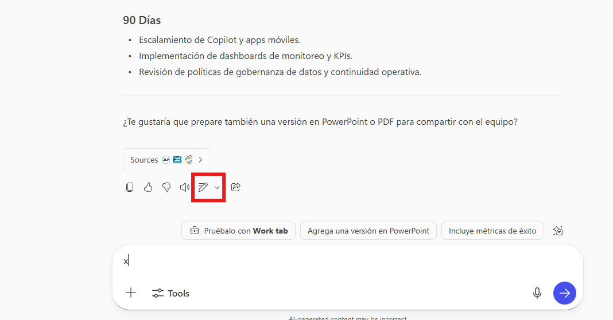
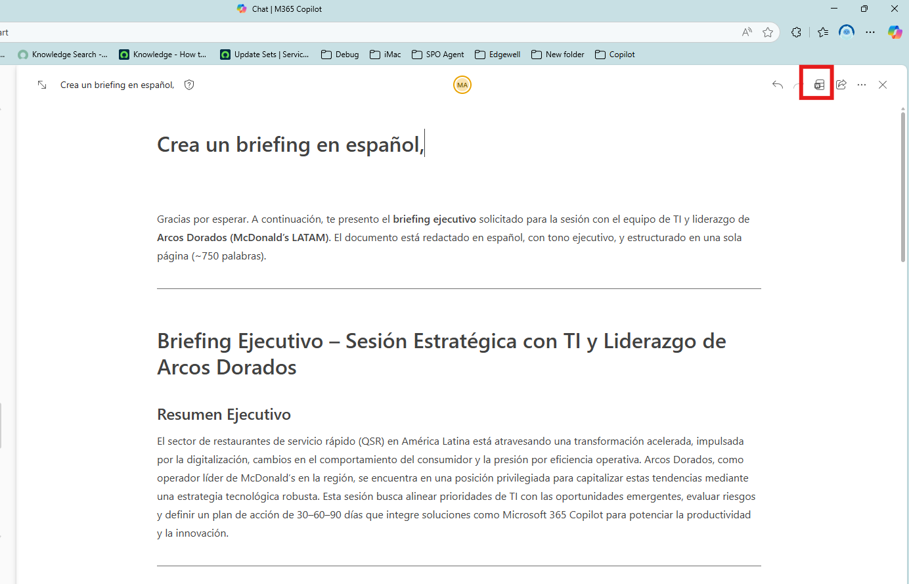
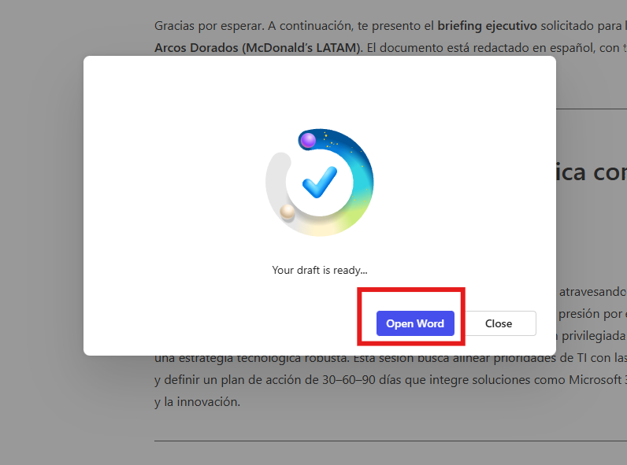
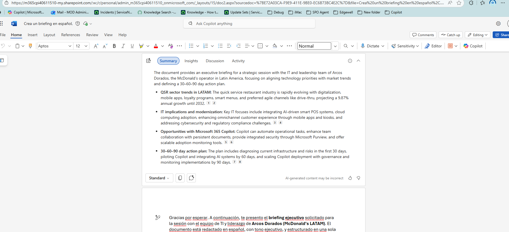
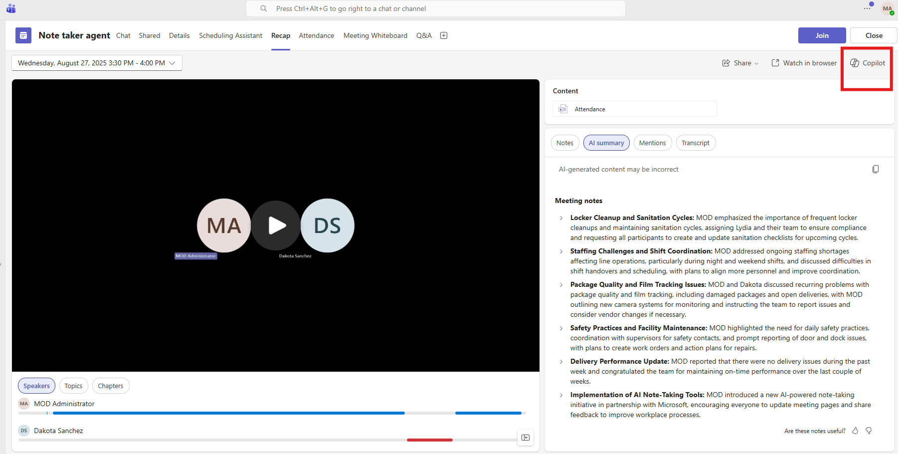
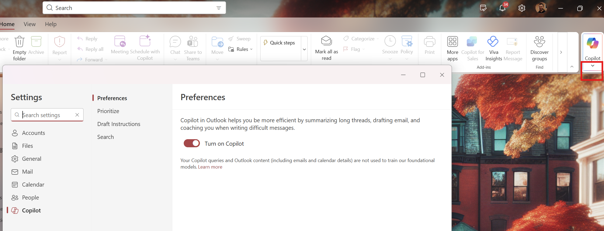
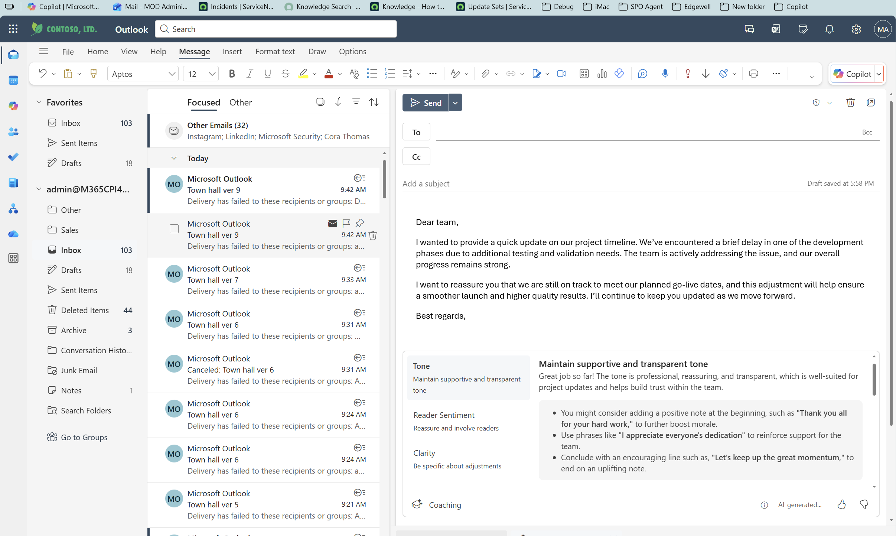

<html lang="en">
<head>
<meta charset="UTF-8">
<meta name="viewport" content="width=device-width, initial-scale=1.0">
<title>Arcos Dorados — Executives Edition | Learning</title>
<link rel="stylesheet" href="../../Allfiles/demo-style.css">

</head>
<body>

  <a href="https://emontes07.github.io/Learning/">← Back to Index</a>

<button class="sidebar-toggle" onclick="openSidebar()" aria-label="Open menu">☰ Menu</button>

  

    <h1>👔 Arcos Dorados — Executives Edition</h1>
    
Crea prompts efectivos para decisiones estratégicas.

    

      👔 Executives
      🍔 Arcos Dorados
      💬 Copilot
    

  

<nav class="sidebar" id="sidebar">
  <a class="sb-home" href="https://emontes07.github.io/Learning/">← Back to Index</a>
  
Executives Edition

  <a href="#sec-intro" class="section-link">Overview</a>
  <a href="#part1-sección-1-ejemplo-de-búsqueda-vs-razonamiento" class="part-link">Sección 1: Ejemplo de búsqueda vs razonamiento</a>
  <a href="#part2-sección-2-información-estratégica-para-ejecutivos-arcos-dora" class="part-link">Sección 2: Información estratégica para ejecutivos (Arcos Dorados)</a>
  <a href="#part3-sección-3-preparación-de-earnings-calls-con-copilot" class="part-link">Sección 3: Preparación de Earnings Calls con Copilot</a>
  <a href="#part4-práctica-1-guardar-prompts-en-copilot" class="part-link">Práctica 1: Guardar Prompts en Copilot</a>
  <a href="#part5-práctica-2-memoria-y-personalización-de-copilot" class="part-link">Práctica 2: Memoria y Personalización de Copilot</a>
  <a href="#part6-práctica-3-crear-y-editar-un-briefing-en-copilot-loop-y-word" class="part-link">Práctica 3: Crear y editar un briefing en Copilot, Loop y Word</a>
  <a href="#part7-práctica-4-trabajar-con-documentos-de-word" class="part-link">Práctica 4: Trabajar con documentos de Word</a>
  <a href="#part8-práctica-5-meeting-recap-decision-owners" class="part-link">Práctica 5: Meeting Recap – Decision & Owners</a>
  <a href="#part9-práctica-6-resumir-y-recapitular-correos-en-outlook" class="part-link">Práctica 6: Resumir y Recapitular Correos en Outlook</a>
  <a href="#part10-práctica-7-agente-researcher-crea-un-documento-técnico-white" class="part-link">Práctica 7: Agente Researcher - Crea un documento técnico (whitepaper)</a>
  <a href="#part11-qué-es-un-notebook" class="part-link">¿Qué es un Notebook?</a>
  <a href="#part12-pasos-para-usar-notebooks" class="part-link">Pasos para usar Notebooks</a>
  <a href="#part13-ejercicio-sugerido-para-practicar" class="part-link">Ejercicio sugerido para practicar</a>
  <a href="#part14-resultado-final" class="part-link">Resultado final</a>
  <a href="#part15-prompting-framework-gcse" class="part-link">Prompting Framework: GCSE</a>
  <a href="#part16-prompting-best-practices" class="part-link">Prompting Best Practices</a>
  <a href="#part17-get-started" class="part-link">Get Started</a>
</nav>

Bienvenido a esta sesión interactiva diseñada para ayudarte a desbloquear todo el potencial de Microsoft Copilot dominando el arte y la ciencia de la creación efectiva de prompts.
Aprenderás técnicas prácticas para crear prompts claros e impactantes que generen valor real para el negocio, ahorren tiempo y aumenten la productividad.

Prepárate para una experiencia práctica y colaborativa, donde experimentarás, iterarás y descubrirás cómo Copilot puede optimizar tus flujos de trabajo y empoderar a tu equipo para lograr más.

---

  

  

    <h2>Sección 1: Ejemplo de búsqueda vs razonamiento</h2>
    ▾
  

  

Objetivo: Mostrar cómo Copilot responde preguntas simples y luego razona con datos estratégicos.

**Pasos**:

- Abre una nueva pestaña del navegador y navega a [M365copilot.com](https://m365copilot.com/).  
- Asegúrate de que la pestaña Modo Web esté seleccionada en Copilot Chat:

    

Prompt 1 (búsqueda simple)

¿Cuántos restaurantes opera Arcos Dorados en Latinoamérica?<button class="copy-btn" onclick="copyPrompt(this)">Copy</button>

¿Cuántos restaurantes opera Arcos Dorados en Latinoamérica?
> **Nota:** Copilot obtiene el dato desde fuentes públicas o reportes trimestrales.

Prompt 2 (razonamiento)

Si Arcos Dorados quisiera aumentar un 10% el número de restaurantes en Brasil, ¿cuántos nuevos locales tendría que abrir?<button class="copy-btn" onclick="copyPrompt(this)">Copy</button>

> **Nota:** Copilot calcula con base en la cifra inicial y proyecta el incremento.

Prompt 3 (comparación rápida)

¿Cómo se compara el número de restaurantes de Arcos Dorados con el de Burger King en la región?<button class="copy-btn" onclick="copyPrompt(this)">Copy</button>

> **Nota:** Copilot genera una tabla comparativa usando datos públicos.

  

  

  

    <h2>Sección 2: Información estratégica para ejecutivos (Arcos Dorados)</h2>
    ▾
  

  

Objetivo: Mostrar cómo Copilot puede generar insights valiosos para la toma de decisiones usando fuentes públicas.

Metas técnicas y operativas:

¿Cuáles son las metas técnicas y operativas de Arcos Dorados según sus últimas llamadas de resultados y reportes trimestrales?<button class="copy-btn" onclick="copyPrompt(this)">Copy</button>

Antecedentes de la marca:

Dame un panorama completo sobre Arcos Dorados y qué los hace únicos como marca en la industria de comida rápida en Latinoamérica.<button class="copy-btn" onclick="copyPrompt(this)">Copy</button>

Comparación con competidores:

Compara el desempeño de ingresos de Arcos Dorados con competidores (por ejemplo, McDonald’s Corp, Burger King, Subway) y muestra los datos en una tabla.<button class="copy-btn" onclick="copyPrompt(this)">Copy</button>

Métricas de empleados:

Usando estos competidores, agrega el número de empleados y el ingreso por empleado en una tabla comparativa.<button class="copy-btn" onclick="copyPrompt(this)">Copy</button>

Discurso para inversionistas:

Escribe un breve discurso para inversionistas sobre cómo Arcos Dorados ha crecido en relación con su competencia.<button class="copy-btn" onclick="copyPrompt(this)">Copy</button>

Versión simplificada para niños:

Reescribe este discurso para un grupo de estudiantes de quinto grado que están aprendiendo sobre negocios.<button class="copy-btn" onclick="copyPrompt(this)">Copy</button>

  

  

  

    <h2>Sección 3: Preparación de Earnings Calls con Copilot</h2>
    ▾
  

  

Objetivo: Mostrar cómo Copilot puede ayudar a ejecutivos (CEO, CFO, IR) a prepararse para una próxima earnings call, anticipar preguntas de inversionistas y mejorar la claridad del mensaje.

**Predicción de preguntas de inversionistas:**

Con base en el desempeño financiero reciente de Arcos Dorados y las tendencias de la industria QSR, genera 8 preguntas difíciles que podrían surgir durante la próxima earnings call y propone respuestas claras y concisas.<button class="copy-btn" onclick="copyPrompt(this)">Copy</button>

**Simulación de sentimiento de inversionistas:**

Analiza los resultados recientes de Arcos Dorados y simula el sentimiento probable de inversionistas institucionales y minoristas. Resume las principales preocupaciones y oportunidades que podrían mencionar.<button class="copy-btn" onclick="copyPrompt(this)">Copy</button>

**Consistencia del mensaje frente a trimestres anteriores:**

Compara el mensaje actual del guion con el del trimestre anterior y resalta discrepancias en tono, narrativa o posicionamiento estratégico.<button class="copy-btn" onclick="copyPrompt(this)">Copy</button>

**Mejorar claridad y precisión del mensaje:**

Analiza los últimos 2 minutos del guion y sugiere mejoras para hacerlo más claro, directo y alineado con lo que los inversionistas más valoran: ejecución operativa, márgenes, digitalización y experiencia del cliente.<button class="copy-btn" onclick="copyPrompt(this)">Copy</button>

**Crear versión simplificada para audiencias no financieras:**

Reescribe este extracto de la earnings call en un lenguaje más simple para inversionistas minoristas que no están familiarizados con métricas financieras avanzadas.<button class="copy-btn" onclick="copyPrompt(this)">Copy</button>

> **Nota:** La siguiente guía demuestra cómo los ejecutivos de Arcos Dorados pueden usar Microsoft Copilot para prepararse de manera más efectiva para una earnings call, anticipar preguntas difíciles y optimizar el mensaje antes de hablar con analistas e inversionistas.

- [Preparación de Earnings Calls con Copilot](https://livesend.microsoft.com/i/rNoOVLzAAYKpEIxHcPLUSSIGNURf0AnaauPLUSSIGNpTT12ioHC1iT2S___gZBvO6C4DFYj9S8S2NPLUSSIGNSv7cUNdZ8vjg___dg32LvyzynI3___M0livxq4bmWzU4JZpFXgNwOTYXR0gySdlKHY3PLUSSIGNE6)

- [English version](https://livesend.microsoft.com/i/rNoOVLzAAYKpEIxHcPLUSSIGNURf0AnaauPLUSSIGNpTT12ioHC1iT2SPLUSSIGNLLO4RZjRG3MRASUnIko7xquzPWY9wuBHJehVmaYX3qIBqoMPgaj9wnQ5T23yjzocfW1rYq1pviVweKrkk___jB___
)

# **Arcos Dorados: Práctica**

  

  

  

    <h2>Práctica 1: Guardar Prompts en Copilot</h2>
    ▾
  

  

Guardar prompts te ayuda a reutilizar rápidamente instrucciones o
consultas sin tener que escribirlas cada vez. A continuación, se explica
cómo administrarlos y guardarlos:

**Guía paso a paso**

**Paso 1: Guardar un Prompt**

1.  Comienza ejecutando un prompt, por ejemplo:

Por favor, elabora un resumen de mis correos electrónicos, mensajes de Teams y reuniones del día laboral anterior, destacando cualquier mención directa a mi nombre. Presenta también mis reuniones programadas para hoy en una tabla que incluya: asunto, participantes y los puntos clave de preparación. Utiliza un tono inspirador y un toque ligero que ayude a comenzar la jornada con energía positiva.<button class="copy-btn" onclick="copyPrompt(this)">Copy</button>

3.  Pasa el cursor sobre el prompt.

4.  Haz clic en *Save Prompt*.

5.  Asigna un nombre para fácil referencia.

> **Consejos**  
> • Usa nombres claros para los prompts (por ejemplo, “Weekly Report Summary”).  
> • Comparte los prompts más usados con tu equipo para mantener la coherencia.  
> • Revisa y actualiza periódicamente los prompts guardados para mantenerlos relevantes.

**Paso 2: Acceder a tus Prompts guardados**

1.  Abre Copilot.

2.  Haz clic en *See More*.

3.  Selecciona *Prompt Gallery*.

4.  Ve a *Your Prompts*.

    - Desde aquí, puedes eliminar prompts, compartirlos mediante enlace
      o compartirlos con un equipo.

  

  

  

    <h2>Práctica 2: Memoria y Personalización de Copilot</h2>
    ▾
  

  

Copilot Memory ofrece una experiencia más personalizada al entrenar a
Copilot con base en tus chats previos, perfil de trabajo, instrucciones
personalizadas, metadatos y más. Esto permite que Copilot te comprenda
mejor y se adapte a tus necesidades.

La Personalización de Copilot utiliza la información de la Memoria de
Copilot para crear interacciones a tu medida. Por ejemplo, puedes
indicarle a Copilot tu estilo de redacción (tono, longitud preferida de
las respuestas, saludos o cierres habituales), lo que ayuda a que los
borradores generados por IA suenen más como tú.

**Guía paso a paso para agregar instrucciones personalizadas**

**Paso 1: Acceder a Copilot**

Abre una nueva pestaña del navegador y navega a
m365.cloud.microsoft/chat (o usa tu método habitual para acceder a
Copilot).

**Paso 2: Agrega instrucciones**

• Haz clic en la configuración seleccionando “…”

• Abre *Settings* y selecciona *Personalization*.

- Luego selecciona *Custom Instructions.*

Puedes agregar tus instrucciones personalizadas en esta sección. Como
referencia, aquí tienes una guía con ejemplos de instrucciones que
puedes agregar a Copilot: Copilot instructions: 

- [Copilot Custom Instructions](https://livesend.microsoft.com/i/rNoOVLzAAYKpEIxHcPLUSSIGNURf0AnaauPLUSSIGNpTT12ioHC1iT2S9v5zfm___ebPPLUSSIGNq8yBBDVxGsPLUSSIGNGevpl4gM20eehkcX55fDwwHvmMnfisgImZ___gDPLUSSIGN7MtPeWjGSVb8I5OJM40FI6OPIj)

  

  

  

    <h2>Práctica 3: Crear y editar un briefing en Copilot, Loop y Word</h2>
    ▾
  

  

1.  **Ejecuta el prompt en Copilot**  
    Copia y pega este prompt en Copilot:

    Crea un informe ejecutivo en español, de 1 página (700–900 palabras), dirigido al equipo C-level de Arcos Dorados (CEO, CFO, COO, CMO, CHRO, CIO). Incluye:     1. Resumen ejecutivo de las tendencias recientes del sector QSR en Latinoamérica (crecimiento, tráfico, delivery, digital, precios, inflación y consumo).     2. Análisis competitivo comparando a Arcos Dorados con McDonald’s Corp, Restaurant Brands International (Burger King), Yum! Brands (KFC), Subway y cadenas locales relevantes. Incluye:       - Comparación de ingresos (“top-line revenue”) en una tabla.      - Número de restaurantes por marca.      - Empleados totales y “ingreso por empleado”.     - Métricas de eficiencia operativa si están disponibles (AUV, crecimiento de ventas comparables, digitalización, delivery mix).     3. Riesgos y oportunidades estratégicas para los próximos 12 meses:      - Inflación y poder adquisitivo del consumidor.      - Competencia en precio vs. valor.      - Expansión de delivery y canales digitales.      - Transformación operativa y experiencia del cliente.     4. Implicaciones para cada área del C-level:       - CEO: crecimiento, visión, prioridades estratégicas.      - CFO: márgenes, costos operativos, CAPEX, proyecciones.       - COO: eficiencia, operaciones, estandarización, supply chain.      - CMO: marca, percepción del consumidor, promociones, lealtad.      - CHRO: talento, rotación, capacitación, productividad por empleado.      - CIO/CTO: digital, analítica, automatización, IA generativa.     5. Recomendaciones ejecutivas trimestrales:       - 5 prioridades estratégicas para el próximo trimestre.      - Indicadores clave que deben revisarse mensualmente.      - Acciones sugeridas basadas en benchmarks del sector.     Usa encabezados claros, párrafos breves, tablas cuando aplique, resalta 5–7 ideas clave en **negrita** e incluye fuentes recientes para datos del sector QSR.<button class="copy-btn" onclick="copyPrompt(this)">Copy</button>

2.  **Selecciona el ícono “Editar en Pages”**

> Esto te permitirá trabajar el contenido en formato de página dentro de
> Loop, con más opciones de edición.
>
>  alt="A screenshot of a computer AI-generated content may be incorrect." />

3.  **Abre en Microsoft Word**  
    En la esquina superior derecha, haz clic en la opción *Abrir en
    Word*. Esto convertirá el contenido en un documento editable en
    Word, donde podrás aplicar formato avanzado, revisar ortografía y
    compartirlo fácilmente.

>  alt="A screenshot of a computer AI-generated content may be incorrect." />

4.  Selecciona “Abrir en Word”

>  alt="A screenshot of a computer AI-generated content may be incorrect." />

  

  

  

    <h2>Práctica 4: Trabajar con documentos de Word</h2>
    ▾
  

  

- **1.Abre el documento en Word**  
Desde Loop, selecciona la opción **Abrir en Word** (esquina superior
derecha). El documento se abrirá en Word Online o en la aplicación de
escritorio.

- **2. Selecciona “View more”**  
Haz clic en **View more** para ver información adicional generada por
Copilot.

- Copilot mostrará:

  - **Resumen del documento**

  - Sección de **Insights** (ideas clave)

  - **Discussion** (comentarios relevantes)

  - **Activity** (historial de cambios)

> 

- **3. Abre la ventana de Copilot y ejecuta el siguiente prompt**:

    Convierte este briefing en una lista de preguntas estratégicas para la sesión<button class="copy-btn" onclick="copyPrompt(this)">Copy</button>

Copilot transformará el contenido en preguntas que podrás usar para
guiar la conversación con el equipo.

  

  

  

    <h2>Práctica 5: Meeting Recap – Decision & Owners</h2>
    ▾
  

  

- **Pre-requisitos (rápido)**  
• La reunión debe existir en tu calendario de Teams (ideal si tuvo
transcripción y/o grabación activadas; Copilot tendrá más contexto).  
• Tienes licencia de Microsoft 365 Copilot y la aplicación de Teams
actualizada.

------------------------------------------------------------------------

- **1) Abre Meeting Recap en Teams**

1.  Abre Microsoft Teams.

2.  Ve a *Calendar* en el panel izquierdo.

3.  Selecciona la reunión que quieres trabajar (preferentemente una que
    ya terminó).

4.  En la vista de la reunión, abre la pestaña *Recap* (o *Resumen*).

Qué verás (los nombres pueden variar según tu versión): *Resumen
generado por IA*, *Notas (AI/Manual)*, *Acciones/Tareas*, *Decisiones*,
*Cronología/Chapters*, *Contenido compartido*, *Transcripción* y
*Grabación* (si existen).

> 

------------------------------------------------------------------------

- **2) Revisa rápidamente el contenido clave del Recap**

• *Resumen:* puntos principales y temas tratados.  
• *Acciones/Tareas:* elementos extraídos por IA (verifica responsables y
fechas).  
• *Decisiones:* acuerdos explícitos detectados por Copilot.  
• *Cronología/Chapters:* saltos rápidos a momentos importantes.  
• *Transcripción:* para validar quién dijo qué.

> **Tip:** Copilot ayuda a resumir la conversación en decisiones concretas con responsables y fechas. Esta información estará disponible incluso desde otras experiencias de Copilot, (Teams, Outlook, etc.)

------------------------------------------------------------------------

- **3) Abre Copilot y lanza prompts para “Resumir → Decisiones y Responsables”**

1.  En la misma vista de *Recap*, abre el panel de Copilot (ícono de
    Copilot, normalmente arriba a la derecha).

2.  Ejecuta este *prompt* base para orientar el objetivo:

    Resume la reunión en 5–7 puntos y convierte cada punto en una     decisión con un responsable y una fecha objetivo. Si faltan datos,     sugiere responsables y fechas tentativas basándote en el contexto de     la conversación.<button class="copy-btn" onclick="copyPrompt(this)">Copy</button>

- **Prompts específicos para “Decisiones y Responsables” (elige o combina según necesites):**

    Extrae todas las decisiones explícitas e implícitas. Para cada una,sugiere responsable, fecha objetivo y primer siguiente paso.<button class="copy-btn" onclick="copyPrompt(this)">Copy</button>

    Crea una tabla con: Decisión \| Responsable \| Fecha objetivo \| Primer siguiente paso \| Riesgo/Bloqueador asociado. <button class="copy-btn" onclick="copyPrompt(this)">Copy</button>

    ¿Quién se comprometió a qué durante la reunión? Normaliza los compromisos como tareas accionables. <button class="copy-btn" onclick="copyPrompt(this)">Copy</button>

    Identifica riesgos y dependencias mencionadas y asigna un owner de mitigación.<button class="copy-btn" onclick="copyPrompt(this)">Copy</button>

    Genera un plan 30–60–90 días a partir de las decisiones tomadas, con hitos y responsables.<button class="copy-btn" onclick="copyPrompt(this)">Copy</button>

- **4) Da forma final a “Decisiones y Responsables”**

- Pide el resultado como tabla para facilitar su uso:

    Reestructura el resultado en una tabla. Campos: Decisión \| Owner \| Due date \| Next step \| Estado (Nuevo/En curso) \| Referencia(timestamp de la transcripción).<button class="copy-btn" onclick="copyPrompt(this)">Copy</button>

> **Tip:** Durante la reunión, utiliza Facilitator para mantener el enfoque en los temas clave y registrar acuerdos en tiempo real. Además, puedes hacerle preguntas o solicitarle resúmenes directamente mencionándolo con “@Facilitator” en el chat de la reunión.

> **Tip:** Usa el agente Translator para comunicarte con participantes que hablen otros idiomas durante la reunión.

  

  

  

    <h2>Práctica 6: Resumir y Recapitular Correos en Outlook</h2>
    ▾
  

  

Usa Copilot Chat en Outlook para extraer solicitudes clave y fechas límite de los hilos de correo.

**Sample Prompt:**

    Recapitula mi correo y muéstrame:     1. Qué se está pidiendo     2. Qué se le está pidiendo al equipo     3. Qué se me está pidiendo directamente a mí     Enumera fechas y temas en una tabla<button class="copy-btn" onclick="copyPrompt(this)">Copy</button>

> **TIP:** También puedes agregar instrucciones personalizadas para que Copilot priorice ciertos temas o formatos al generar los resúmenes.
> Accede a opciones avanzadas
> 
> 

> **TIP:** puedes usar la función de **Coaching** para que Copilot proporcione sugerencias a tus correos electróicos. Por ejemplo:

 Dear team,  I wanted to provide a quick update on our project timeline. We’ve encountered a brief delay in one of the development phases due to additional testing and validation needs. The team is actively addressing the issue, and our overall progress remains strong. I want to reassure you that we are still on track to meet our planned go-live dates, and this adjustment will help ensure a smoother launch and higher quality results. I’ll continue to keep you updated as we move forward. Best regards,<button class="copy-btn" onclick="copyPrompt(this)">Copy</button>

---

# Ejercicio: Realizar investigación en línea usando Agentes

  

  

  

    <h2>Práctica 7: Agente Researcher - Crea un documento técnico (whitepaper)</h2>
    ▾
  

  

> **IMPORTANTE:** Los pasos 1–4 deben completarse al inicio de la sesión para darle a Researcher suficiente tiempo para completar el primer prompt.

1. Abre **Researcher** desde la navegación izquierda en la aplicación de Copilot.  

      

1. Escribe el siguiente prompt::

    Crea un documento técnico (whitepaper) que describa las mejores prácticas para adoptar Copilot y herramientas de IA generativa en toda una empresa. Incluye secciones sobre gestión del cambio, preparación de los empleados, concientización sobre privacidad de datos y uso responsable de la IA. Proporciona ejemplos de cómo las organizaciones líderes están equilibrando la innovación con la gobernanza, y destaca las lecciones aprendidas de las primeras implementaciones de Copilot para garantizar productividad, confianza y cumplimiento.<button class="copy-btn" onclick="copyPrompt(this)">Copy</button>

1. Adjunta los archivos de referencia usando `/` (apunta a SharePoint/OneDrive):  

   - **/SprintCycle Charger Product Launch.docx**  
   - *(Optional)* **/Contoso - PedalPerks GTM Plan.docx**  

1. Haz clic **Submit**.  

**Researcher hará lo siguiente:**

- Combinará información de archivos internos y de la web.
- Estructurará un plan de marketing con recomendaciones sobre canales y estrategia de contenido.
- Citará las fuentes para que puedas validar su trabajo.

> **Nota:** Researcher muestra su ruta de razonamiento (“chain of thought”) y puede invocar a otros agentes cuando sea necesario. 

# Práctica 8: Cómo usar Notebooks en Microsoft 365 Copilot
Guía rápida y sencilla

Los Notebooks de Copilot permiten trabajar con ideas, análisis y contenido complejo en un espacio estructurado. Son útiles para proyectos largos, resúmenes, reportes, documentación o cualquier tarea que requiera varios pasos.

---

  

  

  

    <h2>¿Qué es un Notebook?</h2>
    ▾
  

  

Un Notebook es un espacio dividido en bloques donde puedes:

- Escribir texto
- Pedir tareas a Copilot
- Generar contenido paso a paso
- Guardar tu trabajo
- Reorganizar ideas fácilmente

---

  

  

  

    <h2>Pasos para usar Notebooks</h2>
    ▾
  

  

### 1. Abrir un Notebook

1. Ve a **(https://m365copilot.com)**
2. En la barra lateral izquierda selecciona **Notebooks**
3. Haz clic en **New Notebook** o **Nuevo Notebook**

---

### 2. Crear tu primer bloque

- Haz clic en el primer bloque vacío  
- Escribe una instrucción o texto  
- Presiona Enter para que Copilot genere contenido

Ejemplo:
Resume los principales desafíos del sector QSR en Latinoamérica.

---

### 3. Agregar más bloques

Para continuar construyendo tu documento:

- Haz clic en **+ Add block** o **+ Agregar bloque**
- Escribe tu propio texto o agrega una instrucción para Copilot

Ejemplo:
Agrega una tabla comparativa entre Arcos Dorados y Burger King en la región.

---

### 4. Reorganizar el contenido

Puedes arrastrar los bloques hacia arriba o abajo para reorganizar el documento.  
Esto te permite:

- Crear una introducción
- Agregar análisis
- Mover conclusiones
- Ordenar ideas fácilmente

---

### 5. Guardar y continuar después

Los Notebooks se guardan automáticamente.  
Al volver, Copilot recordará:

- El contexto
- Las instrucciones
- Todo el contenido del documento

---

### 6. Exportar tu trabajo

Cuando finalices tu Notebook puedes:

- Copiar todo el contenido
- Exportarlo a Word
- Convertirlo a PDF desde Word
- Usarlo como base en una presentación de PowerPoint

---

  

  

  

    <h2>Ejercicio sugerido para practicar</h2>
    ▾
  

  

Puedes copiar estos pasos dentro de un Notebook:

1. "Explica en 5 puntos la estrategia de crecimiento de Arcos Dorados."
2. "Agrega una tabla con ingresos vs competidores."
3. "Escribe un resumen ejecutivo de 1 párrafo."
4. "Redacta una versión simplificada para un director no financiero."

---

  

  

  

    <h2>Resultado final</h2>
    ▾
  

  

Con esta práctica, cualquier ejecutivo podrá:

- Crear documentos largos con estructura
- Refinar contenido en varias etapas
- Organizar ideas en bloques
- Preparar reportes ejecutivos con Copilot

---

> **TIP:** Si estás comenzando con Notebooks y quieres aprovecharlos al máximo, un excelente punto de partida es revisar las guías y ejemplos oficiales de Microsoft. Estas recomendaciones te ayudan a estructurar mejor los bloques, combinar análisis con redacción y formular instrucciones más claras para Copilot.

Revisa el recurso oficial aquí:  
👉 [Notebooks guide](https://support.microsoft.com/en-us/topic/get-started-with-microsoft-365-copilot-notebooks-0775e693-11c6-4d80-8aba-fcc81a737a06).  

Este recurso es especialmente útil para ejecutivos que desean convertir ideas estratégicas en documentos bien organizados, con un flujo claro y profesional.

---

  

  

  

    <h2>Prompting Framework: GCSE</h2>
    ▾
  

  

To get the best results from Copilot, use the GCSE framework: 

  

- **Goal**: What do you want Copilot to do?
- **Context**: Why do you need it? Who is involved?
- **Source**: What information or samples should Copilot use?
- **Expectations**: How should Copilot respond? (Format, tone, detail)

**TIP:** If your prompt is too short, you’ll get generic results. If it’s too long, Copilot might miss instructions. Aim for clarity and specificity.

---

  

  

  

    <h2>Prompting Best Practices</h2>
    ▾
  

  

- Break down complex tasks into manageable steps.
- Use persona-based prompting for specialized guidance.
- Ask Copilot what information it needs for success.
- Take a holistic approach—consider entire processes, not just tasks.
- Be curious and experiment with prompt structures.
- Test and refine your prompts for better results.

---

  

  

  

    <h2>Get Started</h2>
    ▾
  

  

Partner with us to build a business case, explore pre-built agents, and keep up with Copilot news on WorkLab: 

👉 [AI at work](https://www.microsoft.com/en-us/worklab/ai-at-work/)

👉 [Excecutives Copilot guide](https://adoption.microsoft.com/en-us/scenario-library/executives/)

👉 [Notebooks guide](https://support.microsoft.com/en-us/topic/get-started-with-microsoft-365-copilot-notebooks-0775e693-11c6-4d80-8aba-fcc81a737a06).

  

<!-- /main-content -->

<!-- /layout -->

</body>
</html>
