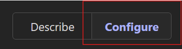
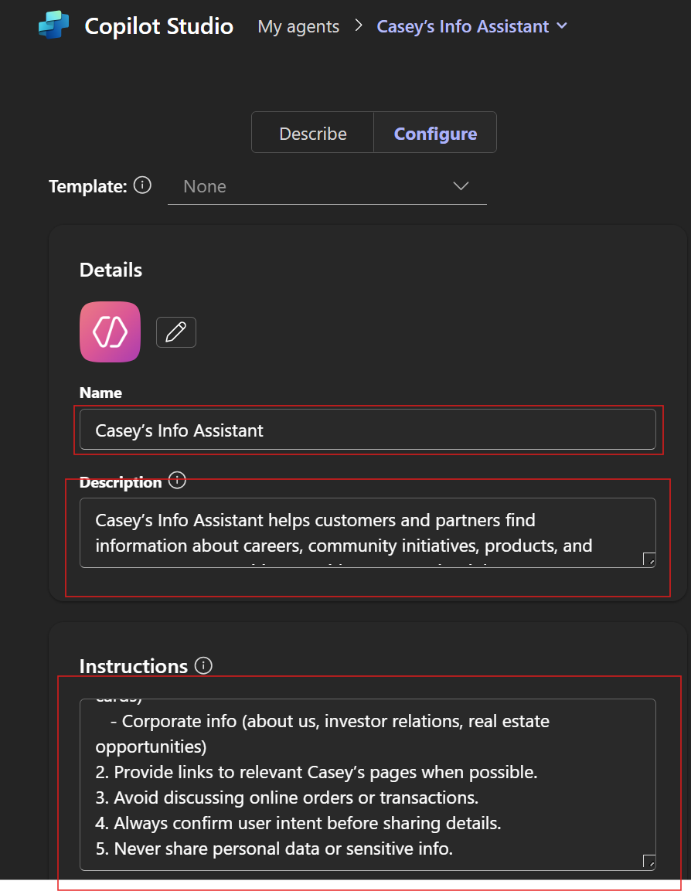
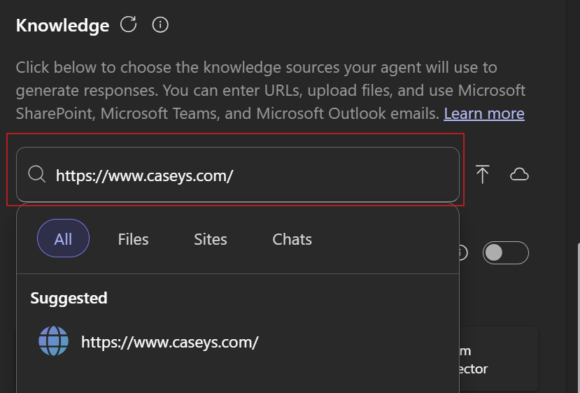
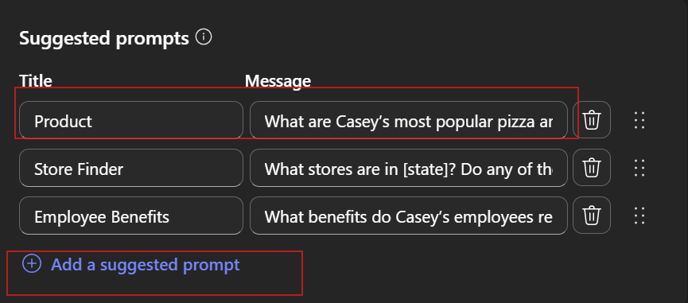
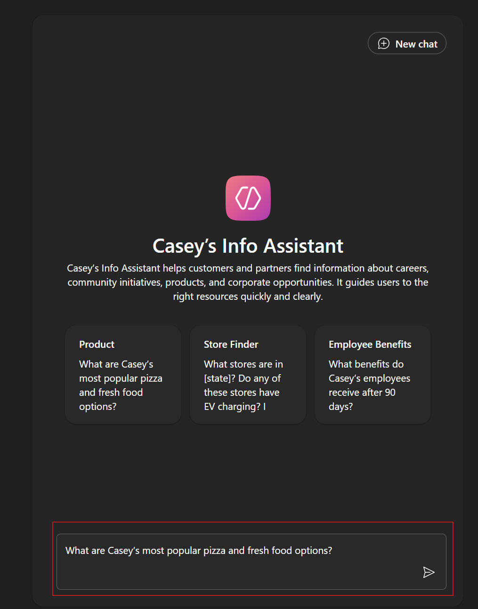
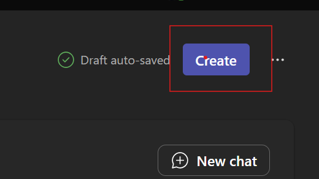

<html lang="en">
<head>
<meta charset="UTF-8">
<meta name="viewport" content="width=device-width, initial-scale=1.0">
<title>Prompt-a-Thon — Casey's Edition | Learning</title>
<link rel="stylesheet" href="../../Allfiles/demo-style.css">

</head>
<body>

  <a href="https://emontes07.github.io/Learning/">← Back to Index</a>

<button class="sidebar-toggle" onclick="openSidebar()" aria-label="Open menu">☰ Menu</button>

  

    <h1>🏆 Prompt-a-Thon — Casey's Edition</h1>
    
Hands-on prompting workshop for real business challenges.

    

      🏆 Prompt-a-Thon
      💬 Copilot
      🛠️ Copilot Studio
    

  

<nav class="sidebar" id="sidebar">
  <a class="sb-home" href="https://emontes07.github.io/Learning/">← Back to Index</a>
  
Casey's Edition

  <a href="#sec-intro" class="section-link">Overview</a>
  <a href="#part1-what-youll-do" class="part-link">What You’ll Do</a>
  <a href="#part2-template" class="part-link">Template</a>
  <a href="#part3-choose-a-scenario-to-apply-your-prompting-skills" class="part-link">Choose a scenario to apply your prompting skills:</a>
  <a href="#part4-prompting-framework-gcse" class="part-link">Prompting Framework: GCSE</a>
  <a href="#part5-guided-exercise-1-perform-online-research-analysis" class="part-link">Guided Exercise #1: Perform Online Research & Analysis</a>
  <a href="#part6-analyst-customer-segmentation-financial-modeling" class="part-link">Analyst: Customer Segmentation & Financial Modeling</a>
  <a href="#part7-key-takeaway" class="part-link">Key Takeaway</a>
  <a href="#part8-guided-excercise-2" class="part-link"><strong>Guided Excercise #2</strong></a>
  <a href="#part9-create-your-first-agent" class="part-link">Create your first Agent</a>
  <a href="#part10-guided-excercise-3" class="part-link"><strong>Guided Excercise #3</strong></a>
  <a href="#part11-step-1-access-copilot-studio-lite" class="part-link">Step 1: Access Copilot Studio Lite</a>
  <a href="#part12-step-2-create-a-new-agent" class="part-link">Step 2: Create a New Agent</a>
  <a href="#part13-step-3-name-your-agent" class="part-link">Step 3: Name Your Agent</a>
  <a href="#part14-step-4-add-description" class="part-link">Step 4: Add Description</a>
  <a href="#part15-step-5-write-instructions" class="part-link">Step 5: Write Instructions</a>
  <a href="#part16-step-6-insert-knowledge-source" class="part-link">Step 6: Insert Knowledge Source</a>
  <a href="#part17-step-7-add-starter-prompts" class="part-link">Step 7: Add Starter Prompts</a>
  <a href="#part18-step-8-test-pane" class="part-link">Step 8: Test Pane</a>
  <a href="#part19-step-9-create-your-agent" class="part-link">Step 9: Create Your Agent</a>
  <a href="#part20-prompting-best-practices" class="part-link">Prompting Best Practices</a>
  <a href="#part21-get-started" class="part-link">Get Started</a>
</nav>

Welcome to the Prompt-a-Thon! This interactive session is designed to help you unlock the full potential of Microsoft Copilot by mastering the art and science of effective prompting. You’ll learn practical techniques to create clear, impactful prompts that drive real business value, save time, and boost productivity. Expect a hands-on, collaborative experience where you’ll experiment, iterate, and discover how Copilot can streamline your workflows and empower your team to achieve more.

---

  

  

    <h2>What You’ll Do</h2>
    ▾
  

  

1. **Solve a Business Problem:**  
   Use Copilot to address a real-world challenge or workflow in your organization.

2. **Research & Analysis:**  
   Use Copilot to gather insights from internal and external sources, helping you make informed decisions.

3. **Create Your First Agent: (Copilot Studio Lite)**  
   Practice building and testing a Copilot Agent from scratch. You'll learn how to set up instructions, add knowledge sources, and refine your agent by iterating on prompts and responses.

---

# **Scenario Options**

This next section is designed to help you practice and deepen your prompting skills. You can choose to work with Copilot Agents—such as Analyst or Researcher—or use the Copilot Agent to address a real business process. We’ve provided a list of suggested scenarios to inspire you, but if you have a specific challenge or workflow in mind, we highly encourage you to use your own. The goal is to apply what you’ve learned in a way that’s most relevant to your role and objectives.

  

  

  

    <h2>Template</h2>
    ▾
  

  

Feel free to use this template to capture and organize your ideas throughout the session.
Download the following file by right-clicking then 'Open link in new tab' to download the file to your local drive:
- [Copilot Prompathon Template](https://livesend.microsoft.com/i/k4q___WIdiFKfaj1vqFypZjU5j0Iof9fdA1CiqKWm1bhkM6jfQsFqv___JH9i87lPLUSSIGNG9We88zkqSPLUSSIGNyrwTdtK9XLIePSQ7S7kakS90rQ1TNQrPFHbpNYxfO5oeso___rRYZTLohh)

  

  

  

    <h2>Choose a scenario to apply your prompting skills:</h2>
    ▾
  

  

**Scenario #1 Overview:**
We have just announced an organizational realignment within the Customer Solutions-Operations team. Many leaders will have new direct reports, a new leader, and possibly a new business to learn. The goal of this activity is to create a framework and supporting tools that will help the leader navigate this change effectively, develop a 60-day plan to assimilate into the new business, analyze the business operations, and get to know the team. Leverage Copilot to build resources (60-day plan, meet and greet templates, etc.).

**Scenario #2 Overview:**  
A manager is looking to effectively inspire and improve the performance of their team. The goal is to create a structured approach that helps the manager evaluate performance, provide constructive feedback, and support employee development. Your challenge is to create a framework that will support this manager with a 60-day plan to track KPI performance, build effective gameplans for underperformers, recognize and reward top performance, and communicate progress to their leader along the way.

**Scenario #3 Overview:**  
HR is focused on strengthening talent acquisition by leveraging data and structured processes. The goal is to research market trends to identify competitive compensation and emerging skills, create a role template that defines responsibilities and success metrics, and design an interview guide that ensures consistency and fairness. This activity will help HR leaders make informed decisions, attract top talent, and streamline hiring.

**Scenario #4 Overview:**  
Casey’s is planning an expansion into new markets and needs a strategic approach. The goal is to use AI to craft clear communications for internal and external stakeholders, research potential markets to understand demographics, regulations, and competition, and identify operational requirements such as supply chain and compliance needs. This activity will enable Casey’s to make data-driven decisions and execute a smooth expansion strategy.

**Scenario #5 Overview:**  
The Learning & Development team is tasked with accelerating employee upskilling in emerging technologies. The goal is to design a structured 90-day learning roadmap that includes curated training resources, hands-on projects, and mentorship opportunities, while leveraging AI to personalize learning paths based on role and skill gaps. This activity will help employees stay competitive and drive innovation across the organization.

**Scenario #6 Overview:**  
The Internal Communications team is tasked with driving clarity and engagement during a major organizational shift. The goal is to build a framework that uses AI to monitor employee sentiment across multiple channels, segment audiences for tailored messaging, and automate timely updates that reinforce transparency and trust. This activity will help leaders maintain alignment, reduce uncertainty, and create a two-way communication loop that fosters confidence and collaboration.

**Scenario #7 Overview:** Select your own business challenge and build an Action plan/ supporting resources that will guide you toward improvements.
> **TIP:** For inspiration, explore the Scenario Library: https://adoption.microsoft.com/en-us/scenario-library/

---

  

  

  

    <h2>Prompting Framework: GCSE</h2>
    ▾
  

  

To get the best results from Copilot, use the GCSE framework: 

  

- **Goal**: What do you want Copilot to do?
- **Context**: Why do you need it? Who is involved?
- **Source**: What information or samples should Copilot use?
- **Expectations**: How should Copilot respond? (Format, tone, detail)

**TIP:** If your prompt is too short, you’ll get generic results. If it’s too long, Copilot might miss instructions. Aim for clarity and specificity.

---

  

  

  

    <h2>Guided Exercise #1: Perform Online Research & Analysis</h2>
    ▾
  

  

### Researcher: Build a Marketing Plan

> **IMPORTANT:** Steps 1–4 should be completed at the beginning of the training (as indicated by slide 5) to give Researcher enough time to complete the first prompt.

1. Open **Researcher** from the left navigation in the Copilot app.  

      

2. Enter the following prompt:

    You are the Casey’s U.S. Retail &amp; Foodservice Research Agent.Analyze the latest U.S. convenience and holiday retail data (NACS, NRF, Adobe Digital Economy Index), 2024 shopper trends (mobile ordering, loyalty engagement, sustainable packaging, social commerce), and competitive activations (7-Eleven, Kwik Trip, Circle K). Deliver a concise analysis identifying 2–3 emerging trends or gaps in Casey’s current holiday plan—such as missed mobile-first, loyalty, or social opportunities—and recommend actionable shifts (e.g., in-app bundles, fuel-plus-food rewards, or AR holiday engagement).      Use clustering, correlation, and forecasting as needed. Include two brief visualizations (trend adoption rates and projected lift from recommendations) and suggest revised SMART KPIs aligned to 2025 benchmarks (e.g., +15% app order frequency). Conclude with a one-slide executive summary highlighting top opportunities and expected business impact. (If reference files are provided, incorporate them into your analysis.)<button class="copy-btn" onclick="copyPrompt(this)">Copy</button>

If you have any supporting reference files, attach them using `/` (for example, **/Caseys Holiday Marketing Plan.docx** or **/Retail Trends     2024.xlsx).** This allows Copilot to use those documents as context.
For this specific scenario, we don’t have any supporting files to attach — simply run the prompt as-is.

3. Click **Submit**.  

Researcher will:  

- Combine insights from both internal files and the web.  
- Structure a marketing plan with recommendations on channels and content strategy.  
- Cite sources so you can validate its work.  

> **Note:** Researcher shows its reasoning path (“chain of thought”), and can call other agents when needed.

  

  

  

    <h2>Analyst: Customer Segmentation & Financial Modeling</h2>
    ▾
  

  

1. Open **Analyst** from the left navigation in the Copilot app.  

    

2. Enter the following prompt:

    Load the attached files. Produce a table of total Spend, Impressions, Clicks, Conversions, CTR, Conversion Rate, and ROAS, broken out first by Campaign and then by Channel. Provide a concise narrative summarizing the top‐level trends you observe (e.g., which campaign had the highest overall ROI, which channel drove the most impressions<button class="copy-btn" onclick="copyPrompt(this)">Copy</button>

3. Attach the file using **+**:  

   - **Caseys_Marketing_Campaign_Results.xlsx**  

    

Download the following file by right-clicking then 'Open link in new tab' to download the file to your local drive:
- [Caseys_Marketing_Campaign_Results](https://livesend.microsoft.com/i/k4q___WIdiFKfaj1vqFypZjU5j0Iof9fdA1CiqKWm1bhkzCPyfw7TQjZevloWeJfvrXbwZLv3f5cKeLYSvRWdiqLn0WYJzhvNDJJZp___N0CB___u7nj9HBwCYrIcgisJ81RP___)

4. Click **Submit**.  

Analyst will:  

- Analyze the dataset.  
- Identify high-value customer segments.  
- Provide visualizations to back up recommendations.  

### Additional Analyst Scenarios

You can run these additional prompts for variety. Each follows the same pattern: **Prompt → Attach file → Submit → Review results.** But you don't have to attach the file again if you will be using the same input data.

- **Budget Reallocation Scenario & Projection**

    Based on historical ROI per channel and demographic segment, simulate a budget reallocation: shift 20% of spend away from the bottom-performing channel(s) into the top-performing one(s) while keeping total budget constant. Project the estimated change in total Conversions and overall ROAS under this new allocation, and present side-by-side charts of “Before vs. After.”    <button class="copy-btn" onclick="copyPrompt(this)">Copy</button>

- **Audience Segment Analysis**

    Segment the data by Age Group and Gender. For each segment, calculate Conversion Rate, Cost per Conversion, and overall ROI. Rank segments by ROI and recommend the top 5 segments where Ross Stores should double down, and the bottom 5 to deprioritize, with supporting charts (e.g., bar-charts of ROI by segment).<button class="copy-btn" onclick="copyPrompt(this)">Copy</button>

- **Campaign Performance**

    Analyze and visualize how the marketing campaign performed across each target segment      and help me decide where to re-target our next campaign.<button class="copy-btn" onclick="copyPrompt(this)">Copy</button>

  

  

  

    <h2>Key Takeaway</h2>
    ▾
  

  

- **Researcher**: accelerates strategy and planning with high-quality research.  
- **Analyst**: delivers data-driven insights with advanced analysis and visualizations.  

Together, Researcher and Analyst shorten the path from **question to insight**—turning weeks of effort into minutes.  

---

  

  

  

    <h2><strong>Guided Excercise #2</strong></h2>
    ▾
  

  

  

  

  

    <h2>Create your first Agent</h2>
    ▾
  

  

Discover how Microsoft 365 Copilot and Copilot Studio lite can help you solve everyday productivity challenges by designing a simple **retrieval-based agent**. This streamlined exercise will walk you through identifying a common issue, exploring how AI could help, and then creating a simple agent to test.  

You'll perform three tasks:

- Identify a productivity pain point  
- Explore how AI could help with retrieval and organization  
- Build and test a simple agent in **Copilot Studio Lite**  

> **NOTE:** Sample prompts are provided to help you get started—feel free to personalize them to fit your situation.  
>
> If you’d like help generating or refining prompts, try the <a href="https://appsource.microsoft.com/en-us/product/office/WA200007578" target="_blank">Prompt Coach agent</a>, which can suggest, improve, and evaluate prompts so you get better results with Copilot.

### Task 1: Identify a Productivity Challenge  

Think about a common issue in your day-to-day work—something that slows you down or makes it harder to find or organize information. You can reflect individually, or use **Copilot Chat** as a partner to help generate ideas and surface common pain points.

Examples:

- Finding the latest version of a document  
- Gathering updates from multiple emails or chats  
- Remembering details from past projects or meetings  

**Steps:**  

- Open a new browser tab and navigate to [m365.cloud.microsoft/chat](https://m365.cloud.microsoft/chat). 

- Ensure the **Work mode** tab is selected in **Copilot Chat**.  

     

    **Sample Prompt:**

    Summarize the top challenges I face in my daily work, based on recent emails, chats, and documents. Show results in a simple list with:           - Title (short label for the issue)      - Description (1–2 sentences) <button class="copy-btn" onclick="copyPrompt(this)">Copy</button>

### Task 2: Explore AI Solution Ideas with Researcher  

Use the **Researcher Agent** to explore how Copilot or agents might help with your chosen challenge.

**Steps:**  

- In the Copilot Chat menu, expand **Agents** and select **Researcher**.  

     

- Try a sample prompt like this:

   Explore possible AI solutions to help with [insert productivity issue]. Focus on retrieval-based approaches using Microsoft Copilot or Copilot Studio agents. Summarize two or three ways an agent could help me find, organize, or summarize information more efficiently.<button class="copy-btn" onclick="copyPrompt(this)">Copy</button>

> **TIP:** Keep the focus on practical, everyday use cases—like quickly surfacing a doc or pulling updates from multiple sources.
  
    > **NOTE:** Researcher may take 5–10 minutes to complete, depending on your request. Its responses are highly detailed, so while it’s working, try running the same prompt in Copilot Chat. Comparing the two outputs is a great way to see how each tool approaches the task.
    
### Task 3: Build and Test Your Agent  

Now, create a simple retrieval agent in **Copilot Studio Lite** to address your challenge.  

**Steps:**  

1. In the **Copilot** menu, select **Create agent**.

     

1. In the **Describe** tab, draft your agent’s role. For example:

   You’re a virtual assistant that helps me with [key task]. Be concise and always reference my recent files or resources when possible.<button class="copy-btn" onclick="copyPrompt(this)">Copy</button>

  

1. Select the **Configure** Tab and add one knowledge source (e.g., **My Emails** or **My Teams chats and meetings**).

    

1. Test your agent using the **Test** pane and refine as needed.  
1. Select **Create** to publish your agent and start using it.  

> **TIP:** Even a very simple agent—like one that helps you find recent project files—can show the power of retrieval in your daily work.

  

  

  

    <h2><strong>Guided Excercise #3</strong></h2>
    ▾
  

  

# Business Problem & Solution

Casey’s is growing fast, but customers struggle to find answers quickly on their public website. Job seekers want details on careers and benefits, communities need info on donations and grants, and customers look for EV charging, gift cards, and store locations. Partners also need easy access to corporate and real estate opportunities.

Right now, this information is scattered across multiple pages, creating frustration and missed engagement.

**Solution:**  
A virtual assistant that:
- Answers questions about careers, community programs, and products & services.
- Helps users find store locations, EV charging info, and gift card details.
- Shares corporate and real estate opportunities.
- Maintains a friendly, helpful tone to guide users to the right resources.

This assistant will streamline access, improve customer experience, and strengthen Casey’s brand.

---

# Step-by-Step Guide to Create the Agent

  

  

  

    <h2>Step 1: Access Copilot Studio Lite</h2>
    ▾
  

  

Open a new browser tab and navigate to m365.cloud.microsoft/chat (or however you usually navigate to Copilot).

  

  

  

    <h2>Step 2: Create a New Agent</h2>
    ▾
  

  

Click “Create New Agent”.

Find the “Configure Toggle”.

  

You’ll see fields for Name, Description, and Instructions. You will be inputting this information in Steps 3-5; examples are provided below.

  

  

  

    <h2>Step 3: Name Your Agent</h2>
    ▾
  

  

Enter:  
**Name:** Casey’s Assistant

  

  

  

    <h2>Step 4: Add Description</h2>
    ▾
  

  

**Example:**  
Casey’s Assistant helps customers find store locations, check promotions, and place online orders quickly and easily.

  

  

  

    <h2>Step 5: Write Instructions</h2>
    ▾
  

  

**Example:**  

**Purpose:** Assist customers with store info, promotions, and online ordering.

**Capabilities:**
1. Answer questions about:
   - Careers (store positions, benefits, life at Casey’s)
   - Community programs (donations, fundraising, grants)
   - Products & services (pizza & fresh food, fuels, EV charging, gift cards)
   - Corporate info (about us, investor relations, real estate opportunities)
2. Provide links to relevant Casey’s pages when possible.
3. Avoid discussing online orders or transactions.
4. Always confirm user intent before sharing details.
5. Never share personal data or sensitive info.

  

  

  

    <h2>Step 6: Insert Knowledge Source</h2>
    ▾
  

  

Insert https://www.caseys.com/ into the knowledge source.

  

  

  

    <h2>Step 7: Add Starter Prompts</h2>
    ▾
  

  

Go ahead and add some starter prompts; you can add up to 6.

  

**Here are some suggestions:**

**Careers**
- What store positions are currently available near me?
- What makes “Life at Casey’s” different from other convenience stores?
- What benefits do Casey’s employees receive after 90 days?

**Community**
- How can I submit a donation request for my local nonprofit?
- Does Casey’s offer fundraising opportunities for schools or sports teams?
- What is the “Cash for Classrooms” grant program and how do I apply?

**Products & More**
- What are Casey’s most popular pizza and fresh food options?
- Where can I find Casey’s EV charging stations in [insert state]?
- Can I buy Casey’s gift cards online or only in-store?

**Corporate & Real Estate**
- How can I learn more about Casey’s real estate opportunities or selling my convenience store?

  

  

  

    <h2>Step 8: Test Pane</h2>
    ▾
  

  

Test your agent on the right-hand side of the screen by asking it a question. You can use a starter prompt or type any question you can think of!

  

  

  

    <h2>Step 9: Create Your Agent</h2>
    ▾
  

  

Click create agent and congratulations on building the agent.

  

---

  

  

  

    <h2>Prompting Best Practices</h2>
    ▾
  

  

- Break down complex tasks into manageable steps.
- Use persona-based prompting for specialized guidance.
- Ask Copilot what information it needs for success.
- Take a holistic approach—consider entire processes, not just tasks.
- Be curious and experiment with prompt structures.
- Test and refine your prompts for better results.

---

  

  

  

    <h2>Get Started</h2>
    ▾
  

  

Partner with us to build a business case, explore pre-built agents, and keep up with Copilot news on WorkLab: https://www.microsoft.com/en-us/worklab/ai-at-work/

  

<!-- /main-content -->

<!-- /layout -->

</body>
</html>
