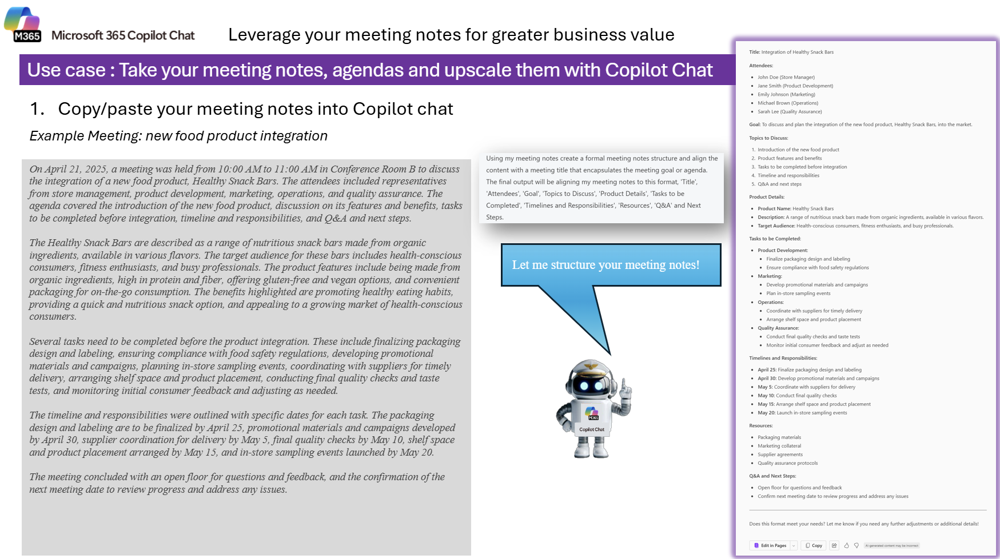
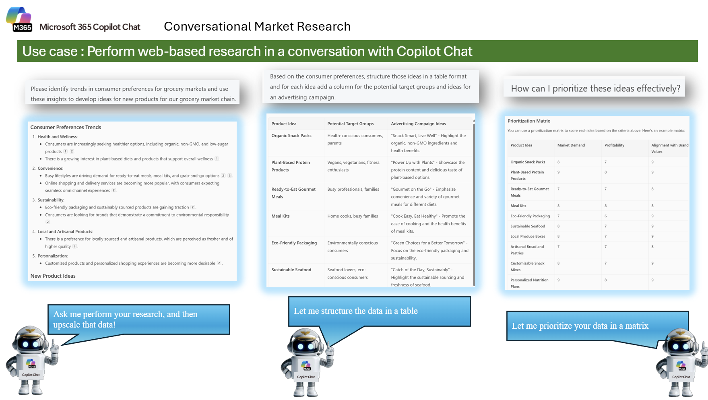
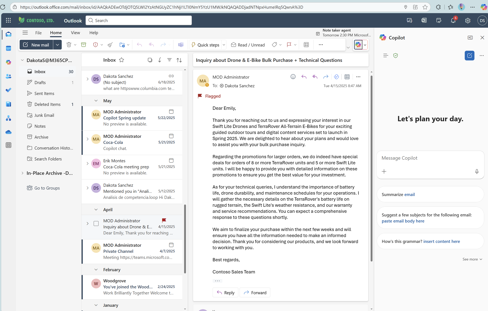
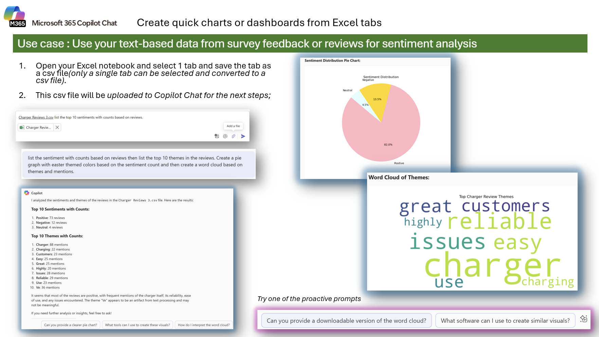
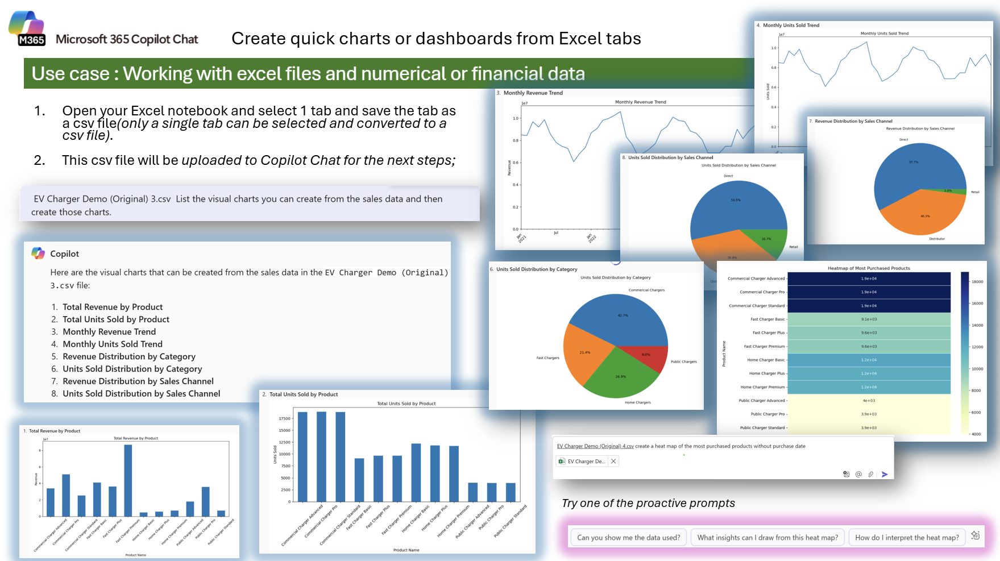
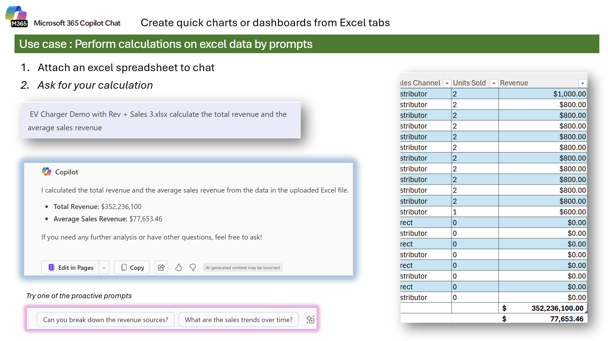
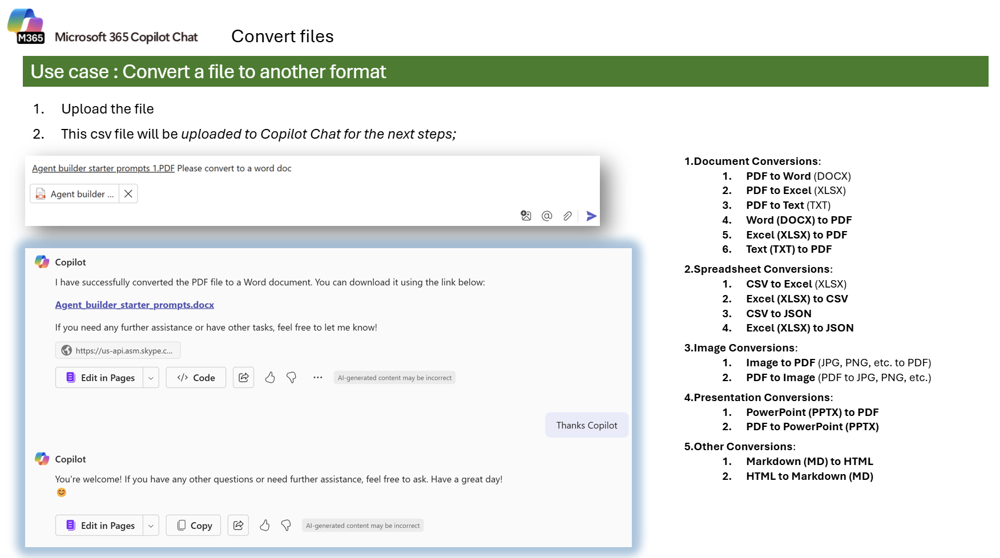
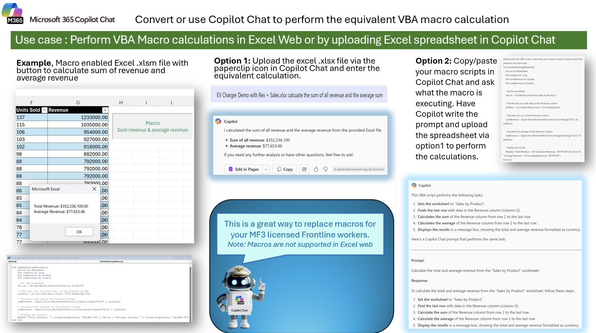
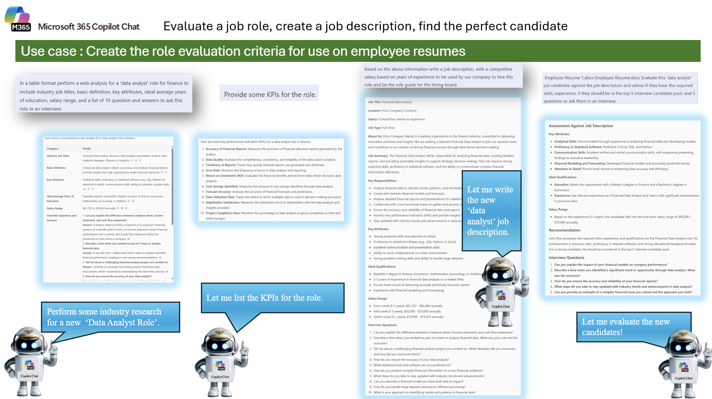

<html lang="en">
<head>
<meta charset="UTF-8">
<meta name="viewport" content="width=device-width, initial-scale=1.0">
<title>Copilot Chat — Practices | Learning</title>
<link rel="stylesheet" href="../../Allfiles/demo-style.css">

</head>
<body>

  <a href="https://emontes07.github.io/Learning/">← Back to Index</a>

<button class="sidebar-toggle" onclick="openSidebar()" aria-label="Open menu">☰ Menu</button>

  

    <h1>💬 Copilot Chat — Practices</h1>
    
Hands-on practice exercises for Microsoft 365 Copilot Chat.

    

      💬 Copilot Chat
      📝 Word
      🎯 Practice
    

  

<nav class="sidebar" id="sidebar">
  <a class="sb-home" href="https://emontes07.github.io/Learning/">← Back to Index</a>
  
Practices

  <a href="#sec-intro" class="section-link">Overview</a>
  <a href="#part1-practice-1-how-to-save-prompts-in-copilot" class="part-link">Practice 1: How to Save Prompts in Copilot</a>
  <a href="#part2-practice-2-memory-and-customization-of-copilot" class="part-link">Practice 2: Memory and Customization of Copilot</a>
  <a href="#part3-practice-3-create-and-edit-a-brief-in-copilot-loop-and-word" class="part-link">Practice 3: Create and edit a brief in Copilot, Loop, and Word</a>
  <a href="#part4-practice-4-working-with-word-documents" class="part-link">Practice 4: Working with Word Documents</a>
  <a href="#part5-practice-5-refine-results-with-follow-up-questions" class="part-link">Practice 5: Refine Results with Follow-Up Questions</a>
  <a href="#part6-practice-6-summarize-and-recap-emails-in-outlook" class="part-link">Practice 6: Summarize and Recap Emails in Outlook</a>
  <a href="#part7-practice-7-analyze-reviews-visualize-sentiments" class="part-link">Practice 7: Analyze Reviews & Visualize Sentiments</a>
  <a href="#part8-practice-8-visualize-financial-data-with-charts-heat-maps" class="part-link">Practice 8: Visualize Financial Data with Charts & Heat Maps</a>
  <a href="#part9-practice-9-perform-calculations-from-excel-data" class="part-link">Practice 9: Perform Calculations from Excel Data</a>
  <a href="#part10-practice-10-convert-files-to-another-format" class="part-link">Practice 10: Convert Files to Another Format</a>
  <a href="#part11-practice-11-fyi-create-or-replace-an-excel-macro-with-copilo" class="part-link">Practice 11 (FYI): Create or Replace an Excel Macro with Copilot</a>
</nav>

Enhance decision-making by gathering insights, conducting online analysis, and drafting professional communications.  

You'll perform three tasks:  

- Research information using **Copilot Chat** (and optionally try GPT-5 for comparison).  
- Conduct an analysis using **Copilot Chat**.  
- Draft a professional communication using **Copilot in Word**.  

> **NOTE:** Sample prompts are provided to help you get started. Feel free to personalize them to suit your needs—be creative and explore! If Copilot Chat doesn’t deliver the result you want, refine your prompt and try again. Enjoy the process and have fun experimenting!  

> **Note:** Learn more about new features here [Copilot Chat](https://www.microsoft.com/en-us/microsoft-365/roadmap/copilotchat?msockid=05bfca65f23f66d91dd1df54f3f86721)

---

  

  

    <h2>Practice 1: How to Save Prompts in Copilot</h2>
    ▾
  

  

Saving prompts helps you quickly reuse instructions or queries without having to rewrite them each time. Below is an explanation of how to manage and save them:

**Step-by-step guide**

**Step 1: Save a Prompt**

1.  Open a new browser tab and navigate to [M365copilot.com](https://m365copilot.com/). 
2.  Start by running a prompt, for example::

I work in marketing and focus on competitor research. Give me a concise summary of recent news about Microsoft. Focus on web articles from the last 3 months. Provide the answer in two to three paragraphs and use a business tone. <button class="copy-btn" onclick="copyPrompt(this)">Copy</button>

3. Hover over the prompt.

4.  Click *Save Prompt*.

5.  Give a name for easy reference.

> **Tips**  
> • Use clear names for prompts (e.g., "Weekly Report Summary").
> • Share the most frequently used prompts with your team to maintain consistency.
> • Regularly review and update saved prompts to keep them relevant.

**Step 2: Access your saved Prompts**

1.  Open Copilot.

2.  Click *See more*.

3.  Select *Prompt Gallery*.

4.  Go to *Your prompts*.

    - From here, you can delete prompts, share them via link or share them with a team.

  

  

  

    <h2>Practice 2: Memory and Customization of Copilot</h2>
    ▾
  

  

Copilot Memory offers a more personalized experience when training Copilot based on your previous chats, work profile, custom instructions, and other metadata. This allows Copilot to understand you best and suits your needs.

Copilot Customization uses the information from the Memory of Copilot to create tailored interactions. For example, you can tell Copilot your writing style (tone, preferred length of the usual responses, greetings, or closings), which helps the AI-generated drafts sound more like you.

**Step-by-step guide to adding custom instructions**

**Step 1: Access Copilot**

Open a new browser tab and navigate to [Copilot](m365.cloud.microsoft/chat) (or use your usual method to access Copilot).

**Step 2: Add instructions**

• Click on the settings by selecting “…”

• Open *Settings* and selec *Personalization*.

- Then select *Custom Instructions.*

You can add your custom instructions in this section. How reference, here's a guide with sample instructions that you can add to Copilot: Copilot instructions:

- [Copilot Custom Instructions](https://livesend.microsoft.com/i/rNoOVLzAAYKpEIxHcPLUSSIGNURf0AnaauPLUSSIGNpTT12ioHC1iT2S9v5zfm___ebPPLUSSIGNq8yBBDVxGsPLUSSIGNGevpl4gM20eehkcX55fDwwHvmMnfisgImZ___gDPLUSSIGN7MtPeWjGSVb8I5OJM40FI6OPIj)

  

  

  

    <h2>Practice 3: Create and edit a brief in Copilot, Loop, and Word</h2>
    ▾
  

  

1.  **Run the prompt in Copilot**  
    Copy and paste this prompt into Copilot:

    Provide a comprehensive regional update for [Michigan] to assist in planning store operations.     The update should include the latest news and insights on the following aspects:      Demographic Trends:     - Population growth or decline     - Age distribution     - Income levels     - Consumer behavior patterns      Financial Events:     - Economic indicators (e.g., employment rates, inflation, GDP growth)     - Major business developments (e.g., new businesses opening, closures, expansions)     - Changes in consumer spending habits      Weather Events:     - Current weather conditions and forecasts     - Recent and upcoming severe weather events (e.g., storms, hurricanes, heatwaves)     - Impact of weather on local infrastructure and transportation      Please provide detailed information and relevant data sources for each aspect to support strategic decision-making for store operations.<button class="copy-btn" onclick="copyPrompt(this)">Copy</button>

2.  **Select the *"Edit in Pages"* icon **

> This will allow you to work the content in page format within Loop, with more editing options..
>
>  alt="A screenshot of a computer AI-generated content may be incorrect." />

3.  **Open in Microsoft Word**  
    In the upper-right corner, click Open in Word. This will convert the content into an editable document in Word, where you can apply advanced formatting, spell check, and Share it easily.

>  alt="A screenshot of a computer AI-generated content may be incorrect." />

4.  Select *"Open in Word"*

>  alt="A screenshot of a computer AI-generated content may be incorrect." />

  

  

  

    <h2>Practice 4: Working with Word Documents</h2>
    ▾
  

  

- **1.Open the document in Word**  
From Loop, select the **Open in Word** option (top corner right). The document will open in Word Online or in the desk.

- **2. Open the Copilot window and run the following prompt:**

    Explain this document using questions (FAQ)<button class="copy-btn" onclick="copyPrompt(this)">Copy</button>

Copilot will transform content into questions that you can use to guide the conversation with the team.

---

### Practice 4: Summarize & Structure Meeting Notes  

Using **Copilot Chat**, transform raw meeting notes into a structured, professional summary. This will help you clearly communicate key decisions, action items, and responsibilities, ensuring alignment across teams.  

If you don’t have internal meeting notes available, you can use a sample transcript or text file that contains general meeting content for practice.  

**Steps**:

- Open a new browser tab and navigate to [M365copilot.com](https://m365copilot.com/)
- Select Copilot Chat
- Upload your meeting notes transcript (text file)
  
      

**Sample Prompt** *(after uploading meeting notes)*:

Using my meeting notes, create a formal meeting notes structure and align the content with a meeting title that encapsulates the meeting goal or agenda.   The final output should format my notes with these sections: - Title   - Attendees   - Goal   - Topics to Discuss   - Product Details   - Tasks to be Completed   - Timelines and Responsibilities   - Resources   - Q&amp;A and Next Steps<button class="copy-btn" onclick="copyPrompt(this)">Copy</button>

> **NOTE:** You can ask Copilot to adjust the level of detail (e.g., “make the summary more concise” or “expand on tasks to be completed”).

> **Learning Outcome:**
After completing this task, you'll know how to turn unstructured notes into a professional, shareable meeting summary.

---

  

  

  

    <h2>Practice 5: Refine Results with Follow-Up Questions</h2>
    ▾
  

  

Using **Copilot Chat**, practice enhancing your results by asking follow-up questions. This task shows how you can go beyond the first answer, structure the data, and get actionable insights for decision-making.  

**Steps**:

- Open a new browser tab and navigate to [M365copilot.com](https://m365copilot.com/)
- Select Copilot Chat
- Enter the following series of prompts to progressively refine your research results:
  
      

**Sample Prompt Sequence**:

Please identify trends in consumer preferences for grocery markets and use these insights to develop ideas for new products for our grocery market chain.<button class="copy-btn" onclick="copyPrompt(this)">Copy</button>

Please structure those ideas in a table format and for each idea add a column for the potential target groups and ideas for an advertising campaign.<button class="copy-btn" onclick="copyPrompt(this)">Copy</button>

How can I prioritize these ideas effectively?<button class="copy-btn" onclick="copyPrompt(this)">Copy</button>

> **TIP:**  Follow-up questions help refine and upscale your results. Try clarifying prompts like: “Expand the table with additional product ideas based on recent market trends,” “Which ideas might have the highest ROI in the next 12 months?,” or “Create a prioritization matrix ranking these ideas by market demand, profitability, and alignment with brand values.”

> **Learning Outcome:**
After completing this task, you’ll understand how to use follow-up prompts to get richer insights and actionable recommendations from Copilot Chat.

  

  

  

    <h2>Practice 6: Summarize and Recap Emails in Outlook</h2>
    ▾
  

  

Use **Copilot Chat** in Outlook to quickly understand the content of an email and extract key actions. This task will help you summarize a long email thread and clearly identify what is being requested — both from you and from your team.  

This task is perfect for staying on top of priorities, deadlines, and next steps without manually scanning through each line of an email.  

**Steps**:  

1. Open [Outlook on the web](https://outlook.office.com/) in your browser.  
2. Select an email thread that contains multiple details, requests, or deadlines.  
3. Click the **Copilot** icon on the upper-right corner of the Outlook window (see screenshot below).  
4. In the Copilot Chat panel that appears, enter the following prompt:

  

**Sample Prompt**:

Recap my email, show me: 1. What is being asked 2. What is being asked of the team 3. What is being asked directly of me  If there are any dates or topics mentioned, put those in a table.<button class="copy-btn" onclick="copyPrompt(this)">Copy</button>

> **💡 Tip:**
If your email thread is very long, try adding “summarize in 3 bullet points” or “summarize in less than 100 words” to the prompt for a quicker, more focused summary.

> **🎯 Learning Outcome:**
You will learn how to use Copilot Chat in Outlook to extract key requests, action items, and deadlines from a single email or an entire thread, helping you and your team stay organized and responsive.

  

  

  

    <h2>Practice 7: Analyze Reviews & Visualize Sentiments</h2>
    ▾
  

  

Use **Copilot Chat** to transform raw survey or review data into actionable insights with charts and dashboards. You'll use a `.csv` file exported from Excel and ask Copilot to identify sentiment, uncover key themes, and generate visuals like a pie chart and word cloud.  

This task is perfect for analyzing customer feedback or product reviews and creating compelling visuals for presentations or reports.  

**Steps**:  

1. Save the following Excel notebook (right click "Save Link as").
- [Charger Reviews.csv](https://livesend.microsoft.com/i/rNoOVLzAAYKpEIxHcPLUSSIGNURf0AnaauPLUSSIGNpTT12ioHC1iT2S8VuzrYz6HnIx80b9RyzyZ8VH9PLUSSIGNteUEPLUSSIGNlRMtqBakFxVdvtp0Y5WWb1AfgMLvhW7TbWIhabsAA5HtCHQl2pnLGCd)
3. Save the selected worksheet as a `.csv` file.  
4. Open a new browser tab and navigate to [M365copilot.com](https://m365copilot.com/)  
5. Select Copilot Chat and upload your `.csv` file  
6. Use the following sample prompt to analyze and visualize the data.  

  

**Sample Prompt** *(after uploading your CSV file)*:

For each review, analyze the whole sentence and provide a sentiment analysis.   List the top 10 sentiments with counts based on reviews using the attached file. Analyze the column “Reviews” located in column C.  Then, list the sentiment with counts on reviews and the top 10 themes in the reviews.   Create a pie graph with Easter-themed colors based on the sentiment count and then create a word cloud based on themes and mentions.<button class="copy-btn" onclick="copyPrompt(this)">Copy</button>

> **TIP:**  If you want to customize the visuals further, follow up with questions like: Can you provide a downloadable version of the word cloud? Can you generate a more vibrant color scheme for the pie chart? What software can I use to recreate these visuals manually?

> **Learning Outcome:** 
After completing this task, you’ll be able to analyze qualitative data from reviews or survey feedback, extract themes and sentiment, and create visual summaries with Copilot Chat.

  

  

  

    <h2>Practice 8: Visualize Financial Data with Charts & Heat Maps</h2>
    ▾
  

  

Use **Copilot Chat** to create a variety of data visualizations from Excel data, such as **monthly trends**, **product sales**, and **revenue distribution**. In this task, you'll explore the charting capabilities of Copilot with structured sales data to uncover key insights.  

**Steps**:  

1. Open your Excel workbook and select one worksheet (only one tab at a time can be used).

- [EV Charger Demo.csv](https://livesend.microsoft.com/i/rNoOVLzAAYKpEIxHcPLUSSIGNURf0AnaauPLUSSIGNpTT12ioHC1iT2S8VuzrYz6HnIx80b9RyzyZ8VH9PLUSSIGNteUEPLUSSIGNlRMtqBakFxVdvtp0Y5WWb1AfgMLvhW7TbWIhabsAA5HtCHQl2pnLGCd)
   
3. Save the selected worksheet as a `.csv` file.  
4. Open a new browser tab and navigate to [M365copilot.com](https://m365copilot.com/)  
5. Select Copilot Chat and upload your `.csv` file  
6. Use the following sample prompt to analyze and visualize the data.  

  

**Sample Prompt** *(after uploading your CSV file)*:

List the visual charts you can create from the sales data and then create those charts.  <button class="copy-btn" onclick="copyPrompt(this)">Copy</button>

Create a Monthly Revenue Trend chart.  <button class="copy-btn" onclick="copyPrompt(this)">Copy</button>

Create a &quot;Units Sold Distribution by Sales Channel&quot; pie chart.<button class="copy-btn" onclick="copyPrompt(this)">Copy</button>

Create a &quot;Total Revenue by Product&quot; chart.  <button class="copy-btn" onclick="copyPrompt(this)">Copy</button>

Create a heat map of the most purchased products without purchase dates.<button class="copy-btn" onclick="copyPrompt(this)">Copy</button>

> **TIP:** 
Once the visuals are generated, try these follow-up prompts to enhance your analysis: Can you add trendlines or highlight seasonal peaks in the revenue chart? What does the heat map reveal about customer preferences? Group sales by category and create a stacked bar chart.Export these charts as image files I can use in PowerPoint.

> **Learning Outcome:**
After completing this task, you’ll be able to transform numerical sales data into various visual formats using Copilot Chat—including line charts, pie charts, bar charts, and heat maps—empowering you to extract and present insights for better decision-making.

  

  

  

    <h2>Practice 9: Perform Calculations from Excel Data</h2>
    ▾
  

  

Use **Copilot Chat** to perform calculations directly from Excel data—without needing formulas or pivot tables. In this task, you’ll calculate the **total revenue** and the **average sales revenue** from a provided spreadsheet and explore how to break down those results further.

This is a great use case for operations, finance, or business teams looking for fast insights without writing code or complex formulas.

**Steps**:  

1. Save the following Excel workbook (right click "Save Link as").  
   - [EV Charger Demo.csv](https://livesend.microsoft.com/i/rNoOVLzAAYKpEIxHcPLUSSIGNURf0AnaauPLUSSIGNpTT12ioHC1iT2S8VuzrYz6HnIx80b9RyzyZ8VH9PLUSSIGNteUEPLUSSIGNlRMtqBakFxVdvtp0Y5WWb1AfgMLvhW7TbWIhabsAA5HtCHQl2pnLGCd)
2. Open a new browser tab and navigate to [M365copilot.com](https://m365copilot.com/)  
3. Select Copilot Chat and upload your `.xlsx` file  
4. Use the following sample prompt to analyze and calculate values from the data  

  

**Sample Prompt** *(after uploading your Excel file)*:

Calculate the total revenue and the average sales revenue.<button class="copy-btn" onclick="copyPrompt(this)">Copy</button>

> **TIP:** 
Once the results are shown, try these follow-up prompts to dig deeper:
> Can you break down the revenue sources by sales channel or product?
> What are the monthly or quarterly sales trends?
> Can you calculate revenue growth over time?

> **Learning Outcome:**
After completing this task, you’ll be able to use Copilot Chat to quickly calculate financial metrics like total and average revenue, and follow up with deeper questions to uncover trends or performance breakdowns in your Excel data.

  

  

  

    <h2>Practice 10: Convert Files to Another Format</h2>
    ▾
  

  

Use **Copilot Chat** to convert files between formats quickly and easily. This task helps you explore supported conversion types—perfect when you need to standardize formats or extract data for analysis.  

**Steps**:  

1. Upload the file you want to convert to **Copilot Chat**.  
2. Ask Copilot Chat to convert it into your desired format.  

**Sample Prompt**:

Convert this PDF to a Word document.<button class="copy-btn" onclick="copyPrompt(this)">Copy</button>

You can also request Copilot to perform other conversions such the one mentioned in the image.

> **TIP:** 
Ask follow-up questions like:
> Can you extract tables from this PDF into Excel?
> Save this as a downloadable file.
> Combine multiple PDFs into one document.”

> **Learning Outcome:**
After completing this task, you’ll know how to use Copilot Chat to convert files into various formats, making it easier to prepare data, create editable documents, and streamline workflows.

  

  

  

    <h2>Practice 11 (FYI): Create or Replace an Excel Macro with Copilot</h2>
    ▾
  

  

This advanced, **FYI-only** task shows two ways to handle VBA-style calculations using **Copilot Chat**—either by asking Copilot to do the equivalent calculation from an uploaded spreadsheet, or by having Copilot help author/adjust the VBA macro.  
> **Heads-up:** VBA macros don’t run in **Excel for the web**; Copilot Chat can still perform the same calculations from your uploaded workbook.

**How to use it:**  

1. Open a new browser tab and go to [M365copilot.com](https://m365copilot.com/).  
2. Select **Copilot Chat**.  
3. Use one of the options below.

**Option 1 – Have Copilot perform the calculation from your file**  

Upload your `Revenue.xlsx` (or similar) and run:

Please create an Excel Macro script that performs the following task: Calculate the total and average revenue from the &quot;Sales by Product&quot; worksheet.  For Excel web users, execute the equivalent calculation now on the uploaded file and report: - Total Revenue - Average Revenue<button class="copy-btn" onclick="copyPrompt(this)">Copy</button>

**Option 2 – Ask Copilot to draft/modify the VBA macro**

Write a VBA macro that calculates the total and average revenue from the &quot;Sales by Product&quot; worksheet and displays the results in a message box.  Now modify the script so it writes: - Total Revenue to cell J4 - Average Revenue to cell J5 and formats both as currency.<button class="copy-btn" onclick="copyPrompt(this)">Copy</button>

> **TIP:**
> Explain what this macro does line by line.
> Convert this macro to a Copilot prompt that performs the same calculation without VBA.
> Add error handling if the sheet or column is missing.”

> **Learning Outcome:**
You’ll understand two practical paths to handle macro-style work: (1) let Copilot Chat run the calculation directly from your uploaded workbook, or (2) have Copilot author or refactor the VBA macro for desktop Excel, including writing results to specific cells.

### Task 10: Create a Job Description & Evaluate a Candidate  

Use **Copilot Chat** to create a professional job description based on web research, define KPIs, and then analyze a candidate’s resume for fit against the role. This task is ideal for HR teams, hiring managers, and recruiters who want to streamline job creation and resume evaluation.

**Steps**:  

1. Open a new browser tab and navigate to [M365copilot.com](https://m365copilot.com/)  
2. Select **Copilot Chat**.  
3. Start by asking Copilot to research and build a job profile.  
4. Then, upload a candidate’s resume (in `.docx` format) and ask Copilot to perform a gap analysis.

**Sample Prompt** *(Step 1 – Build the job description)*:

In a table format perform a web analysis for a &quot;data analyst&quot; role for finance to include: - Industry job titles   - Basic definition   - Key attributes   - Ideal average years of education   - Salary range   - A list of 10 questions and answers to ask this role in an interview    Then provide some KPIs for the role.    Finally, based on the above information, write a job description with a competitive salary based on years of experience. This job description will serve as the guide for our hiring board.<button class="copy-btn" onclick="copyPrompt(this)">Copy</button>

> **TIP:**
> Rank the candidate from 1–10 based on fit for the role.
> Identify skill gaps and recommend a training plan if they were hired.
> Generate a scorecard template the hiring board can use for all candidates.

> **Learning Outcome:**
After completing this task, you’ll be able to create a well-structured job description, identify KPIs for a role, and perform a resume gap analysis with Copilot Chat—streamlining your hiring process and improving candidate evaluation consistency.

  

<!-- /main-content -->

<!-- /layout -->

</body>
</html>
